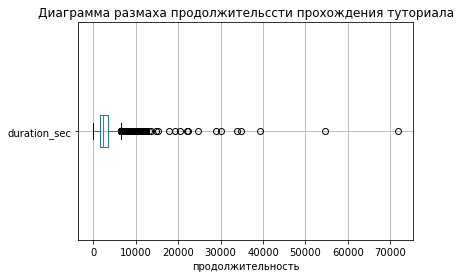

# Задание 1. Загрузка данных из файлов

Мы будем рассматривать популярную мобильную игру Clash of Clowns. Загружаем данные о том, когда новые игроки завершали учебный уровень в игре и сколько времени они потратили на прохождение, а также данные журнала посещений.


```python
import pandas as pd
tutorial = pd.read_csv('hw_lesson02_tutorial_completed.csv')
tutorial.head(5)
```


<div>
<style scoped>
    .dataframe tbody tr th:only-of-type {
        vertical-align: middle;
    }

    .dataframe tbody tr th {
        vertical-align: top;
    }

    .dataframe thead th {
        text-align: right;
    }
</style>
<table border="1" class="dataframe">
  <thead>
    <tr style="text-align: right;">
      <th></th>
      <th>user_id</th>
      <th>event_name</th>
      <th>event_dt</th>
      <th>duration_sec</th>
    </tr>
  </thead>
  <tbody>
    <tr>
      <th>0</th>
      <td>--0-b0cbb8-a</td>
      <td>tutorial_completed</td>
      <td>2020-06-08 13:46:07</td>
      <td>951</td>
    </tr>
    <tr>
      <th>1</th>
      <td>--014ca35_b7</td>
      <td>tutorial_completed</td>
      <td>2020-05-09 04:20:13</td>
      <td>1143</td>
    </tr>
    <tr>
      <th>2</th>
      <td>--0424774bcb</td>
      <td>tutorial_completed</td>
      <td>2020-05-30 07:23:05</td>
      <td>3758</td>
    </tr>
    <tr>
      <th>3</th>
      <td>--043682a1ad</td>
      <td>tutorial_completed</td>
      <td>2020-05-15 03:14:40</td>
      <td>1326</td>
    </tr>
    <tr>
      <th>4</th>
      <td>--05-26b0-6b</td>
      <td>tutorial_completed</td>
      <td>2020-05-20 13:07:08</td>
      <td>2828</td>
    </tr>
  </tbody>
</table>
</div>


```python
sessions = pd.read_excel('hw_lesson02_sessions.xlsx.xlsx')
sessions.head(5)
```


<div>
<style scoped>
    .dataframe tbody tr th:only-of-type {
        vertical-align: middle;
    }

    .dataframe tbody tr th {
        vertical-align: top;
    }

    .dataframe thead th {
        text-align: right;
    }
</style>
<table border="1" class="dataframe">
  <thead>
    <tr style="text-align: right;">
      <th></th>
      <th>user_id</th>
      <th>region</th>
      <th>device</th>
      <th>channel</th>
      <th>session_duration</th>
      <th>session_start</th>
    </tr>
  </thead>
  <tbody>
    <tr>
      <th>0</th>
      <td>d35ad20dd45d</td>
      <td>SEA</td>
      <td>iPhone</td>
      <td>GameAds</td>
      <td>2589.186227</td>
      <td>2020-04-01 17:51:25</td>
    </tr>
    <tr>
      <th>1</th>
      <td>ac4a113c52c_</td>
      <td>CIS</td>
      <td>iPhone</td>
      <td>GameAds</td>
      <td>1467.539334</td>
      <td>2020-04-01 09:39:33</td>
    </tr>
    <tr>
      <th>2</th>
      <td>d0337d117cc8</td>
      <td>CIS</td>
      <td>iPhone</td>
      <td>GameAds</td>
      <td>3777.737508</td>
      <td>2020-04-01 01:19:56</td>
    </tr>
    <tr>
      <th>3</th>
      <td>2f8c_262-_85</td>
      <td>North America</td>
      <td>iPhone</td>
      <td>GameAds</td>
      <td>3755.966201</td>
      <td>2020-04-01 11:21:54</td>
    </tr>
    <tr>
      <th>4</th>
      <td>4b1-114-4692</td>
      <td>Europe</td>
      <td>iPhone</td>
      <td>GameAds</td>
      <td>2898.802314</td>
      <td>2020-04-01 18:29:57</td>
    </tr>
  </tbody>
</table>
</div>


Исследуем данные с помощью команды info


```python
sessions.info(), tutorial.info()
```

    <class 'pandas.core.frame.DataFrame'>
    RangeIndex: 167890 entries, 0 to 167889
    Data columns (total 6 columns):
     #   Column            Non-Null Count   Dtype         
    ---  ------            --------------   -----         
     0   user_id           167890 non-null  object        
     1   region            167890 non-null  object        
     2   device            167890 non-null  object        
     3   channel           167890 non-null  object        
     4   session_duration  167890 non-null  float64       
     5   session_start     167890 non-null  datetime64[ns]
    dtypes: datetime64[ns](1), float64(1), object(4)
    memory usage: 7.7+ MB
    <class 'pandas.core.frame.DataFrame'>
    RangeIndex: 59857 entries, 0 to 59856
    Data columns (total 4 columns):
     #   Column        Non-Null Count  Dtype 
    ---  ------        --------------  ----- 
     0   user_id       59857 non-null  object
     1   event_name    59857 non-null  object
     2   event_dt      59857 non-null  object
     3   duration_sec  59857 non-null  int64 
    dtypes: int64(1), object(3)
    memory usage: 1.8+ MB
    


    (None, None)


Изучим категориальные переменные.


```python
sessions['region'].value_counts()
```


    CN               33116
    North America    28260
    CIS              26187
    Europe           23413
    South America    19962
    Africa           15049
    SEA              12356
    Australia         9547
    Name: region, dtype: int64


```python
sessions['device'].value_counts()
```


    Andoroid    116186
    iPhone       51704
    Name: device, dtype: int64


```python
sessions['channel'].value_counts()
```


    BrainPlus    77660
    JetAds       38526
    GameAds      34970
    SenseAds     16734
    Name: channel, dtype: int64


```python
sessions['session_duration'].min(), sessions['session_duration'].max()
```


    (0.0002282910481539417, 21197.16666061496)


```python
sessions['session_start'].min(), sessions['session_start'].max()
```


    (Timestamp('2020-04-01 00:00:23'), Timestamp('2020-06-30 23:59:45'))


```python
tutorial['event_dt'].min(), tutorial['event_dt'].max()
```


    ('2020-04-01 00:04:01', '2020-06-30 23:54:40')


В обоих датафреймах данные покрывают временной интервал с 1 апреля по 30 июня.

# Задание 2. Описательная статистика

Исследуем колонки duration_sec и session_duration. Расчитаем для них среднее, среднеквадратическое отклонение и медиану.


```python
tutorial['duration_sec'].mean() / 60, tutorial['duration_sec'].std() / 60, tutorial['duration_sec'].median() / 60
```


    (44.942355948343554, 27.197112054898657, 39.96666666666667)


```python
sessions['session_duration'].mean() / 60, sessions['session_duration'].std() / 60, sessions['session_duration'].median() / 60
```


    (30.132045553160186, 30.130765971597008, 20.83862560779046)


Построим гистограмму для колоноки duration_sec. 


```python
from matplotlib import pyplot as plt 
tutorial['duration_sec'].hist(bins = 1000)
plt.xlabel('продолжительность'), plt.ylabel('Частота появления'), plt.title('Распределение продолжительности прохождения туториал')
plt.show()
```


    

    


Продолжительность прохождения туториала имеет вид гамма распредения. Теперь построим гистограмму для колоноки session_duration.


```python
sessions['session_duration'].hist(bins = 1000)
plt.xlabel('продолжительность'), plt.ylabel('Частота появления'), plt.title('Распределение продолжительности сессии')
plt.show()
```


    

    


Продолжительность сессий имеет вид экспоненциального распределения.

# Задание 3. Исследование выбросов

Построим диаграммы размаха для обеих колонок.


```python
tutorial.boxplot('duration_sec', vert = False)
plt.xlabel('продолжительность'), plt.title('Диаграмма размаха продолжительссти прохождения туториала')
plt.show()
```


    

    


```python
sessions.boxplot('session_duration', vert = False)
plt.xlabel('продолжительность'), plt.title('Диаграмма размаха продолжительссти сессии')
plt.show()
```


    

    


Для каждой колонки рассчитаем 99% перцентиль.


```python
tutorial['duration_sec'].quantile(0.99), sessions['session_duration'].quantile(0.99)
```


    (7605.440000000002, 8323.137208860211)


Мы видим, что большая часть выбросов оказалась выше 99% перцентиля.

# Задание 4. Сохранение данных в файл

С помощью query отфильтруем из таблиц визитов и учебных игр выбросы по столбцам duration_sec и session_duration. Запишем очищенные данные в csv файлы.


```python
most_trusted_tutorial = tutorial.query('duration_sec < 7605')
most_trusted_tutorial.to_csv('most_trusted_tutorial.csv', index = False)
most_trusted_tutorial 
```


<div>
<style scoped>
    .dataframe tbody tr th:only-of-type {
        vertical-align: middle;
    }

    .dataframe tbody tr th {
        vertical-align: top;
    }

    .dataframe thead th {
        text-align: right;
    }
</style>
<table border="1" class="dataframe">
  <thead>
    <tr style="text-align: right;">
      <th></th>
      <th>user_id</th>
      <th>event_name</th>
      <th>event_dt</th>
      <th>duration_sec</th>
    </tr>
  </thead>
  <tbody>
    <tr>
      <th>0</th>
      <td>--0-b0cbb8-a</td>
      <td>tutorial_completed</td>
      <td>2020-06-08 13:46:07</td>
      <td>951</td>
    </tr>
    <tr>
      <th>1</th>
      <td>--014ca35_b7</td>
      <td>tutorial_completed</td>
      <td>2020-05-09 04:20:13</td>
      <td>1143</td>
    </tr>
    <tr>
      <th>2</th>
      <td>--0424774bcb</td>
      <td>tutorial_completed</td>
      <td>2020-05-30 07:23:05</td>
      <td>3758</td>
    </tr>
    <tr>
      <th>3</th>
      <td>--043682a1ad</td>
      <td>tutorial_completed</td>
      <td>2020-05-15 03:14:40</td>
      <td>1326</td>
    </tr>
    <tr>
      <th>4</th>
      <td>--05-26b0-6b</td>
      <td>tutorial_completed</td>
      <td>2020-05-20 13:07:08</td>
      <td>2828</td>
    </tr>
    <tr>
      <th>...</th>
      <td>...</td>
      <td>...</td>
      <td>...</td>
      <td>...</td>
    </tr>
    <tr>
      <th>59852</th>
      <td>fff68c81cb2f</td>
      <td>tutorial_completed</td>
      <td>2020-06-04 22:59:42</td>
      <td>2578</td>
    </tr>
    <tr>
      <th>59853</th>
      <td>fff7d81ca3_5</td>
      <td>tutorial_completed</td>
      <td>2020-05-31 18:55:50</td>
      <td>2078</td>
    </tr>
    <tr>
      <th>59854</th>
      <td>fff88bbb3_c8</td>
      <td>tutorial_completed</td>
      <td>2020-05-28 13:14:38</td>
      <td>2544</td>
    </tr>
    <tr>
      <th>59855</th>
      <td>fff97c4d3c74</td>
      <td>tutorial_completed</td>
      <td>2020-06-16 09:35:12</td>
      <td>1783</td>
    </tr>
    <tr>
      <th>59856</th>
      <td>fffa9419ccf6</td>
      <td>tutorial_completed</td>
      <td>2020-06-06 18:41:33</td>
      <td>1186</td>
    </tr>
  </tbody>
</table>
<p>59257 rows × 4 columns</p>
</div>


```python
most_trusted_sessions = sessions.query('session_duration < 8323')
most_trusted_sessions.to_csv('most_trusted_sessions.csv', index = False)
most_trusted_sessions
```


<div>
<style scoped>
    .dataframe tbody tr th:only-of-type {
        vertical-align: middle;
    }

    .dataframe tbody tr th {
        vertical-align: top;
    }

    .dataframe thead th {
        text-align: right;
    }
</style>
<table border="1" class="dataframe">
  <thead>
    <tr style="text-align: right;">
      <th></th>
      <th>user_id</th>
      <th>region</th>
      <th>device</th>
      <th>channel</th>
      <th>session_duration</th>
      <th>session_start</th>
    </tr>
  </thead>
  <tbody>
    <tr>
      <th>0</th>
      <td>d35ad20dd45d</td>
      <td>SEA</td>
      <td>iPhone</td>
      <td>GameAds</td>
      <td>2589.186227</td>
      <td>2020-04-01 17:51:25</td>
    </tr>
    <tr>
      <th>1</th>
      <td>ac4a113c52c_</td>
      <td>CIS</td>
      <td>iPhone</td>
      <td>GameAds</td>
      <td>1467.539334</td>
      <td>2020-04-01 09:39:33</td>
    </tr>
    <tr>
      <th>2</th>
      <td>d0337d117cc8</td>
      <td>CIS</td>
      <td>iPhone</td>
      <td>GameAds</td>
      <td>3777.737508</td>
      <td>2020-04-01 01:19:56</td>
    </tr>
    <tr>
      <th>3</th>
      <td>2f8c_262-_85</td>
      <td>North America</td>
      <td>iPhone</td>
      <td>GameAds</td>
      <td>3755.966201</td>
      <td>2020-04-01 11:21:54</td>
    </tr>
    <tr>
      <th>4</th>
      <td>4b1-114-4692</td>
      <td>Europe</td>
      <td>iPhone</td>
      <td>GameAds</td>
      <td>2898.802314</td>
      <td>2020-04-01 18:29:57</td>
    </tr>
    <tr>
      <th>...</th>
      <td>...</td>
      <td>...</td>
      <td>...</td>
      <td>...</td>
      <td>...</td>
      <td>...</td>
    </tr>
    <tr>
      <th>167885</th>
      <td>f4436b_52dc_</td>
      <td>CIS</td>
      <td>Andoroid</td>
      <td>BrainPlus</td>
      <td>2775.695988</td>
      <td>2020-06-30 15:14:56</td>
    </tr>
    <tr>
      <th>167886</th>
      <td>ad3-bc75a9fc</td>
      <td>Europe</td>
      <td>Andoroid</td>
      <td>JetAds</td>
      <td>1885.137209</td>
      <td>2020-06-30 14:56:09</td>
    </tr>
    <tr>
      <th>167887</th>
      <td>a08d5af97-3d</td>
      <td>Europe</td>
      <td>Andoroid</td>
      <td>BrainPlus</td>
      <td>157.472441</td>
      <td>2020-06-30 05:22:07</td>
    </tr>
    <tr>
      <th>167888</th>
      <td>-9_13acb52-7</td>
      <td>Africa</td>
      <td>Andoroid</td>
      <td>BrainPlus</td>
      <td>151.266928</td>
      <td>2020-06-30 17:43:42</td>
    </tr>
    <tr>
      <th>167889</th>
      <td>-175c05_40d3</td>
      <td>North America</td>
      <td>Andoroid</td>
      <td>BrainPlus</td>
      <td>5052.781567</td>
      <td>2020-06-30 11:38:15</td>
    </tr>
  </tbody>
</table>
<p>166211 rows × 6 columns</p>
</div>


# Задание 5. Фильтрация выбросов с помощью функции

Напишем функцию filter_outliers, которая принимает на вход: датафрейм; наименование столбца, по которому в этом датафрейме нужно найти выбросы; значения границы выбросов для расчета перцентиля. Функция убирает из фрейма все выбросы по указанному столбцу и возвращает отфильтрованный датафрейм.


```python
def filter_outliers(frame, column, quantile):
    p = frame[column].quantile(quantile)
    return frame[frame[column] < p]
```


```python
filter_outliers(sessions, 'session_duration', 0.95)
```


<div>
<style scoped>
    .dataframe tbody tr th:only-of-type {
        vertical-align: middle;
    }

    .dataframe tbody tr th {
        vertical-align: top;
    }

    .dataframe thead th {
        text-align: right;
    }
</style>
<table border="1" class="dataframe">
  <thead>
    <tr style="text-align: right;">
      <th></th>
      <th>user_id</th>
      <th>region</th>
      <th>device</th>
      <th>channel</th>
      <th>session_duration</th>
      <th>session_start</th>
    </tr>
  </thead>
  <tbody>
    <tr>
      <th>0</th>
      <td>d35ad20dd45d</td>
      <td>SEA</td>
      <td>iPhone</td>
      <td>GameAds</td>
      <td>2589.186227</td>
      <td>2020-04-01 17:51:25</td>
    </tr>
    <tr>
      <th>1</th>
      <td>ac4a113c52c_</td>
      <td>CIS</td>
      <td>iPhone</td>
      <td>GameAds</td>
      <td>1467.539334</td>
      <td>2020-04-01 09:39:33</td>
    </tr>
    <tr>
      <th>2</th>
      <td>d0337d117cc8</td>
      <td>CIS</td>
      <td>iPhone</td>
      <td>GameAds</td>
      <td>3777.737508</td>
      <td>2020-04-01 01:19:56</td>
    </tr>
    <tr>
      <th>3</th>
      <td>2f8c_262-_85</td>
      <td>North America</td>
      <td>iPhone</td>
      <td>GameAds</td>
      <td>3755.966201</td>
      <td>2020-04-01 11:21:54</td>
    </tr>
    <tr>
      <th>4</th>
      <td>4b1-114-4692</td>
      <td>Europe</td>
      <td>iPhone</td>
      <td>GameAds</td>
      <td>2898.802314</td>
      <td>2020-04-01 18:29:57</td>
    </tr>
    <tr>
      <th>...</th>
      <td>...</td>
      <td>...</td>
      <td>...</td>
      <td>...</td>
      <td>...</td>
      <td>...</td>
    </tr>
    <tr>
      <th>167885</th>
      <td>f4436b_52dc_</td>
      <td>CIS</td>
      <td>Andoroid</td>
      <td>BrainPlus</td>
      <td>2775.695988</td>
      <td>2020-06-30 15:14:56</td>
    </tr>
    <tr>
      <th>167886</th>
      <td>ad3-bc75a9fc</td>
      <td>Europe</td>
      <td>Andoroid</td>
      <td>JetAds</td>
      <td>1885.137209</td>
      <td>2020-06-30 14:56:09</td>
    </tr>
    <tr>
      <th>167887</th>
      <td>a08d5af97-3d</td>
      <td>Europe</td>
      <td>Andoroid</td>
      <td>BrainPlus</td>
      <td>157.472441</td>
      <td>2020-06-30 05:22:07</td>
    </tr>
    <tr>
      <th>167888</th>
      <td>-9_13acb52-7</td>
      <td>Africa</td>
      <td>Andoroid</td>
      <td>BrainPlus</td>
      <td>151.266928</td>
      <td>2020-06-30 17:43:42</td>
    </tr>
    <tr>
      <th>167889</th>
      <td>-175c05_40d3</td>
      <td>North America</td>
      <td>Andoroid</td>
      <td>BrainPlus</td>
      <td>5052.781567</td>
      <td>2020-06-30 11:38:15</td>
    </tr>
  </tbody>
</table>
<p>159495 rows × 6 columns</p>
</div>


