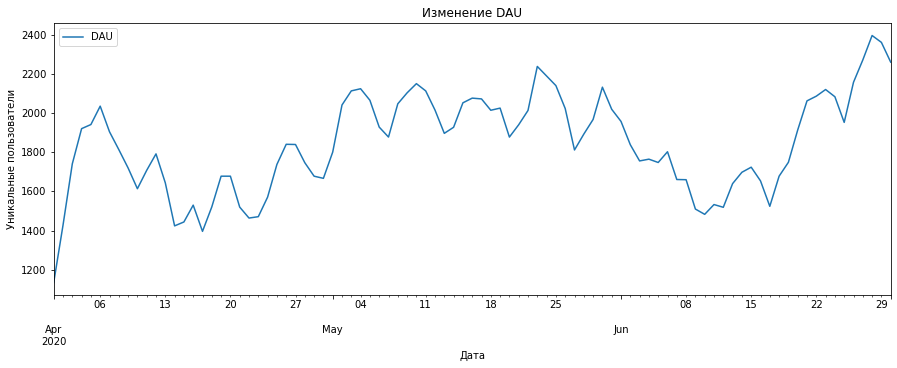
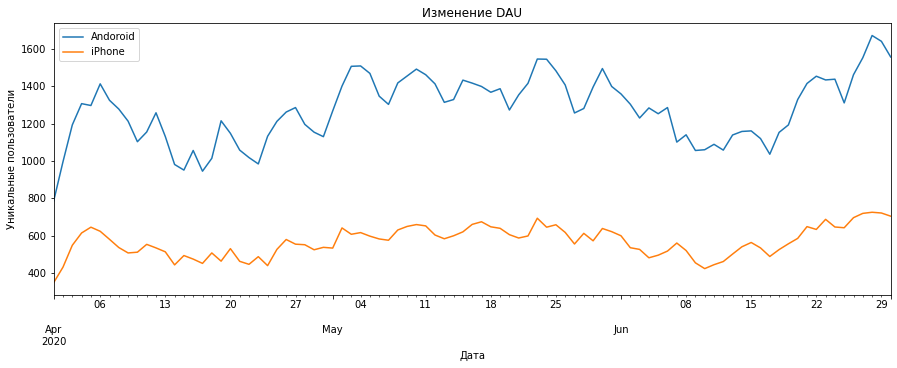
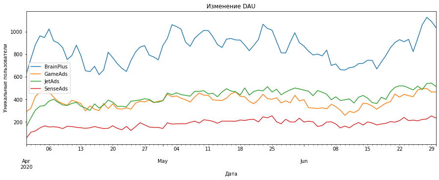
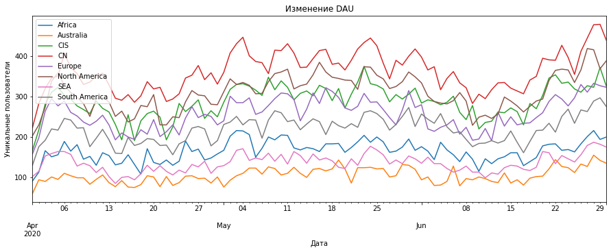
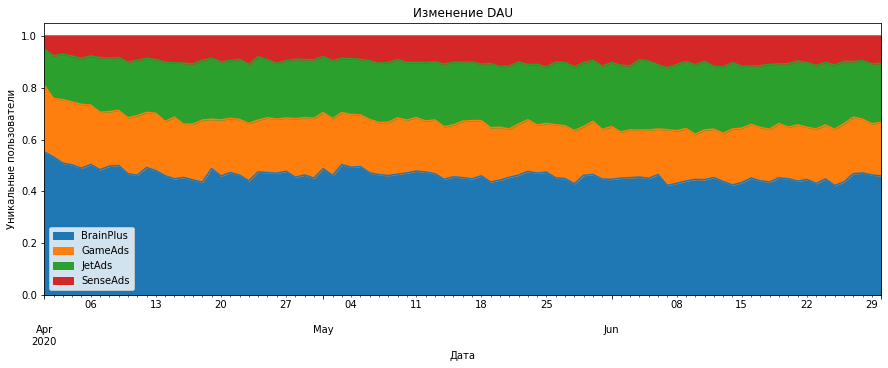
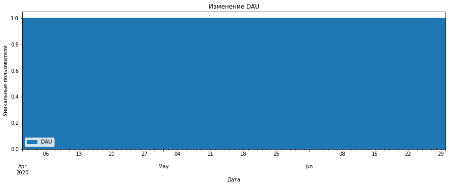
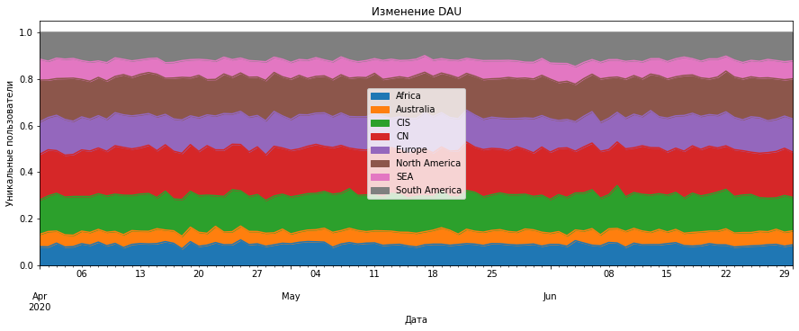
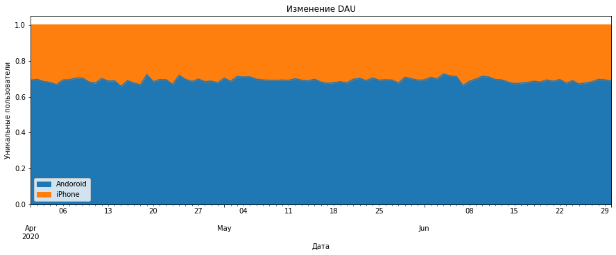

# Задание 1. Построение графика DAU

В этом задании нашей целью будет изучение количества пользователей, посещающих игру каждый день.


```python
import pandas as pd
from matplotlib import pyplot as plt
```

Загружайем файлы с разбивкой по устройствам, рекламным каналам и регионам. Построим линейные графики ежедневных активных пользователей(DAU).


```python
dau = pd.read_excel('hw_lesson03_dau.xlsx.xlsx')
dau = dau.set_index('date')
display(dau.head())
dau.plot(figsize=(15,5))
plt.title('Изменение DAU'), plt.xlabel('Дата'), plt.ylabel('Уникальные пользователи');
```


<div>
<style scoped>
    .dataframe tbody tr th:only-of-type {
        vertical-align: middle;
    }

    .dataframe tbody tr th {
        vertical-align: top;
    }

    .dataframe thead th {
        text-align: right;
    }
</style>
<table border="1" class="dataframe">
  <thead>
    <tr style="text-align: right;">
      <th></th>
      <th>DAU</th>
    </tr>
    <tr>
      <th>date</th>
      <th></th>
    </tr>
  </thead>
  <tbody>
    <tr>
      <th>2020-04-01</th>
      <td>1134</td>
    </tr>
    <tr>
      <th>2020-04-02</th>
      <td>1427</td>
    </tr>
    <tr>
      <th>2020-04-03</th>
      <td>1741</td>
    </tr>
    <tr>
      <th>2020-04-04</th>
      <td>1921</td>
    </tr>
    <tr>
      <th>2020-04-05</th>
      <td>1942</td>
    </tr>
  </tbody>
</table>
</div>


    

    


```python
dau_device = pd.read_excel('hw_lesson03_dau_device.xlsx.xlsx')
dau_device = dau_device.set_index('date')
display(dau_device.head())
dau_device.plot(figsize=(15,5))
plt.title('Изменение DAU'), plt.xlabel('Дата'), plt.ylabel('Уникальные пользователи');
```


<div>
<style scoped>
    .dataframe tbody tr th:only-of-type {
        vertical-align: middle;
    }

    .dataframe tbody tr th {
        vertical-align: top;
    }

    .dataframe thead th {
        text-align: right;
    }
</style>
<table border="1" class="dataframe">
  <thead>
    <tr style="text-align: right;">
      <th></th>
      <th>Andoroid</th>
      <th>iPhone</th>
    </tr>
    <tr>
      <th>date</th>
      <th></th>
      <th></th>
    </tr>
  </thead>
  <tbody>
    <tr>
      <th>2020-04-01</th>
      <td>786</td>
      <td>348</td>
    </tr>
    <tr>
      <th>2020-04-02</th>
      <td>996</td>
      <td>431</td>
    </tr>
    <tr>
      <th>2020-04-03</th>
      <td>1193</td>
      <td>548</td>
    </tr>
    <tr>
      <th>2020-04-04</th>
      <td>1307</td>
      <td>614</td>
    </tr>
    <tr>
      <th>2020-04-05</th>
      <td>1297</td>
      <td>645</td>
    </tr>
  </tbody>
</table>
</div>


    

    


```python
dau_channel = pd.read_excel('hw_lesson03_dau_channel.xlsx.xlsx')
dau_channel = dau_channel.set_index('date')
display(dau_channel.head())
dau_channel.plot(figsize=(15,5))
plt.title('Изменение DAU'), plt.xlabel('Дата'), plt.ylabel('Уникальные пользователи');
```


<div>
<style scoped>
    .dataframe tbody tr th:only-of-type {
        vertical-align: middle;
    }

    .dataframe tbody tr th {
        vertical-align: top;
    }

    .dataframe thead th {
        text-align: right;
    }
</style>
<table border="1" class="dataframe">
  <thead>
    <tr style="text-align: right;">
      <th></th>
      <th>BrainPlus</th>
      <th>GameAds</th>
      <th>JetAds</th>
      <th>SenseAds</th>
    </tr>
    <tr>
      <th>date</th>
      <th></th>
      <th></th>
      <th></th>
      <th></th>
    </tr>
  </thead>
  <tbody>
    <tr>
      <th>2020-04-01</th>
      <td>627</td>
      <td>292</td>
      <td>159</td>
      <td>56</td>
    </tr>
    <tr>
      <th>2020-04-02</th>
      <td>761</td>
      <td>322</td>
      <td>235</td>
      <td>109</td>
    </tr>
    <tr>
      <th>2020-04-03</th>
      <td>887</td>
      <td>427</td>
      <td>306</td>
      <td>121</td>
    </tr>
    <tr>
      <th>2020-04-04</th>
      <td>966</td>
      <td>466</td>
      <td>341</td>
      <td>148</td>
    </tr>
    <tr>
      <th>2020-04-05</th>
      <td>951</td>
      <td>479</td>
      <td>346</td>
      <td>166</td>
    </tr>
  </tbody>
</table>
</div>


    

    


```python
dau_region = pd.read_excel('hw_lesson03_dau_region.xlsx.xlsx')
dau_region = dau_region.set_index('date')
display(dau_region.head())
dau_region.plot(figsize=(15,5))
plt.title('Изменение DAU'), plt.xlabel('Дата'), plt.ylabel('Уникальные пользователи');
```


<div>
<style scoped>
    .dataframe tbody tr th:only-of-type {
        vertical-align: middle;
    }

    .dataframe tbody tr th {
        vertical-align: top;
    }

    .dataframe thead th {
        text-align: right;
    }
</style>
<table border="1" class="dataframe">
  <thead>
    <tr style="text-align: right;">
      <th></th>
      <th>Africa</th>
      <th>Australia</th>
      <th>CIS</th>
      <th>CN</th>
      <th>Europe</th>
      <th>North America</th>
      <th>SEA</th>
      <th>South America</th>
    </tr>
    <tr>
      <th>date</th>
      <th></th>
      <th></th>
      <th></th>
      <th></th>
      <th></th>
      <th></th>
      <th></th>
      <th></th>
    </tr>
  </thead>
  <tbody>
    <tr>
      <th>2020-04-01</th>
      <td>91</td>
      <td>60</td>
      <td>167</td>
      <td>223</td>
      <td>158</td>
      <td>203</td>
      <td>102</td>
      <td>130</td>
    </tr>
    <tr>
      <th>2020-04-02</th>
      <td>113</td>
      <td>94</td>
      <td>218</td>
      <td>283</td>
      <td>198</td>
      <td>230</td>
      <td>115</td>
      <td>176</td>
    </tr>
    <tr>
      <th>2020-04-03</th>
      <td>166</td>
      <td>90</td>
      <td>282</td>
      <td>320</td>
      <td>264</td>
      <td>274</td>
      <td>153</td>
      <td>192</td>
    </tr>
    <tr>
      <th>2020-04-04</th>
      <td>151</td>
      <td>101</td>
      <td>311</td>
      <td>346</td>
      <td>295</td>
      <td>338</td>
      <td>159</td>
      <td>220</td>
    </tr>
    <tr>
      <th>2020-04-05</th>
      <td>156</td>
      <td>95</td>
      <td>323</td>
      <td>351</td>
      <td>277</td>
      <td>359</td>
      <td>164</td>
      <td>217</td>
    </tr>
  </tbody>
</table>
</div>


    

    


Мы видим, что посещаемость игры имеет недельную цикличность. Большая чать пользователей использует устройста с ОС Android, пришли из рекламного канала BrainPlus и живут в Китае.

# Задание 2. Операции над столбцами

Создадим новый фрейм, в котором вместо абсолютных значений DAU хранятся данные о процентах DAU от суммы DAU по всем рекламным каналам.


```python
dau_channel['BrainPlus'].median(), dau_channel['GameAds'].median(), dau_channel['JetAds'].median(), dau_channel['SenseAds'].median()
```


    (866.0, 385.0, 434.0, 188.0)


```python
dau_channel['Total'] = dau_channel['BrainPlus'] + dau_channel['GameAds'] + dau_channel['JetAds'] + dau_channel['SenseAds']
dau_channel
```


<div>
<style scoped>
    .dataframe tbody tr th:only-of-type {
        vertical-align: middle;
    }

    .dataframe tbody tr th {
        vertical-align: top;
    }

    .dataframe thead th {
        text-align: right;
    }
</style>
<table border="1" class="dataframe">
  <thead>
    <tr style="text-align: right;">
      <th></th>
      <th>BrainPlus</th>
      <th>GameAds</th>
      <th>JetAds</th>
      <th>SenseAds</th>
      <th>Total</th>
    </tr>
    <tr>
      <th>date</th>
      <th></th>
      <th></th>
      <th></th>
      <th></th>
      <th></th>
    </tr>
  </thead>
  <tbody>
    <tr>
      <th>2020-04-01</th>
      <td>627</td>
      <td>292</td>
      <td>159</td>
      <td>56</td>
      <td>1134</td>
    </tr>
    <tr>
      <th>2020-04-02</th>
      <td>761</td>
      <td>322</td>
      <td>235</td>
      <td>109</td>
      <td>1427</td>
    </tr>
    <tr>
      <th>2020-04-03</th>
      <td>887</td>
      <td>427</td>
      <td>306</td>
      <td>121</td>
      <td>1741</td>
    </tr>
    <tr>
      <th>2020-04-04</th>
      <td>966</td>
      <td>466</td>
      <td>341</td>
      <td>148</td>
      <td>1921</td>
    </tr>
    <tr>
      <th>2020-04-05</th>
      <td>951</td>
      <td>479</td>
      <td>346</td>
      <td>166</td>
      <td>1942</td>
    </tr>
    <tr>
      <th>...</th>
      <td>...</td>
      <td>...</td>
      <td>...</td>
      <td>...</td>
      <td>...</td>
    </tr>
    <tr>
      <th>2020-06-26</th>
      <td>943</td>
      <td>485</td>
      <td>519</td>
      <td>211</td>
      <td>2158</td>
    </tr>
    <tr>
      <th>2020-06-27</th>
      <td>1065</td>
      <td>496</td>
      <td>488</td>
      <td>223</td>
      <td>2272</td>
    </tr>
    <tr>
      <th>2020-06-28</th>
      <td>1130</td>
      <td>498</td>
      <td>542</td>
      <td>227</td>
      <td>2397</td>
    </tr>
    <tr>
      <th>2020-06-29</th>
      <td>1095</td>
      <td>467</td>
      <td>546</td>
      <td>254</td>
      <td>2362</td>
    </tr>
    <tr>
      <th>2020-06-30</th>
      <td>1040</td>
      <td>468</td>
      <td>517</td>
      <td>236</td>
      <td>2261</td>
    </tr>
  </tbody>
</table>
<p>91 rows × 5 columns</p>
</div>


```python
dau_channel_perc = dau_channel.copy() 
dau_channel_perc['BrainPlus'] = dau_channel_perc['BrainPlus'] / dau_channel_perc['Total']
dau_channel_perc['GameAds'] = dau_channel_perc['GameAds'] / dau_channel_perc['Total']
dau_channel_perc['JetAds'] = dau_channel_perc['JetAds'] / dau_channel_perc['Total']
dau_channel_perc['SenseAds'] = dau_channel_perc['SenseAds'] / dau_channel_perc['Total']
dau_channel_perc
```


<div>
<style scoped>
    .dataframe tbody tr th:only-of-type {
        vertical-align: middle;
    }

    .dataframe tbody tr th {
        vertical-align: top;
    }

    .dataframe thead th {
        text-align: right;
    }
</style>
<table border="1" class="dataframe">
  <thead>
    <tr style="text-align: right;">
      <th></th>
      <th>BrainPlus</th>
      <th>GameAds</th>
      <th>JetAds</th>
      <th>SenseAds</th>
      <th>Total</th>
    </tr>
    <tr>
      <th>date</th>
      <th></th>
      <th></th>
      <th></th>
      <th></th>
      <th></th>
    </tr>
  </thead>
  <tbody>
    <tr>
      <th>2020-04-01</th>
      <td>0.552910</td>
      <td>0.257496</td>
      <td>0.140212</td>
      <td>0.049383</td>
      <td>1134</td>
    </tr>
    <tr>
      <th>2020-04-02</th>
      <td>0.533287</td>
      <td>0.225648</td>
      <td>0.164681</td>
      <td>0.076384</td>
      <td>1427</td>
    </tr>
    <tr>
      <th>2020-04-03</th>
      <td>0.509477</td>
      <td>0.245261</td>
      <td>0.175761</td>
      <td>0.069500</td>
      <td>1741</td>
    </tr>
    <tr>
      <th>2020-04-04</th>
      <td>0.502863</td>
      <td>0.242582</td>
      <td>0.177512</td>
      <td>0.077043</td>
      <td>1921</td>
    </tr>
    <tr>
      <th>2020-04-05</th>
      <td>0.489701</td>
      <td>0.246653</td>
      <td>0.178167</td>
      <td>0.085479</td>
      <td>1942</td>
    </tr>
    <tr>
      <th>...</th>
      <td>...</td>
      <td>...</td>
      <td>...</td>
      <td>...</td>
      <td>...</td>
    </tr>
    <tr>
      <th>2020-06-26</th>
      <td>0.436979</td>
      <td>0.224745</td>
      <td>0.240500</td>
      <td>0.097776</td>
      <td>2158</td>
    </tr>
    <tr>
      <th>2020-06-27</th>
      <td>0.468750</td>
      <td>0.218310</td>
      <td>0.214789</td>
      <td>0.098151</td>
      <td>2272</td>
    </tr>
    <tr>
      <th>2020-06-28</th>
      <td>0.471423</td>
      <td>0.207760</td>
      <td>0.226116</td>
      <td>0.094702</td>
      <td>2397</td>
    </tr>
    <tr>
      <th>2020-06-29</th>
      <td>0.463590</td>
      <td>0.197714</td>
      <td>0.231160</td>
      <td>0.107536</td>
      <td>2362</td>
    </tr>
    <tr>
      <th>2020-06-30</th>
      <td>0.459973</td>
      <td>0.206988</td>
      <td>0.228660</td>
      <td>0.104379</td>
      <td>2261</td>
    </tr>
  </tbody>
</table>
<p>91 rows × 5 columns</p>
</div>


Построим график истории изменения процента DAU. По оси x графика отложим даты, а по оси y - процент от общего DAU для каждого рекламного канала. График будет иметь тип "области с накоплением".


```python
dau_channel_perc[['BrainPlus','GameAds','JetAds','SenseAds']].plot.area(figsize = (15,5))
plt.title('Изменение DAU'), plt.xlabel('Дата'), plt.ylabel('Уникальные пользователи');
```


    

    


Мы видим, что доля пользователей из рекламного канала BrainPlus	несколько уменьшилась, а из SenseAds увеличилась.

# Задание 3. Модификация данных - apply и loc


```python
mau_region = pd.read_excel('hw_lesson03_mau_region.xlsx.xlsx')
mau_region
```


<div>
<style scoped>
    .dataframe tbody tr th:only-of-type {
        vertical-align: middle;
    }

    .dataframe tbody tr th {
        vertical-align: top;
    }

    .dataframe thead th {
        text-align: right;
    }
</style>
<table border="1" class="dataframe">
  <thead>
    <tr style="text-align: right;">
      <th></th>
      <th>month</th>
      <th>Africa</th>
      <th>Australia</th>
      <th>CIS</th>
      <th>CN</th>
      <th>Europe</th>
      <th>North America</th>
      <th>SEA</th>
      <th>South America</th>
    </tr>
  </thead>
  <tbody>
    <tr>
      <th>0</th>
      <td>4</td>
      <td>2490</td>
      <td>1534</td>
      <td>4229</td>
      <td>5392</td>
      <td>3845</td>
      <td>4639</td>
      <td>2058</td>
      <td>3241</td>
    </tr>
    <tr>
      <th>1</th>
      <td>5</td>
      <td>3190</td>
      <td>1937</td>
      <td>5432</td>
      <td>6884</td>
      <td>4872</td>
      <td>5930</td>
      <td>2587</td>
      <td>4119</td>
    </tr>
    <tr>
      <th>2</th>
      <td>6</td>
      <td>2805</td>
      <td>1846</td>
      <td>4941</td>
      <td>6225</td>
      <td>4387</td>
      <td>5383</td>
      <td>2361</td>
      <td>3805</td>
    </tr>
  </tbody>
</table>
</div>


```python
mau_region = mau_region.set_index('month')
mau_region
```


<div>
<style scoped>
    .dataframe tbody tr th:only-of-type {
        vertical-align: middle;
    }

    .dataframe tbody tr th {
        vertical-align: top;
    }

    .dataframe thead th {
        text-align: right;
    }
</style>
<table border="1" class="dataframe">
  <thead>
    <tr style="text-align: right;">
      <th></th>
      <th>Africa</th>
      <th>Australia</th>
      <th>CIS</th>
      <th>CN</th>
      <th>Europe</th>
      <th>North America</th>
      <th>SEA</th>
      <th>South America</th>
    </tr>
    <tr>
      <th>month</th>
      <th></th>
      <th></th>
      <th></th>
      <th></th>
      <th></th>
      <th></th>
      <th></th>
      <th></th>
    </tr>
  </thead>
  <tbody>
    <tr>
      <th>4</th>
      <td>2490</td>
      <td>1534</td>
      <td>4229</td>
      <td>5392</td>
      <td>3845</td>
      <td>4639</td>
      <td>2058</td>
      <td>3241</td>
    </tr>
    <tr>
      <th>5</th>
      <td>3190</td>
      <td>1937</td>
      <td>5432</td>
      <td>6884</td>
      <td>4872</td>
      <td>5930</td>
      <td>2587</td>
      <td>4119</td>
    </tr>
    <tr>
      <th>6</th>
      <td>2805</td>
      <td>1846</td>
      <td>4941</td>
      <td>6225</td>
      <td>4387</td>
      <td>5383</td>
      <td>2361</td>
      <td>3805</td>
    </tr>
  </tbody>
</table>
</div>


Воспользуемся .loc, чтобы исправить данные.


```python
mau_region.loc[5 ,'Africa'] = 5000
mau_region
```


<div>
<style scoped>
    .dataframe tbody tr th:only-of-type {
        vertical-align: middle;
    }

    .dataframe tbody tr th {
        vertical-align: top;
    }

    .dataframe thead th {
        text-align: right;
    }
</style>
<table border="1" class="dataframe">
  <thead>
    <tr style="text-align: right;">
      <th></th>
      <th>Africa</th>
      <th>Australia</th>
      <th>CIS</th>
      <th>CN</th>
      <th>Europe</th>
      <th>North America</th>
      <th>SEA</th>
      <th>South America</th>
    </tr>
    <tr>
      <th>month</th>
      <th></th>
      <th></th>
      <th></th>
      <th></th>
      <th></th>
      <th></th>
      <th></th>
      <th></th>
    </tr>
  </thead>
  <tbody>
    <tr>
      <th>4</th>
      <td>2490</td>
      <td>1534</td>
      <td>4229</td>
      <td>5392</td>
      <td>3845</td>
      <td>4639</td>
      <td>2058</td>
      <td>3241</td>
    </tr>
    <tr>
      <th>5</th>
      <td>5000</td>
      <td>1937</td>
      <td>5432</td>
      <td>6884</td>
      <td>4872</td>
      <td>5930</td>
      <td>2587</td>
      <td>4119</td>
    </tr>
    <tr>
      <th>6</th>
      <td>2805</td>
      <td>1846</td>
      <td>4941</td>
      <td>6225</td>
      <td>4387</td>
      <td>5383</td>
      <td>2361</td>
      <td>3805</td>
    </tr>
  </tbody>
</table>
</div>


Напишем функцию, которая вычисляет сумму MAU в столбцах Australia и Africa и проверяет, превышает ли эта сумма значение в столбце CIS. Если Australia + Africa > CIS, то функция возвращает сумму Australia + Africa, в противном случае, возвращает 0. Применим функцию с помощью apply.


```python
def summer(frame):
    s = frame['Australia'] + frame['Africa']
    if s > frame['CIS']:
        return s
    else:
        return 0

mau_region['Australia + Africa'] = mau_region.apply(summer, axis = 1)
mau_region
```


<div>
<style scoped>
    .dataframe tbody tr th:only-of-type {
        vertical-align: middle;
    }

    .dataframe tbody tr th {
        vertical-align: top;
    }

    .dataframe thead th {
        text-align: right;
    }
</style>
<table border="1" class="dataframe">
  <thead>
    <tr style="text-align: right;">
      <th></th>
      <th>Africa</th>
      <th>Australia</th>
      <th>CIS</th>
      <th>CN</th>
      <th>Europe</th>
      <th>North America</th>
      <th>SEA</th>
      <th>South America</th>
      <th>Australia + Africa</th>
    </tr>
    <tr>
      <th>month</th>
      <th></th>
      <th></th>
      <th></th>
      <th></th>
      <th></th>
      <th></th>
      <th></th>
      <th></th>
      <th></th>
    </tr>
  </thead>
  <tbody>
    <tr>
      <th>4</th>
      <td>2490</td>
      <td>1534</td>
      <td>4229</td>
      <td>5392</td>
      <td>3845</td>
      <td>4639</td>
      <td>2058</td>
      <td>3241</td>
      <td>0</td>
    </tr>
    <tr>
      <th>5</th>
      <td>5000</td>
      <td>1937</td>
      <td>5432</td>
      <td>6884</td>
      <td>4872</td>
      <td>5930</td>
      <td>2587</td>
      <td>4119</td>
      <td>6937</td>
    </tr>
    <tr>
      <th>6</th>
      <td>2805</td>
      <td>1846</td>
      <td>4941</td>
      <td>6225</td>
      <td>4387</td>
      <td>5383</td>
      <td>2361</td>
      <td>3805</td>
      <td>0</td>
    </tr>
  </tbody>
</table>
</div>


Создадим новый столбец 'EU превышает порог'. Он принимает значение True, в ситуациях, когда EU > 4000 и False в противном случае.


```python
mau_region['EU превышает порог'] = mau_region['Europe'] > 4000
mau_region
```


<div>
<style scoped>
    .dataframe tbody tr th:only-of-type {
        vertical-align: middle;
    }

    .dataframe tbody tr th {
        vertical-align: top;
    }

    .dataframe thead th {
        text-align: right;
    }
</style>
<table border="1" class="dataframe">
  <thead>
    <tr style="text-align: right;">
      <th></th>
      <th>Africa</th>
      <th>Australia</th>
      <th>CIS</th>
      <th>CN</th>
      <th>Europe</th>
      <th>North America</th>
      <th>SEA</th>
      <th>South America</th>
      <th>Australia + Africa</th>
      <th>EU превышает порог</th>
    </tr>
    <tr>
      <th>month</th>
      <th></th>
      <th></th>
      <th></th>
      <th></th>
      <th></th>
      <th></th>
      <th></th>
      <th></th>
      <th></th>
      <th></th>
    </tr>
  </thead>
  <tbody>
    <tr>
      <th>4</th>
      <td>2490</td>
      <td>1534</td>
      <td>4229</td>
      <td>5392</td>
      <td>3845</td>
      <td>4639</td>
      <td>2058</td>
      <td>3241</td>
      <td>0</td>
      <td>False</td>
    </tr>
    <tr>
      <th>5</th>
      <td>5000</td>
      <td>1937</td>
      <td>5432</td>
      <td>6884</td>
      <td>4872</td>
      <td>5930</td>
      <td>2587</td>
      <td>4119</td>
      <td>6937</td>
      <td>True</td>
    </tr>
    <tr>
      <th>6</th>
      <td>2805</td>
      <td>1846</td>
      <td>4941</td>
      <td>6225</td>
      <td>4387</td>
      <td>5383</td>
      <td>2361</td>
      <td>3805</td>
      <td>0</td>
      <td>True</td>
    </tr>
  </tbody>
</table>
</div>


# Задание 4. Функция исследования DAU

Напишем обобщенную функцию исследования DAU. Функция принимает на вход имя файла с данными DAU и выводит на экран: таблицу DAU, линейный график DAU, график долей пользователей (область с накоплением).

Вызовем функцию для файлов из предыдущих заданий.


```python
def researchDAU(data):
    dau = pd.read_excel(data)
    dau = dau.set_index('date')
    display(dau)
    
    dau.plot(figsize=(15,5))
    plt.title('Изменение DAU'), plt.xlabel('Дата'), plt.ylabel('Уникальные пользователи');
    
    dau['Total'] = 0    
    for x in dau:
        if x != 'Total':
            dau['Total'] = dau['Total'] + dau[x]
            
    for x in dau:
        if x != 'Total':
            dau[x] = dau[x] / dau['Total']
            
    dau.drop(columns = ['Total'], axis = 1, inplace=True)
            
    dau.plot.area(figsize=(15,5))
    plt.title('Изменение DAU'), plt.xlabel('Дата'), plt.ylabel('Уникальные пользователи');
    
researchDAU('hw_lesson03_dau_channel.xlsx.xlsx')
researchDAU('hw_lesson03_dau.xlsx.xlsx')
researchDAU('hw_lesson03_dau_region.xlsx.xlsx')
researchDAU('hw_lesson03_dau_device.xlsx.xlsx')
        
```


<div>
<style scoped>
    .dataframe tbody tr th:only-of-type {
        vertical-align: middle;
    }

    .dataframe tbody tr th {
        vertical-align: top;
    }

    .dataframe thead th {
        text-align: right;
    }
</style>
<table border="1" class="dataframe">
  <thead>
    <tr style="text-align: right;">
      <th></th>
      <th>BrainPlus</th>
      <th>GameAds</th>
      <th>JetAds</th>
      <th>SenseAds</th>
    </tr>
    <tr>
      <th>date</th>
      <th></th>
      <th></th>
      <th></th>
      <th></th>
    </tr>
  </thead>
  <tbody>
    <tr>
      <th>2020-04-01</th>
      <td>627</td>
      <td>292</td>
      <td>159</td>
      <td>56</td>
    </tr>
    <tr>
      <th>2020-04-02</th>
      <td>761</td>
      <td>322</td>
      <td>235</td>
      <td>109</td>
    </tr>
    <tr>
      <th>2020-04-03</th>
      <td>887</td>
      <td>427</td>
      <td>306</td>
      <td>121</td>
    </tr>
    <tr>
      <th>2020-04-04</th>
      <td>966</td>
      <td>466</td>
      <td>341</td>
      <td>148</td>
    </tr>
    <tr>
      <th>2020-04-05</th>
      <td>951</td>
      <td>479</td>
      <td>346</td>
      <td>166</td>
    </tr>
    <tr>
      <th>...</th>
      <td>...</td>
      <td>...</td>
      <td>...</td>
      <td>...</td>
    </tr>
    <tr>
      <th>2020-06-26</th>
      <td>943</td>
      <td>485</td>
      <td>519</td>
      <td>211</td>
    </tr>
    <tr>
      <th>2020-06-27</th>
      <td>1065</td>
      <td>496</td>
      <td>488</td>
      <td>223</td>
    </tr>
    <tr>
      <th>2020-06-28</th>
      <td>1130</td>
      <td>498</td>
      <td>542</td>
      <td>227</td>
    </tr>
    <tr>
      <th>2020-06-29</th>
      <td>1095</td>
      <td>467</td>
      <td>546</td>
      <td>254</td>
    </tr>
    <tr>
      <th>2020-06-30</th>
      <td>1040</td>
      <td>468</td>
      <td>517</td>
      <td>236</td>
    </tr>
  </tbody>
</table>
<p>91 rows × 4 columns</p>
</div>


<div>
<style scoped>
    .dataframe tbody tr th:only-of-type {
        vertical-align: middle;
    }

    .dataframe tbody tr th {
        vertical-align: top;
    }

    .dataframe thead th {
        text-align: right;
    }
</style>
<table border="1" class="dataframe">
  <thead>
    <tr style="text-align: right;">
      <th></th>
      <th>DAU</th>
    </tr>
    <tr>
      <th>date</th>
      <th></th>
    </tr>
  </thead>
  <tbody>
    <tr>
      <th>2020-04-01</th>
      <td>1134</td>
    </tr>
    <tr>
      <th>2020-04-02</th>
      <td>1427</td>
    </tr>
    <tr>
      <th>2020-04-03</th>
      <td>1741</td>
    </tr>
    <tr>
      <th>2020-04-04</th>
      <td>1921</td>
    </tr>
    <tr>
      <th>2020-04-05</th>
      <td>1942</td>
    </tr>
    <tr>
      <th>...</th>
      <td>...</td>
    </tr>
    <tr>
      <th>2020-06-26</th>
      <td>2158</td>
    </tr>
    <tr>
      <th>2020-06-27</th>
      <td>2272</td>
    </tr>
    <tr>
      <th>2020-06-28</th>
      <td>2397</td>
    </tr>
    <tr>
      <th>2020-06-29</th>
      <td>2362</td>
    </tr>
    <tr>
      <th>2020-06-30</th>
      <td>2261</td>
    </tr>
  </tbody>
</table>
<p>91 rows × 1 columns</p>
</div>


<div>
<style scoped>
    .dataframe tbody tr th:only-of-type {
        vertical-align: middle;
    }

    .dataframe tbody tr th {
        vertical-align: top;
    }

    .dataframe thead th {
        text-align: right;
    }
</style>
<table border="1" class="dataframe">
  <thead>
    <tr style="text-align: right;">
      <th></th>
      <th>Africa</th>
      <th>Australia</th>
      <th>CIS</th>
      <th>CN</th>
      <th>Europe</th>
      <th>North America</th>
      <th>SEA</th>
      <th>South America</th>
    </tr>
    <tr>
      <th>date</th>
      <th></th>
      <th></th>
      <th></th>
      <th></th>
      <th></th>
      <th></th>
      <th></th>
      <th></th>
    </tr>
  </thead>
  <tbody>
    <tr>
      <th>2020-04-01</th>
      <td>91</td>
      <td>60</td>
      <td>167</td>
      <td>223</td>
      <td>158</td>
      <td>203</td>
      <td>102</td>
      <td>130</td>
    </tr>
    <tr>
      <th>2020-04-02</th>
      <td>113</td>
      <td>94</td>
      <td>218</td>
      <td>283</td>
      <td>198</td>
      <td>230</td>
      <td>115</td>
      <td>176</td>
    </tr>
    <tr>
      <th>2020-04-03</th>
      <td>166</td>
      <td>90</td>
      <td>282</td>
      <td>320</td>
      <td>264</td>
      <td>274</td>
      <td>153</td>
      <td>192</td>
    </tr>
    <tr>
      <th>2020-04-04</th>
      <td>151</td>
      <td>101</td>
      <td>311</td>
      <td>346</td>
      <td>295</td>
      <td>338</td>
      <td>159</td>
      <td>220</td>
    </tr>
    <tr>
      <th>2020-04-05</th>
      <td>156</td>
      <td>95</td>
      <td>323</td>
      <td>351</td>
      <td>277</td>
      <td>359</td>
      <td>164</td>
      <td>217</td>
    </tr>
    <tr>
      <th>...</th>
      <td>...</td>
      <td>...</td>
      <td>...</td>
      <td>...</td>
      <td>...</td>
      <td>...</td>
      <td>...</td>
      <td>...</td>
    </tr>
    <tr>
      <th>2020-06-26</th>
      <td>183</td>
      <td>133</td>
      <td>311</td>
      <td>412</td>
      <td>330</td>
      <td>366</td>
      <td>156</td>
      <td>267</td>
    </tr>
    <tr>
      <th>2020-06-27</th>
      <td>201</td>
      <td>127</td>
      <td>327</td>
      <td>445</td>
      <td>311</td>
      <td>419</td>
      <td>179</td>
      <td>263</td>
    </tr>
    <tr>
      <th>2020-06-28</th>
      <td>216</td>
      <td>155</td>
      <td>323</td>
      <td>478</td>
      <td>333</td>
      <td>416</td>
      <td>187</td>
      <td>289</td>
    </tr>
    <tr>
      <th>2020-06-29</th>
      <td>194</td>
      <td>142</td>
      <td>372</td>
      <td>479</td>
      <td>327</td>
      <td>369</td>
      <td>182</td>
      <td>297</td>
    </tr>
    <tr>
      <th>2020-06-30</th>
      <td>200</td>
      <td>135</td>
      <td>325</td>
      <td>439</td>
      <td>323</td>
      <td>389</td>
      <td>175</td>
      <td>275</td>
    </tr>
  </tbody>
</table>
<p>91 rows × 8 columns</p>
</div>


<div>
<style scoped>
    .dataframe tbody tr th:only-of-type {
        vertical-align: middle;
    }

    .dataframe tbody tr th {
        vertical-align: top;
    }

    .dataframe thead th {
        text-align: right;
    }
</style>
<table border="1" class="dataframe">
  <thead>
    <tr style="text-align: right;">
      <th></th>
      <th>Andoroid</th>
      <th>iPhone</th>
    </tr>
    <tr>
      <th>date</th>
      <th></th>
      <th></th>
    </tr>
  </thead>
  <tbody>
    <tr>
      <th>2020-04-01</th>
      <td>786</td>
      <td>348</td>
    </tr>
    <tr>
      <th>2020-04-02</th>
      <td>996</td>
      <td>431</td>
    </tr>
    <tr>
      <th>2020-04-03</th>
      <td>1193</td>
      <td>548</td>
    </tr>
    <tr>
      <th>2020-04-04</th>
      <td>1307</td>
      <td>614</td>
    </tr>
    <tr>
      <th>2020-04-05</th>
      <td>1297</td>
      <td>645</td>
    </tr>
    <tr>
      <th>...</th>
      <td>...</td>
      <td>...</td>
    </tr>
    <tr>
      <th>2020-06-26</th>
      <td>1462</td>
      <td>696</td>
    </tr>
    <tr>
      <th>2020-06-27</th>
      <td>1553</td>
      <td>719</td>
    </tr>
    <tr>
      <th>2020-06-28</th>
      <td>1672</td>
      <td>725</td>
    </tr>
    <tr>
      <th>2020-06-29</th>
      <td>1641</td>
      <td>721</td>
    </tr>
    <tr>
      <th>2020-06-30</th>
      <td>1557</td>
      <td>704</td>
    </tr>
  </tbody>
</table>
<p>91 rows × 2 columns</p>
</div>


    

    


    

    


    

    


    

    


    

    


    

    


    

    


    

    

