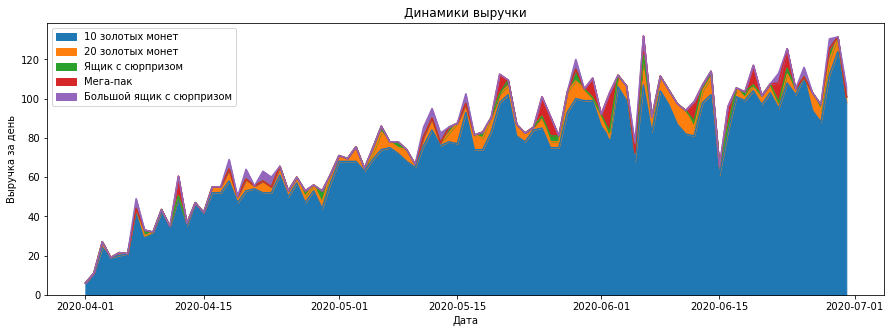

```python
import pandas as pd
from matplotlib import pyplot as plt
import matplotlib.ticker as mtick
import plotly
from plotly import graph_objects as go
plotly.offline.init_notebook_mode(connected=True)
import seaborn as sns
```


<script type="text/javascript">
window.PlotlyConfig = {MathJaxConfig: 'local'};
if (window.MathJax) {MathJax.Hub.Config({SVG: {font: "STIX-Web"}});}
if (typeof require !== 'undefined') {
require.undef("plotly");
requirejs.config({
    paths: {
        'plotly': ['https://cdn.plot.ly/plotly-2.9.0.min']
    }
});
require(['plotly'], function(Plotly) {
    window._Plotly = Plotly;
});
}
</script>


# Задание 1. Загрузите и исследуйте данные

Загрузим и исследуем данные о покупках исобытиях в игре Clash of Clowns.


```python
purchases = pd.read_csv('hw_lesson04_purchases.csv')
purchases.info()
```

    <class 'pandas.core.frame.DataFrame'>
    RangeIndex: 6889 entries, 0 to 6888
    Data columns (total 4 columns):
     #   Column    Non-Null Count  Dtype  
    ---  ------    --------------  -----  
     0   user_id   6889 non-null   object 
     1   event_dt  6889 non-null   object 
     2   revenue   6889 non-null   float64
     3   item      6889 non-null   object 
    dtypes: float64(1), object(3)
    memory usage: 215.4+ KB
    


```python
purchases['revenue'].value_counts()
```


    1.0     6580
    1.5      257
    3.0       24
    5.0       15
    10.0      13
    Name: revenue, dtype: int64


```python
purchases
```


<div>
<style scoped>
    .dataframe tbody tr th:only-of-type {
        vertical-align: middle;
    }

    .dataframe tbody tr th {
        vertical-align: top;
    }

    .dataframe thead th {
        text-align: right;
    }
</style>
<table border="1" class="dataframe">
  <thead>
    <tr style="text-align: right;">
      <th></th>
      <th>user_id</th>
      <th>event_dt</th>
      <th>revenue</th>
      <th>item</th>
    </tr>
  </thead>
  <tbody>
    <tr>
      <th>0</th>
      <td>df0f3327-381</td>
      <td>2020-04-01 05:16:29</td>
      <td>1.0</td>
      <td>10 золотых монет</td>
    </tr>
    <tr>
      <th>1</th>
      <td>df0f3327-381</td>
      <td>2020-04-02 18:32:34</td>
      <td>1.0</td>
      <td>10 золотых монет</td>
    </tr>
    <tr>
      <th>2</th>
      <td>241cb8694b53</td>
      <td>2020-04-02 01:04:57</td>
      <td>1.0</td>
      <td>10 золотых монет</td>
    </tr>
    <tr>
      <th>3</th>
      <td>0c9453440c85</td>
      <td>2020-04-02 11:36:41</td>
      <td>1.0</td>
      <td>10 золотых монет</td>
    </tr>
    <tr>
      <th>4</th>
      <td>96-4377d99ca</td>
      <td>2020-04-02 23:28:18</td>
      <td>1.0</td>
      <td>10 золотых монет</td>
    </tr>
    <tr>
      <th>...</th>
      <td>...</td>
      <td>...</td>
      <td>...</td>
      <td>...</td>
    </tr>
    <tr>
      <th>6884</th>
      <td>9cd8aa06b00b</td>
      <td>2020-06-30 04:10:13</td>
      <td>1.0</td>
      <td>10 золотых монет</td>
    </tr>
    <tr>
      <th>6885</th>
      <td>-f-dbaa-52f0</td>
      <td>2020-06-30 13:12:34</td>
      <td>1.0</td>
      <td>10 золотых монет</td>
    </tr>
    <tr>
      <th>6886</th>
      <td>50d0c5-63801</td>
      <td>2020-06-30 13:43:59</td>
      <td>1.0</td>
      <td>10 золотых монет</td>
    </tr>
    <tr>
      <th>6887</th>
      <td>109af6_d505-</td>
      <td>2020-06-30 08:45:05</td>
      <td>1.0</td>
      <td>10 золотых монет</td>
    </tr>
    <tr>
      <th>6888</th>
      <td>b243584_22c_</td>
      <td>2020-06-30 16:17:04</td>
      <td>1.0</td>
      <td>10 золотых монет</td>
    </tr>
  </tbody>
</table>
<p>6889 rows × 4 columns</p>
</div>


```python
events = pd.read_excel('hw_lesson04_events.xlsx.xlsx')
```


```python
events
```


<div>
<style scoped>
    .dataframe tbody tr th:only-of-type {
        vertical-align: middle;
    }

    .dataframe tbody tr th {
        vertical-align: top;
    }

    .dataframe thead th {
        text-align: right;
    }
</style>
<table border="1" class="dataframe">
  <thead>
    <tr style="text-align: right;">
      <th></th>
      <th>user_id</th>
      <th>event_name</th>
      <th>event_dt</th>
    </tr>
  </thead>
  <tbody>
    <tr>
      <th>0</th>
      <td>--0-b0cbb8-a</td>
      <td>first_game</td>
      <td>2020-06-08 13:46:08</td>
    </tr>
    <tr>
      <th>1</th>
      <td>--0-b0cbb8-a</td>
      <td>first_upgrade</td>
      <td>2020-06-09 15:52:00</td>
    </tr>
    <tr>
      <th>2</th>
      <td>--0-b0cbb8-a</td>
      <td>login</td>
      <td>2020-06-01 23:36:14</td>
    </tr>
    <tr>
      <th>3</th>
      <td>--0-b0cbb8-a</td>
      <td>registration</td>
      <td>2020-06-01 23:36:16</td>
    </tr>
    <tr>
      <th>4</th>
      <td>--0-b0cbb8-a</td>
      <td>tutorial_completed</td>
      <td>2020-06-08 13:46:07</td>
    </tr>
    <tr>
      <th>...</th>
      <td>...</td>
      <td>...</td>
      <td>...</td>
    </tr>
    <tr>
      <th>370369</th>
      <td>9cd8aa06b00b</td>
      <td>purchase</td>
      <td>2020-06-30 04:10:13</td>
    </tr>
    <tr>
      <th>370370</th>
      <td>-f-dbaa-52f0</td>
      <td>purchase</td>
      <td>2020-06-30 13:12:34</td>
    </tr>
    <tr>
      <th>370371</th>
      <td>50d0c5-63801</td>
      <td>purchase</td>
      <td>2020-06-30 13:43:59</td>
    </tr>
    <tr>
      <th>370372</th>
      <td>109af6_d505-</td>
      <td>purchase</td>
      <td>2020-06-30 08:45:05</td>
    </tr>
    <tr>
      <th>370373</th>
      <td>b243584_22c_</td>
      <td>purchase</td>
      <td>2020-06-30 16:17:04</td>
    </tr>
  </tbody>
</table>
<p>370374 rows × 3 columns</p>
</div>


```python
events['event_name'].value_counts()
```


    login                 83185
    registration          79897
    tuturial_started      74348
    tutorial_completed    59857
    first_game            47666
    first_upgrade         17832
    purchase               6889
    friend_invite           700
    Name: event_name, dtype: int64


# Задание 2. Группировка

С помощью groupby построим таблицу, у которой в строках находятся названия купленных предметов (item), а в колонках количество покупок, уникальное число покупателей, общая выручка и медианная цена.


```python
report = purchases.groupby(['item']).agg({'item': 'count', 'user_id': 'nunique', 'revenue': ['sum','median']})
report.index = ['10 золотых монет', '20 золотых монет', 'Ящик c сюрпризом', 'Мега-пак', 'Большой ящик c сюрпризом']
report
```


<div>
<style scoped>
    .dataframe tbody tr th:only-of-type {
        vertical-align: middle;
    }

    .dataframe tbody tr th {
        vertical-align: top;
    }

    .dataframe thead tr th {
        text-align: left;
    }
</style>
<table border="1" class="dataframe">
  <thead>
    <tr>
      <th></th>
      <th>item</th>
      <th>user_id</th>
      <th colspan="2" halign="left">revenue</th>
    </tr>
    <tr>
      <th></th>
      <th>count</th>
      <th>nunique</th>
      <th>sum</th>
      <th>median</th>
    </tr>
  </thead>
  <tbody>
    <tr>
      <th>10 золотых монет</th>
      <td>6580</td>
      <td>1376</td>
      <td>6580.0</td>
      <td>1.0</td>
    </tr>
    <tr>
      <th>20 золотых монет</th>
      <td>257</td>
      <td>219</td>
      <td>385.5</td>
      <td>1.5</td>
    </tr>
    <tr>
      <th>Ящик c сюрпризом</th>
      <td>24</td>
      <td>23</td>
      <td>72.0</td>
      <td>3.0</td>
    </tr>
    <tr>
      <th>Мега-пак</th>
      <td>13</td>
      <td>13</td>
      <td>130.0</td>
      <td>10.0</td>
    </tr>
    <tr>
      <th>Большой ящик c сюрпризом</th>
      <td>15</td>
      <td>15</td>
      <td>75.0</td>
      <td>5.0</td>
    </tr>
  </tbody>
</table>
</div>


Добавьте в таблицу колонки "% от общих покупок" и "% выручки"


```python
report.columns = ['Количество покупок', 'Количество покупателей', 'Выручка', 'Медианная цена']
report
```


<div>
<style scoped>
    .dataframe tbody tr th:only-of-type {
        vertical-align: middle;
    }

    .dataframe tbody tr th {
        vertical-align: top;
    }

    .dataframe thead th {
        text-align: right;
    }
</style>
<table border="1" class="dataframe">
  <thead>
    <tr style="text-align: right;">
      <th></th>
      <th>Количество покупок</th>
      <th>Количество покупателей</th>
      <th>Выручка</th>
      <th>Медианная цена</th>
    </tr>
  </thead>
  <tbody>
    <tr>
      <th>10 золотых монет</th>
      <td>6580</td>
      <td>1376</td>
      <td>6580.0</td>
      <td>1.0</td>
    </tr>
    <tr>
      <th>20 золотых монет</th>
      <td>257</td>
      <td>219</td>
      <td>385.5</td>
      <td>1.5</td>
    </tr>
    <tr>
      <th>Ящик c сюрпризом</th>
      <td>24</td>
      <td>23</td>
      <td>72.0</td>
      <td>3.0</td>
    </tr>
    <tr>
      <th>Мега-пак</th>
      <td>13</td>
      <td>13</td>
      <td>130.0</td>
      <td>10.0</td>
    </tr>
    <tr>
      <th>Большой ящик c сюрпризом</th>
      <td>15</td>
      <td>15</td>
      <td>75.0</td>
      <td>5.0</td>
    </tr>
  </tbody>
</table>
</div>


```python
report['% от общих покупок'] = report['Количество покупок'] / report['Количество покупок'].sum()
report['% выручки'] = report['Выручка'] / report['Выручка'].sum()
report
```


<div>
<style scoped>
    .dataframe tbody tr th:only-of-type {
        vertical-align: middle;
    }

    .dataframe tbody tr th {
        vertical-align: top;
    }

    .dataframe thead th {
        text-align: right;
    }
</style>
<table border="1" class="dataframe">
  <thead>
    <tr style="text-align: right;">
      <th></th>
      <th>Количество покупок</th>
      <th>Количество покупателей</th>
      <th>Выручка</th>
      <th>Медианная цена</th>
      <th>% от общих покупок</th>
      <th>% выручки</th>
    </tr>
  </thead>
  <tbody>
    <tr>
      <th>10 золотых монет</th>
      <td>6580</td>
      <td>1376</td>
      <td>6580.0</td>
      <td>1.0</td>
      <td>0.955146</td>
      <td>0.908526</td>
    </tr>
    <tr>
      <th>20 золотых монет</th>
      <td>257</td>
      <td>219</td>
      <td>385.5</td>
      <td>1.5</td>
      <td>0.037306</td>
      <td>0.053227</td>
    </tr>
    <tr>
      <th>Ящик c сюрпризом</th>
      <td>24</td>
      <td>23</td>
      <td>72.0</td>
      <td>3.0</td>
      <td>0.003484</td>
      <td>0.009941</td>
    </tr>
    <tr>
      <th>Мега-пак</th>
      <td>13</td>
      <td>13</td>
      <td>130.0</td>
      <td>10.0</td>
      <td>0.001887</td>
      <td>0.017950</td>
    </tr>
    <tr>
      <th>Большой ящик c сюрпризом</th>
      <td>15</td>
      <td>15</td>
      <td>75.0</td>
      <td>5.0</td>
      <td>0.002177</td>
      <td>0.010356</td>
    </tr>
  </tbody>
</table>
</div>


```python
report.style.format({'Выручка': '{:.0f}','Медианная цена': '{:.1f}' ,'% от общих покупок': '{:.2%}', '% выручки': '{:.2%}'})
```


<style type="text/css">
</style>
<table id="T_fc359">
  <thead>
    <tr>
      <th class="blank level0" >&nbsp;</th>
      <th id="T_fc359_level0_col0" class="col_heading level0 col0" >Количество покупок</th>
      <th id="T_fc359_level0_col1" class="col_heading level0 col1" >Количество покупателей</th>
      <th id="T_fc359_level0_col2" class="col_heading level0 col2" >Выручка</th>
      <th id="T_fc359_level0_col3" class="col_heading level0 col3" >Медианная цена</th>
      <th id="T_fc359_level0_col4" class="col_heading level0 col4" >% от общих покупок</th>
      <th id="T_fc359_level0_col5" class="col_heading level0 col5" >% выручки</th>
    </tr>
  </thead>
  <tbody>
    <tr>
      <th id="T_fc359_level0_row0" class="row_heading level0 row0" >10 золотых монет</th>
      <td id="T_fc359_row0_col0" class="data row0 col0" >6580</td>
      <td id="T_fc359_row0_col1" class="data row0 col1" >1376</td>
      <td id="T_fc359_row0_col2" class="data row0 col2" >6580</td>
      <td id="T_fc359_row0_col3" class="data row0 col3" >1.0</td>
      <td id="T_fc359_row0_col4" class="data row0 col4" >95.51%</td>
      <td id="T_fc359_row0_col5" class="data row0 col5" >90.85%</td>
    </tr>
    <tr>
      <th id="T_fc359_level0_row1" class="row_heading level0 row1" >20 золотых монет</th>
      <td id="T_fc359_row1_col0" class="data row1 col0" >257</td>
      <td id="T_fc359_row1_col1" class="data row1 col1" >219</td>
      <td id="T_fc359_row1_col2" class="data row1 col2" >386</td>
      <td id="T_fc359_row1_col3" class="data row1 col3" >1.5</td>
      <td id="T_fc359_row1_col4" class="data row1 col4" >3.73%</td>
      <td id="T_fc359_row1_col5" class="data row1 col5" >5.32%</td>
    </tr>
    <tr>
      <th id="T_fc359_level0_row2" class="row_heading level0 row2" >Ящик c сюрпризом</th>
      <td id="T_fc359_row2_col0" class="data row2 col0" >24</td>
      <td id="T_fc359_row2_col1" class="data row2 col1" >23</td>
      <td id="T_fc359_row2_col2" class="data row2 col2" >72</td>
      <td id="T_fc359_row2_col3" class="data row2 col3" >3.0</td>
      <td id="T_fc359_row2_col4" class="data row2 col4" >0.35%</td>
      <td id="T_fc359_row2_col5" class="data row2 col5" >0.99%</td>
    </tr>
    <tr>
      <th id="T_fc359_level0_row3" class="row_heading level0 row3" >Мега-пак</th>
      <td id="T_fc359_row3_col0" class="data row3 col0" >13</td>
      <td id="T_fc359_row3_col1" class="data row3 col1" >13</td>
      <td id="T_fc359_row3_col2" class="data row3 col2" >130</td>
      <td id="T_fc359_row3_col3" class="data row3 col3" >10.0</td>
      <td id="T_fc359_row3_col4" class="data row3 col4" >0.19%</td>
      <td id="T_fc359_row3_col5" class="data row3 col5" >1.79%</td>
    </tr>
    <tr>
      <th id="T_fc359_level0_row4" class="row_heading level0 row4" >Большой ящик c сюрпризом</th>
      <td id="T_fc359_row4_col0" class="data row4 col0" >15</td>
      <td id="T_fc359_row4_col1" class="data row4 col1" >15</td>
      <td id="T_fc359_row4_col2" class="data row4 col2" >75</td>
      <td id="T_fc359_row4_col3" class="data row4 col3" >5.0</td>
      <td id="T_fc359_row4_col4" class="data row4 col4" >0.22%</td>
      <td id="T_fc359_row4_col5" class="data row4 col5" >1.04%</td>
    </tr>
  </tbody>
</table>


Мы видим, что чем больше стоимость предмета, тем реже его покупают пользователи. Самые дешевые покупки приносят более 90% прибыли.

# Задание 3. Сводная таблица

Построим сводную таблицу, у которой в строках находятся даты покупок, в столбцах купленные предметы (item), а на пересечении сумма выручки.


```python
purchases['event_dt'] = pd.to_datetime(purchases['event_dt']).dt.date
purchases
```


<div>
<style scoped>
    .dataframe tbody tr th:only-of-type {
        vertical-align: middle;
    }

    .dataframe tbody tr th {
        vertical-align: top;
    }

    .dataframe thead th {
        text-align: right;
    }
</style>
<table border="1" class="dataframe">
  <thead>
    <tr style="text-align: right;">
      <th></th>
      <th>user_id</th>
      <th>event_dt</th>
      <th>revenue</th>
      <th>item</th>
    </tr>
  </thead>
  <tbody>
    <tr>
      <th>0</th>
      <td>df0f3327-381</td>
      <td>2020-04-01</td>
      <td>1.0</td>
      <td>10 золотых монет</td>
    </tr>
    <tr>
      <th>1</th>
      <td>df0f3327-381</td>
      <td>2020-04-02</td>
      <td>1.0</td>
      <td>10 золотых монет</td>
    </tr>
    <tr>
      <th>2</th>
      <td>241cb8694b53</td>
      <td>2020-04-02</td>
      <td>1.0</td>
      <td>10 золотых монет</td>
    </tr>
    <tr>
      <th>3</th>
      <td>0c9453440c85</td>
      <td>2020-04-02</td>
      <td>1.0</td>
      <td>10 золотых монет</td>
    </tr>
    <tr>
      <th>4</th>
      <td>96-4377d99ca</td>
      <td>2020-04-02</td>
      <td>1.0</td>
      <td>10 золотых монет</td>
    </tr>
    <tr>
      <th>...</th>
      <td>...</td>
      <td>...</td>
      <td>...</td>
      <td>...</td>
    </tr>
    <tr>
      <th>6884</th>
      <td>9cd8aa06b00b</td>
      <td>2020-06-30</td>
      <td>1.0</td>
      <td>10 золотых монет</td>
    </tr>
    <tr>
      <th>6885</th>
      <td>-f-dbaa-52f0</td>
      <td>2020-06-30</td>
      <td>1.0</td>
      <td>10 золотых монет</td>
    </tr>
    <tr>
      <th>6886</th>
      <td>50d0c5-63801</td>
      <td>2020-06-30</td>
      <td>1.0</td>
      <td>10 золотых монет</td>
    </tr>
    <tr>
      <th>6887</th>
      <td>109af6_d505-</td>
      <td>2020-06-30</td>
      <td>1.0</td>
      <td>10 золотых монет</td>
    </tr>
    <tr>
      <th>6888</th>
      <td>b243584_22c_</td>
      <td>2020-06-30</td>
      <td>1.0</td>
      <td>10 золотых монет</td>
    </tr>
  </tbody>
</table>
<p>6889 rows × 4 columns</p>
</div>


```python
report2 = purchases.pivot_table(index ='event_dt', columns ='item',values ='revenue', aggfunc ='sum').fillna(0)
report2.columns = ['10 золотых монет', '20 золотых монет', 'Ящик c сюрпризом', 'Мега-пак', 'Большой ящик c сюрпризом']
report2
```


<div>
<style scoped>
    .dataframe tbody tr th:only-of-type {
        vertical-align: middle;
    }

    .dataframe tbody tr th {
        vertical-align: top;
    }

    .dataframe thead th {
        text-align: right;
    }
</style>
<table border="1" class="dataframe">
  <thead>
    <tr style="text-align: right;">
      <th></th>
      <th>10 золотых монет</th>
      <th>20 золотых монет</th>
      <th>Ящик c сюрпризом</th>
      <th>Мега-пак</th>
      <th>Большой ящик c сюрпризом</th>
    </tr>
    <tr>
      <th>event_dt</th>
      <th></th>
      <th></th>
      <th></th>
      <th></th>
      <th></th>
    </tr>
  </thead>
  <tbody>
    <tr>
      <th>2020-04-01</th>
      <td>6.0</td>
      <td>0.0</td>
      <td>0.0</td>
      <td>0.0</td>
      <td>0.0</td>
    </tr>
    <tr>
      <th>2020-04-02</th>
      <td>11.0</td>
      <td>0.0</td>
      <td>0.0</td>
      <td>0.0</td>
      <td>0.0</td>
    </tr>
    <tr>
      <th>2020-04-03</th>
      <td>24.0</td>
      <td>3.0</td>
      <td>0.0</td>
      <td>0.0</td>
      <td>0.0</td>
    </tr>
    <tr>
      <th>2020-04-04</th>
      <td>19.0</td>
      <td>0.0</td>
      <td>0.0</td>
      <td>0.0</td>
      <td>0.0</td>
    </tr>
    <tr>
      <th>2020-04-05</th>
      <td>20.0</td>
      <td>1.5</td>
      <td>0.0</td>
      <td>0.0</td>
      <td>0.0</td>
    </tr>
    <tr>
      <th>...</th>
      <td>...</td>
      <td>...</td>
      <td>...</td>
      <td>...</td>
      <td>...</td>
    </tr>
    <tr>
      <th>2020-06-26</th>
      <td>94.0</td>
      <td>9.0</td>
      <td>0.0</td>
      <td>0.0</td>
      <td>0.0</td>
    </tr>
    <tr>
      <th>2020-06-27</th>
      <td>88.0</td>
      <td>6.0</td>
      <td>3.0</td>
      <td>0.0</td>
      <td>0.0</td>
    </tr>
    <tr>
      <th>2020-06-28</th>
      <td>112.0</td>
      <td>7.5</td>
      <td>6.0</td>
      <td>0.0</td>
      <td>5.0</td>
    </tr>
    <tr>
      <th>2020-06-29</th>
      <td>124.0</td>
      <td>7.5</td>
      <td>0.0</td>
      <td>0.0</td>
      <td>0.0</td>
    </tr>
    <tr>
      <th>2020-06-30</th>
      <td>98.0</td>
      <td>3.0</td>
      <td>0.0</td>
      <td>0.0</td>
      <td>5.0</td>
    </tr>
  </tbody>
</table>
<p>91 rows × 5 columns</p>
</div>


Построим график динамики выручки с разбивкой по типам купленных предметов. График имеет тип "область с накоплением"


```python
report2.plot.area(figsize=(15,5))
plt.title('Динамики выручки'), plt.xlabel('Дата'), plt.ylabel('Выручка за день');
```


    

    


Наблюдаем рост выручки с течением времени, а также недлельную цикличность. На протяжении всего времени наблюдений item 10 золотых монет остается самым прибыльным.

  # Задание 4. Построение воронки

С помощью groupby и датафрейма событий построим таблицу воронки событий, содержащую колонки "Число событий", "Уникальные пользователи", "% от первого шага воронки".


```python
report3 = events.groupby('event_name').agg({'user_id': ['count', 'nunique']})
report3.columns = ['События', 'Уникальные пользователи']
report3 = report3.sort_values(by ='Уникальные пользователи', ascending = False)
report3['%'] = report3['Уникальные пользователи'] / report3['Уникальные пользователи'].values[0]
report3.style.format({'%': '{:.2%}'})
```


<style type="text/css">
</style>
<table id="T_0257b">
  <thead>
    <tr>
      <th class="blank level0" >&nbsp;</th>
      <th id="T_0257b_level0_col0" class="col_heading level0 col0" >События</th>
      <th id="T_0257b_level0_col1" class="col_heading level0 col1" >Уникальные пользователи</th>
      <th id="T_0257b_level0_col2" class="col_heading level0 col2" >%</th>
    </tr>
    <tr>
      <th class="index_name level0" >event_name</th>
      <th class="blank col0" >&nbsp;</th>
      <th class="blank col1" >&nbsp;</th>
      <th class="blank col2" >&nbsp;</th>
    </tr>
  </thead>
  <tbody>
    <tr>
      <th id="T_0257b_level0_row0" class="row_heading level0 row0" >login</th>
      <td id="T_0257b_row0_col0" class="data row0 col0" >83185</td>
      <td id="T_0257b_row0_col1" class="data row0 col1" >83185</td>
      <td id="T_0257b_row0_col2" class="data row0 col2" >100.00%</td>
    </tr>
    <tr>
      <th id="T_0257b_level0_row1" class="row_heading level0 row1" >registration</th>
      <td id="T_0257b_row1_col0" class="data row1 col0" >79897</td>
      <td id="T_0257b_row1_col1" class="data row1 col1" >79897</td>
      <td id="T_0257b_row1_col2" class="data row1 col2" >96.05%</td>
    </tr>
    <tr>
      <th id="T_0257b_level0_row2" class="row_heading level0 row2" >tuturial_started</th>
      <td id="T_0257b_row2_col0" class="data row2 col0" >74348</td>
      <td id="T_0257b_row2_col1" class="data row2 col1" >74348</td>
      <td id="T_0257b_row2_col2" class="data row2 col2" >89.38%</td>
    </tr>
    <tr>
      <th id="T_0257b_level0_row3" class="row_heading level0 row3" >tutorial_completed</th>
      <td id="T_0257b_row3_col0" class="data row3 col0" >59857</td>
      <td id="T_0257b_row3_col1" class="data row3 col1" >59857</td>
      <td id="T_0257b_row3_col2" class="data row3 col2" >71.96%</td>
    </tr>
    <tr>
      <th id="T_0257b_level0_row4" class="row_heading level0 row4" >first_game</th>
      <td id="T_0257b_row4_col0" class="data row4 col0" >47666</td>
      <td id="T_0257b_row4_col1" class="data row4 col1" >47666</td>
      <td id="T_0257b_row4_col2" class="data row4 col2" >57.30%</td>
    </tr>
    <tr>
      <th id="T_0257b_level0_row5" class="row_heading level0 row5" >first_upgrade</th>
      <td id="T_0257b_row5_col0" class="data row5 col0" >17832</td>
      <td id="T_0257b_row5_col1" class="data row5 col1" >17832</td>
      <td id="T_0257b_row5_col2" class="data row5 col2" >21.44%</td>
    </tr>
    <tr>
      <th id="T_0257b_level0_row6" class="row_heading level0 row6" >purchase</th>
      <td id="T_0257b_row6_col0" class="data row6 col0" >6889</td>
      <td id="T_0257b_row6_col1" class="data row6 col1" >1385</td>
      <td id="T_0257b_row6_col2" class="data row6 col2" >1.66%</td>
    </tr>
    <tr>
      <th id="T_0257b_level0_row7" class="row_heading level0 row7" >friend_invite</th>
      <td id="T_0257b_row7_col0" class="data row7 col0" >700</td>
      <td id="T_0257b_row7_col1" class="data row7 col1" >700</td>
      <td id="T_0257b_row7_col2" class="data row7 col2" >0.84%</td>
    </tr>
  </tbody>
</table>


Построим воронку в виде линейного графика, столбчаой диаграммы и интерактивного изображения.


```python
ax = report3['%'].plot(figsize = (16, 9), grid =True)
ax.yaxis.set_major_formatter(mtick.PercentFormatter(1))
plt.xticks(range(len(report3)), report3.index.values, rotation =45)
for x, y in zip(range(len(report3)), report3['%']):
    ax.annotate('{:.2%}'.format(y), xy = (x, y), color ='grey')
    
plt.xlabel('Шаг воронки'), plt.ylabel('Коверсия, %'), plt.title('Воронка событий');
```


    

    


```python
colors = ['yellow' if x < 0.85 and x > 0.10 else 'red' if x < 0.10 else 'green' for x in report3['%'].values]
# colors = [x[1] if report3['%'].values[x[0]] > 0.1 else'red' for x in enumerate(colors)]

plt.figure(figsize = (15, 5))
ax = sns.barplot(x = report3.index.values, y = report3['%'], palette = colors, alpha =0.5)
ax.yaxis.set_major_formatter(mtick.PercentFormatter(1))

for x, y, z in zip(range(len(report3)), report3['%'], report3['Уникальные пользователи']):
    ax.annotate('{:.0%}'.format(y), xy = (x, y + 0.01), color ='grey',  ha ='center')
    ax.annotate('{}'.format(z), xy = (x, 0 + 0.1), color ='black',  ha ='center')

plt.xlabel('Шаг воронки'), plt.ylabel('Конверсия, %'), plt.title('Воронка событий');

```


    

    


```python
fig = go.Figure()

fig.add_trace(go.Funnel(y = report3.index.values, x = report3['Уникальные пользователи'], textinfo = "value+percent initial"))
fig.update_layout(title ='Воронка событий', yaxis_title = 'Шаги воронки',)

fig.show()
```


<div>                            <div id="10d86b48-b2df-4ae4-9351-138630502608" class="plotly-graph-div" style="height:525px; width:100%;"></div>            <script type="text/javascript">                require(["plotly"], function(Plotly) {                    window.PLOTLYENV=window.PLOTLYENV || {};                                    if (document.getElementById("10d86b48-b2df-4ae4-9351-138630502608")) {                    Plotly.newPlot(                        "10d86b48-b2df-4ae4-9351-138630502608",                        [{"textinfo":"value+percent initial","x":[83185,79897,74348,59857,47666,17832,1385,700],"y":["login","registration","tuturial_started","tutorial_completed","first_game","first_upgrade","purchase","friend_invite"],"type":"funnel"}],                        {"template":{"data":{"bar":[{"error_x":{"color":"#2a3f5f"},"error_y":{"color":"#2a3f5f"},"marker":{"line":{"color":"#E5ECF6","width":0.5},"pattern":{"fillmode":"overlay","size":10,"solidity":0.2}},"type":"bar"}],"barpolar":[{"marker":{"line":{"color":"#E5ECF6","width":0.5},"pattern":{"fillmode":"overlay","size":10,"solidity":0.2}},"type":"barpolar"}],"carpet":[{"aaxis":{"endlinecolor":"#2a3f5f","gridcolor":"white","linecolor":"white","minorgridcolor":"white","startlinecolor":"#2a3f5f"},"baxis":{"endlinecolor":"#2a3f5f","gridcolor":"white","linecolor":"white","minorgridcolor":"white","startlinecolor":"#2a3f5f"},"type":"carpet"}],"choropleth":[{"colorbar":{"outlinewidth":0,"ticks":""},"type":"choropleth"}],"contour":[{"colorbar":{"outlinewidth":0,"ticks":""},"colorscale":[[0.0,"#0d0887"],[0.1111111111111111,"#46039f"],[0.2222222222222222,"#7201a8"],[0.3333333333333333,"#9c179e"],[0.4444444444444444,"#bd3786"],[0.5555555555555556,"#d8576b"],[0.6666666666666666,"#ed7953"],[0.7777777777777778,"#fb9f3a"],[0.8888888888888888,"#fdca26"],[1.0,"#f0f921"]],"type":"contour"}],"contourcarpet":[{"colorbar":{"outlinewidth":0,"ticks":""},"type":"contourcarpet"}],"heatmap":[{"colorbar":{"outlinewidth":0,"ticks":""},"colorscale":[[0.0,"#0d0887"],[0.1111111111111111,"#46039f"],[0.2222222222222222,"#7201a8"],[0.3333333333333333,"#9c179e"],[0.4444444444444444,"#bd3786"],[0.5555555555555556,"#d8576b"],[0.6666666666666666,"#ed7953"],[0.7777777777777778,"#fb9f3a"],[0.8888888888888888,"#fdca26"],[1.0,"#f0f921"]],"type":"heatmap"}],"heatmapgl":[{"colorbar":{"outlinewidth":0,"ticks":""},"colorscale":[[0.0,"#0d0887"],[0.1111111111111111,"#46039f"],[0.2222222222222222,"#7201a8"],[0.3333333333333333,"#9c179e"],[0.4444444444444444,"#bd3786"],[0.5555555555555556,"#d8576b"],[0.6666666666666666,"#ed7953"],[0.7777777777777778,"#fb9f3a"],[0.8888888888888888,"#fdca26"],[1.0,"#f0f921"]],"type":"heatmapgl"}],"histogram":[{"marker":{"pattern":{"fillmode":"overlay","size":10,"solidity":0.2}},"type":"histogram"}],"histogram2d":[{"colorbar":{"outlinewidth":0,"ticks":""},"colorscale":[[0.0,"#0d0887"],[0.1111111111111111,"#46039f"],[0.2222222222222222,"#7201a8"],[0.3333333333333333,"#9c179e"],[0.4444444444444444,"#bd3786"],[0.5555555555555556,"#d8576b"],[0.6666666666666666,"#ed7953"],[0.7777777777777778,"#fb9f3a"],[0.8888888888888888,"#fdca26"],[1.0,"#f0f921"]],"type":"histogram2d"}],"histogram2dcontour":[{"colorbar":{"outlinewidth":0,"ticks":""},"colorscale":[[0.0,"#0d0887"],[0.1111111111111111,"#46039f"],[0.2222222222222222,"#7201a8"],[0.3333333333333333,"#9c179e"],[0.4444444444444444,"#bd3786"],[0.5555555555555556,"#d8576b"],[0.6666666666666666,"#ed7953"],[0.7777777777777778,"#fb9f3a"],[0.8888888888888888,"#fdca26"],[1.0,"#f0f921"]],"type":"histogram2dcontour"}],"mesh3d":[{"colorbar":{"outlinewidth":0,"ticks":""},"type":"mesh3d"}],"parcoords":[{"line":{"colorbar":{"outlinewidth":0,"ticks":""}},"type":"parcoords"}],"pie":[{"automargin":true,"type":"pie"}],"scatter":[{"marker":{"colorbar":{"outlinewidth":0,"ticks":""}},"type":"scatter"}],"scatter3d":[{"line":{"colorbar":{"outlinewidth":0,"ticks":""}},"marker":{"colorbar":{"outlinewidth":0,"ticks":""}},"type":"scatter3d"}],"scattercarpet":[{"marker":{"colorbar":{"outlinewidth":0,"ticks":""}},"type":"scattercarpet"}],"scattergeo":[{"marker":{"colorbar":{"outlinewidth":0,"ticks":""}},"type":"scattergeo"}],"scattergl":[{"marker":{"colorbar":{"outlinewidth":0,"ticks":""}},"type":"scattergl"}],"scattermapbox":[{"marker":{"colorbar":{"outlinewidth":0,"ticks":""}},"type":"scattermapbox"}],"scatterpolar":[{"marker":{"colorbar":{"outlinewidth":0,"ticks":""}},"type":"scatterpolar"}],"scatterpolargl":[{"marker":{"colorbar":{"outlinewidth":0,"ticks":""}},"type":"scatterpolargl"}],"scatterternary":[{"marker":{"colorbar":{"outlinewidth":0,"ticks":""}},"type":"scatterternary"}],"surface":[{"colorbar":{"outlinewidth":0,"ticks":""},"colorscale":[[0.0,"#0d0887"],[0.1111111111111111,"#46039f"],[0.2222222222222222,"#7201a8"],[0.3333333333333333,"#9c179e"],[0.4444444444444444,"#bd3786"],[0.5555555555555556,"#d8576b"],[0.6666666666666666,"#ed7953"],[0.7777777777777778,"#fb9f3a"],[0.8888888888888888,"#fdca26"],[1.0,"#f0f921"]],"type":"surface"}],"table":[{"cells":{"fill":{"color":"#EBF0F8"},"line":{"color":"white"}},"header":{"fill":{"color":"#C8D4E3"},"line":{"color":"white"}},"type":"table"}]},"layout":{"annotationdefaults":{"arrowcolor":"#2a3f5f","arrowhead":0,"arrowwidth":1},"autotypenumbers":"strict","coloraxis":{"colorbar":{"outlinewidth":0,"ticks":""}},"colorscale":{"diverging":[[0,"#8e0152"],[0.1,"#c51b7d"],[0.2,"#de77ae"],[0.3,"#f1b6da"],[0.4,"#fde0ef"],[0.5,"#f7f7f7"],[0.6,"#e6f5d0"],[0.7,"#b8e186"],[0.8,"#7fbc41"],[0.9,"#4d9221"],[1,"#276419"]],"sequential":[[0.0,"#0d0887"],[0.1111111111111111,"#46039f"],[0.2222222222222222,"#7201a8"],[0.3333333333333333,"#9c179e"],[0.4444444444444444,"#bd3786"],[0.5555555555555556,"#d8576b"],[0.6666666666666666,"#ed7953"],[0.7777777777777778,"#fb9f3a"],[0.8888888888888888,"#fdca26"],[1.0,"#f0f921"]],"sequentialminus":[[0.0,"#0d0887"],[0.1111111111111111,"#46039f"],[0.2222222222222222,"#7201a8"],[0.3333333333333333,"#9c179e"],[0.4444444444444444,"#bd3786"],[0.5555555555555556,"#d8576b"],[0.6666666666666666,"#ed7953"],[0.7777777777777778,"#fb9f3a"],[0.8888888888888888,"#fdca26"],[1.0,"#f0f921"]]},"colorway":["#636efa","#EF553B","#00cc96","#ab63fa","#FFA15A","#19d3f3","#FF6692","#B6E880","#FF97FF","#FECB52"],"font":{"color":"#2a3f5f"},"geo":{"bgcolor":"white","lakecolor":"white","landcolor":"#E5ECF6","showlakes":true,"showland":true,"subunitcolor":"white"},"hoverlabel":{"align":"left"},"hovermode":"closest","mapbox":{"style":"light"},"paper_bgcolor":"white","plot_bgcolor":"#E5ECF6","polar":{"angularaxis":{"gridcolor":"white","linecolor":"white","ticks":""},"bgcolor":"#E5ECF6","radialaxis":{"gridcolor":"white","linecolor":"white","ticks":""}},"scene":{"xaxis":{"backgroundcolor":"#E5ECF6","gridcolor":"white","gridwidth":2,"linecolor":"white","showbackground":true,"ticks":"","zerolinecolor":"white"},"yaxis":{"backgroundcolor":"#E5ECF6","gridcolor":"white","gridwidth":2,"linecolor":"white","showbackground":true,"ticks":"","zerolinecolor":"white"},"zaxis":{"backgroundcolor":"#E5ECF6","gridcolor":"white","gridwidth":2,"linecolor":"white","showbackground":true,"ticks":"","zerolinecolor":"white"}},"shapedefaults":{"line":{"color":"#2a3f5f"}},"ternary":{"aaxis":{"gridcolor":"white","linecolor":"white","ticks":""},"baxis":{"gridcolor":"white","linecolor":"white","ticks":""},"bgcolor":"#E5ECF6","caxis":{"gridcolor":"white","linecolor":"white","ticks":""}},"title":{"x":0.05},"xaxis":{"automargin":true,"gridcolor":"white","linecolor":"white","ticks":"","title":{"standoff":15},"zerolinecolor":"white","zerolinewidth":2},"yaxis":{"automargin":true,"gridcolor":"white","linecolor":"white","ticks":"","title":{"standoff":15},"zerolinecolor":"white","zerolinewidth":2}}},"title":{"text":"\u0412\u043e\u0440\u043e\u043d\u043a\u0430 \u0441\u043e\u0431\u044b\u0442\u0438\u0439"},"yaxis":{"title":{"text":"\u0428\u0430\u0433\u0438 \u0432\u043e\u0440\u043e\u043d\u043a\u0438"}}},                        {"responsive": true}                    ).then(function(){

var gd = document.getElementById('10d86b48-b2df-4ae4-9351-138630502608');
var x = new MutationObserver(function (mutations, observer) {{
        var display = window.getComputedStyle(gd).display;
        if (!display || display === 'none') {{
            console.log([gd, 'removed!']);
            Plotly.purge(gd);
            observer.disconnect();
        }}
}});

// Listen for the removal of the full notebook cells
var notebookContainer = gd.closest('#notebook-container');
if (notebookContainer) {{
    x.observe(notebookContainer, {childList: true});
}}

// Listen for the clearing of the current output cell
var outputEl = gd.closest('.output');
if (outputEl) {{
    x.observe(outputEl, {childList: true});
}}

                        })                };                });            </script>        </div>


Мы видим, что лишб небольшая доля пользователей 2% совершает покупки.

# Задание 5. Построение воронки

Построить круговую диаграмму (pie chart) для выручки с разбивкой по item.


```python
report
```


<div>
<style scoped>
    .dataframe tbody tr th:only-of-type {
        vertical-align: middle;
    }

    .dataframe tbody tr th {
        vertical-align: top;
    }

    .dataframe thead th {
        text-align: right;
    }
</style>
<table border="1" class="dataframe">
  <thead>
    <tr style="text-align: right;">
      <th></th>
      <th>Количество покупок</th>
      <th>Количество покупателей</th>
      <th>Выручка</th>
      <th>Медианная цена</th>
      <th>% от общих покупок</th>
      <th>% выручки</th>
    </tr>
  </thead>
  <tbody>
    <tr>
      <th>10 золотых монет</th>
      <td>6580</td>
      <td>1376</td>
      <td>6580.0</td>
      <td>1.0</td>
      <td>0.955146</td>
      <td>0.908526</td>
    </tr>
    <tr>
      <th>20 золотых монет</th>
      <td>257</td>
      <td>219</td>
      <td>385.5</td>
      <td>1.5</td>
      <td>0.037306</td>
      <td>0.053227</td>
    </tr>
    <tr>
      <th>Ящик c сюрпризом</th>
      <td>24</td>
      <td>23</td>
      <td>72.0</td>
      <td>3.0</td>
      <td>0.003484</td>
      <td>0.009941</td>
    </tr>
    <tr>
      <th>Мега-пак</th>
      <td>13</td>
      <td>13</td>
      <td>130.0</td>
      <td>10.0</td>
      <td>0.001887</td>
      <td>0.017950</td>
    </tr>
    <tr>
      <th>Большой ящик c сюрпризом</th>
      <td>15</td>
      <td>15</td>
      <td>75.0</td>
      <td>5.0</td>
      <td>0.002177</td>
      <td>0.010356</td>
    </tr>
  </tbody>
</table>
</div>


```python
report.plot.pie(y = '% выручки', figsize=(10, 10))
plt.ylabel('Коверсия, %'), plt.title('Круговая диаграмма');
```


    

    

