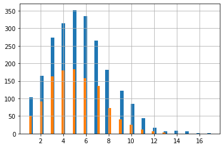

```python
import pandas as pd
from matplotlib import pyplot as plt
import matplotlib.ticker as mtick
import plotly
from plotly import graph_objects as go
plotly.offline.init_notebook_mode(connected=True)
import seaborn as sns
```


<script type="text/javascript">
window.PlotlyConfig = {MathJaxConfig: 'local'};
if (window.MathJax) {MathJax.Hub.Config({SVG: {font: "STIX-Web"}});}
if (typeof require !== 'undefined') {
require.undef("plotly");
requirejs.config({
    paths: {
        'plotly': ['https://cdn.plot.ly/plotly-2.9.0.min']
    }
});
require(['plotly'], function(Plotly) {
    window._Plotly = Plotly;
});
}
</script>


# Задание 1. Загрузите и исследуйте данные

В этом задании нашей целью будет проверить несколько бизнес-гипотез с помощью статистических тестов. Загрузим и изучим данные.


```python
events = pd.read_excel('hw_lesson05_events.xlsx.xlsx')
events.info()
events
```

    <class 'pandas.core.frame.DataFrame'>
    RangeIndex: 370374 entries, 0 to 370373
    Data columns (total 4 columns):
     #   Column       Non-Null Count   Dtype         
    ---  ------       --------------   -----         
     0   user_id      370374 non-null  object        
     1   event_name   370374 non-null  object        
     2   event_dt     370374 non-null  datetime64[ns]
     3   acq_channel  370374 non-null  object        
    dtypes: datetime64[ns](1), object(3)
    memory usage: 11.3+ MB
    


<div>
<style scoped>
    .dataframe tbody tr th:only-of-type {
        vertical-align: middle;
    }

    .dataframe tbody tr th {
        vertical-align: top;
    }

    .dataframe thead th {
        text-align: right;
    }
</style>
<table border="1" class="dataframe">
  <thead>
    <tr style="text-align: right;">
      <th></th>
      <th>user_id</th>
      <th>event_name</th>
      <th>event_dt</th>
      <th>acq_channel</th>
    </tr>
  </thead>
  <tbody>
    <tr>
      <th>0</th>
      <td>--0-b0cbb8-a</td>
      <td>first_game</td>
      <td>2020-06-08 13:46:08</td>
      <td>GameAds</td>
    </tr>
    <tr>
      <th>1</th>
      <td>--0-b0cbb8-a</td>
      <td>first_upgrade</td>
      <td>2020-06-09 15:52:00</td>
      <td>GameAds</td>
    </tr>
    <tr>
      <th>2</th>
      <td>--0-b0cbb8-a</td>
      <td>login</td>
      <td>2020-06-01 23:36:14</td>
      <td>GameAds</td>
    </tr>
    <tr>
      <th>3</th>
      <td>--0-b0cbb8-a</td>
      <td>registration</td>
      <td>2020-06-01 23:36:16</td>
      <td>GameAds</td>
    </tr>
    <tr>
      <th>4</th>
      <td>--0-b0cbb8-a</td>
      <td>tutorial_completed</td>
      <td>2020-06-08 13:46:07</td>
      <td>GameAds</td>
    </tr>
    <tr>
      <th>...</th>
      <td>...</td>
      <td>...</td>
      <td>...</td>
      <td>...</td>
    </tr>
    <tr>
      <th>370369</th>
      <td>fffa52af06d-</td>
      <td>tuturial_started</td>
      <td>2020-06-19 10:48:31</td>
      <td>BrainPlus</td>
    </tr>
    <tr>
      <th>370370</th>
      <td>fffa9419ccf6</td>
      <td>login</td>
      <td>2020-06-06 18:41:32</td>
      <td>BrainPlus</td>
    </tr>
    <tr>
      <th>370371</th>
      <td>fffa9419ccf6</td>
      <td>registration</td>
      <td>2020-06-06 18:41:31</td>
      <td>BrainPlus</td>
    </tr>
    <tr>
      <th>370372</th>
      <td>fffa9419ccf6</td>
      <td>tutorial_completed</td>
      <td>2020-06-06 18:41:33</td>
      <td>BrainPlus</td>
    </tr>
    <tr>
      <th>370373</th>
      <td>fffa9419ccf6</td>
      <td>tuturial_started</td>
      <td>2020-06-06 18:41:35</td>
      <td>BrainPlus</td>
    </tr>
  </tbody>
</table>
<p>370374 rows × 4 columns</p>
</div>


```python
events.describe()
```

    C:\Users\79110\AppData\Local\Temp\ipykernel_2216\24332620.py:1: FutureWarning:
    
    Treating datetime data as categorical rather than numeric in `.describe` is deprecated and will be removed in a future version of pandas. Specify `datetime_is_numeric=True` to silence this warning and adopt the future behavior now.
    
    


<div>
<style scoped>
    .dataframe tbody tr th:only-of-type {
        vertical-align: middle;
    }

    .dataframe tbody tr th {
        vertical-align: top;
    }

    .dataframe thead th {
        text-align: right;
    }
</style>
<table border="1" class="dataframe">
  <thead>
    <tr style="text-align: right;">
      <th></th>
      <th>user_id</th>
      <th>event_name</th>
      <th>event_dt</th>
      <th>acq_channel</th>
    </tr>
  </thead>
  <tbody>
    <tr>
      <th>count</th>
      <td>370374</td>
      <td>370374</td>
      <td>370374</td>
      <td>370374</td>
    </tr>
    <tr>
      <th>unique</th>
      <td>83185</td>
      <td>8</td>
      <td>294663</td>
      <td>4</td>
    </tr>
    <tr>
      <th>top</th>
      <td>513_16ad5-3_</td>
      <td>login</td>
      <td>2020-06-30 09:04:46</td>
      <td>BrainPlus</td>
    </tr>
    <tr>
      <th>freq</th>
      <td>23</td>
      <td>83185</td>
      <td>11</td>
      <td>188270</td>
    </tr>
    <tr>
      <th>first</th>
      <td>NaN</td>
      <td>NaN</td>
      <td>2020-04-01 00:00:58</td>
      <td>NaN</td>
    </tr>
    <tr>
      <th>last</th>
      <td>NaN</td>
      <td>NaN</td>
      <td>2020-06-30 23:58:50</td>
      <td>NaN</td>
    </tr>
  </tbody>
</table>
</div>


```python
purchases = pd.read_excel('lesson05_purchases.xlsx')
purchases.info()
purchases
```

    <class 'pandas.core.frame.DataFrame'>
    RangeIndex: 18232 entries, 0 to 18231
    Data columns (total 4 columns):
     #   Column      Non-Null Count  Dtype         
    ---  ------      --------------  -----         
     0   user_id     18232 non-null  object        
     1   event_dt    18232 non-null  datetime64[ns]
     2   revenue     18232 non-null  float64       
     3   ad_network  18232 non-null  object        
    dtypes: datetime64[ns](1), float64(1), object(2)
    memory usage: 569.9+ KB
    


<div>
<style scoped>
    .dataframe tbody tr th:only-of-type {
        vertical-align: middle;
    }

    .dataframe tbody tr th {
        vertical-align: top;
    }

    .dataframe thead th {
        text-align: right;
    }
</style>
<table border="1" class="dataframe">
  <thead>
    <tr style="text-align: right;">
      <th></th>
      <th>user_id</th>
      <th>event_dt</th>
      <th>revenue</th>
      <th>ad_network</th>
    </tr>
  </thead>
  <tbody>
    <tr>
      <th>0</th>
      <td>fb1b6f9ddc3ddd6d</td>
      <td>2021-02-01 10:26:57</td>
      <td>4.99</td>
      <td>FB</td>
    </tr>
    <tr>
      <th>1</th>
      <td>fb1b6f9ddc3ddd6d</td>
      <td>2021-02-06 22:15:05</td>
      <td>4.99</td>
      <td>FB</td>
    </tr>
    <tr>
      <th>2</th>
      <td>fb1b6f9ddc3ddd6d</td>
      <td>2021-02-19 04:36:59</td>
      <td>4.99</td>
      <td>FB</td>
    </tr>
    <tr>
      <th>3</th>
      <td>fb1b6f9ddc3ddd6d</td>
      <td>2021-02-26 21:14:23</td>
      <td>4.99</td>
      <td>FB</td>
    </tr>
    <tr>
      <th>4</th>
      <td>fb1b6f9ddc3ddd6d</td>
      <td>2021-03-04 21:03:59</td>
      <td>4.99</td>
      <td>FB</td>
    </tr>
    <tr>
      <th>...</th>
      <td>...</td>
      <td>...</td>
      <td>...</td>
      <td>...</td>
    </tr>
    <tr>
      <th>18227</th>
      <td>41a6960b610cd152</td>
      <td>2021-06-08 15:56:50</td>
      <td>4.99</td>
      <td>Instagroom</td>
    </tr>
    <tr>
      <th>18228</th>
      <td>33927ac261f94ba5</td>
      <td>2021-06-08 15:42:06</td>
      <td>4.99</td>
      <td>Instagroom</td>
    </tr>
    <tr>
      <th>18229</th>
      <td>7d3453c718fb492d</td>
      <td>2021-06-12 13:47:23</td>
      <td>4.99</td>
      <td>Instagroom</td>
    </tr>
    <tr>
      <th>18230</th>
      <td>7d3453c718fb492d</td>
      <td>2021-06-18 20:21:15</td>
      <td>4.99</td>
      <td>Instagroom</td>
    </tr>
    <tr>
      <th>18231</th>
      <td>72f6356f33340124</td>
      <td>2021-06-14 15:30:35</td>
      <td>4.99</td>
      <td>Instagroom</td>
    </tr>
  </tbody>
</table>
<p>18232 rows × 4 columns</p>
</div>


```python
purchases.describe()
```


<div>
<style scoped>
    .dataframe tbody tr th:only-of-type {
        vertical-align: middle;
    }

    .dataframe tbody tr th {
        vertical-align: top;
    }

    .dataframe thead th {
        text-align: right;
    }
</style>
<table border="1" class="dataframe">
  <thead>
    <tr style="text-align: right;">
      <th></th>
      <th>revenue</th>
    </tr>
  </thead>
  <tbody>
    <tr>
      <th>count</th>
      <td>18232.000000</td>
    </tr>
    <tr>
      <th>mean</th>
      <td>5.503273</td>
    </tr>
    <tr>
      <th>std</th>
      <td>4.070068</td>
    </tr>
    <tr>
      <th>min</th>
      <td>4.990000</td>
    </tr>
    <tr>
      <th>25%</th>
      <td>4.990000</td>
    </tr>
    <tr>
      <th>50%</th>
      <td>4.990000</td>
    </tr>
    <tr>
      <th>75%</th>
      <td>4.990000</td>
    </tr>
    <tr>
      <th>max</th>
      <td>49.990000</td>
    </tr>
  </tbody>
</table>
</div>


С помощью сводной таблицы изучим различия воронки событий по разным рекламным источникам.


```python
report1 = events.pivot_table(index = 'event_name', columns = 'acq_channel', values ='user_id', aggfunc ='nunique').fillna(0)
report1
```


<div>
<style scoped>
    .dataframe tbody tr th:only-of-type {
        vertical-align: middle;
    }

    .dataframe tbody tr th {
        vertical-align: top;
    }

    .dataframe thead th {
        text-align: right;
    }
</style>
<table border="1" class="dataframe">
  <thead>
    <tr style="text-align: right;">
      <th>acq_channel</th>
      <th>BrainPlus</th>
      <th>GameAds</th>
      <th>JetAds</th>
      <th>SenseAds</th>
    </tr>
    <tr>
      <th>event_name</th>
      <th></th>
      <th></th>
      <th></th>
      <th></th>
    </tr>
  </thead>
  <tbody>
    <tr>
      <th>first_game</th>
      <td>21700</td>
      <td>12742</td>
      <td>8935</td>
      <td>4289</td>
    </tr>
    <tr>
      <th>first_upgrade</th>
      <td>4975</td>
      <td>6691</td>
      <td>3139</td>
      <td>3027</td>
    </tr>
    <tr>
      <th>friend_invite</th>
      <td>76</td>
      <td>306</td>
      <td>74</td>
      <td>244</td>
    </tr>
    <tr>
      <th>login</th>
      <td>46433</td>
      <td>19965</td>
      <td>11783</td>
      <td>5004</td>
    </tr>
    <tr>
      <th>purchase</th>
      <td>448</td>
      <td>370</td>
      <td>360</td>
      <td>207</td>
    </tr>
    <tr>
      <th>registration</th>
      <td>43893</td>
      <td>19453</td>
      <td>11589</td>
      <td>4962</td>
    </tr>
    <tr>
      <th>tutorial_completed</th>
      <td>29823</td>
      <td>15346</td>
      <td>10112</td>
      <td>4576</td>
    </tr>
    <tr>
      <th>tuturial_started</th>
      <td>39456</td>
      <td>18757</td>
      <td>11231</td>
      <td>4904</td>
    </tr>
  </tbody>
</table>
</div>


```python
report = report1.sort_values(by = 'BrainPlus', ascending = False)
report
```


<div>
<style scoped>
    .dataframe tbody tr th:only-of-type {
        vertical-align: middle;
    }

    .dataframe tbody tr th {
        vertical-align: top;
    }

    .dataframe thead th {
        text-align: right;
    }
</style>
<table border="1" class="dataframe">
  <thead>
    <tr style="text-align: right;">
      <th>acq_channel</th>
      <th>BrainPlus</th>
      <th>GameAds</th>
      <th>JetAds</th>
      <th>SenseAds</th>
    </tr>
    <tr>
      <th>event_name</th>
      <th></th>
      <th></th>
      <th></th>
      <th></th>
    </tr>
  </thead>
  <tbody>
    <tr>
      <th>login</th>
      <td>46433</td>
      <td>19965</td>
      <td>11783</td>
      <td>5004</td>
    </tr>
    <tr>
      <th>registration</th>
      <td>43893</td>
      <td>19453</td>
      <td>11589</td>
      <td>4962</td>
    </tr>
    <tr>
      <th>tuturial_started</th>
      <td>39456</td>
      <td>18757</td>
      <td>11231</td>
      <td>4904</td>
    </tr>
    <tr>
      <th>tutorial_completed</th>
      <td>29823</td>
      <td>15346</td>
      <td>10112</td>
      <td>4576</td>
    </tr>
    <tr>
      <th>first_game</th>
      <td>21700</td>
      <td>12742</td>
      <td>8935</td>
      <td>4289</td>
    </tr>
    <tr>
      <th>first_upgrade</th>
      <td>4975</td>
      <td>6691</td>
      <td>3139</td>
      <td>3027</td>
    </tr>
    <tr>
      <th>purchase</th>
      <td>448</td>
      <td>370</td>
      <td>360</td>
      <td>207</td>
    </tr>
    <tr>
      <th>friend_invite</th>
      <td>76</td>
      <td>306</td>
      <td>74</td>
      <td>244</td>
    </tr>
  </tbody>
</table>
</div>


```python
for s in report:
    report[s] = report[s] / report.loc['login', s]
report.style.format('{:.2%}')
```


<style type="text/css">
</style>
<table id="T_94fe4">
  <thead>
    <tr>
      <th class="index_name level0" >acq_channel</th>
      <th id="T_94fe4_level0_col0" class="col_heading level0 col0" >BrainPlus</th>
      <th id="T_94fe4_level0_col1" class="col_heading level0 col1" >GameAds</th>
      <th id="T_94fe4_level0_col2" class="col_heading level0 col2" >JetAds</th>
      <th id="T_94fe4_level0_col3" class="col_heading level0 col3" >SenseAds</th>
    </tr>
    <tr>
      <th class="index_name level0" >event_name</th>
      <th class="blank col0" >&nbsp;</th>
      <th class="blank col1" >&nbsp;</th>
      <th class="blank col2" >&nbsp;</th>
      <th class="blank col3" >&nbsp;</th>
    </tr>
  </thead>
  <tbody>
    <tr>
      <th id="T_94fe4_level0_row0" class="row_heading level0 row0" >login</th>
      <td id="T_94fe4_row0_col0" class="data row0 col0" >100.00%</td>
      <td id="T_94fe4_row0_col1" class="data row0 col1" >100.00%</td>
      <td id="T_94fe4_row0_col2" class="data row0 col2" >100.00%</td>
      <td id="T_94fe4_row0_col3" class="data row0 col3" >100.00%</td>
    </tr>
    <tr>
      <th id="T_94fe4_level0_row1" class="row_heading level0 row1" >registration</th>
      <td id="T_94fe4_row1_col0" class="data row1 col0" >94.53%</td>
      <td id="T_94fe4_row1_col1" class="data row1 col1" >97.44%</td>
      <td id="T_94fe4_row1_col2" class="data row1 col2" >98.35%</td>
      <td id="T_94fe4_row1_col3" class="data row1 col3" >99.16%</td>
    </tr>
    <tr>
      <th id="T_94fe4_level0_row2" class="row_heading level0 row2" >tuturial_started</th>
      <td id="T_94fe4_row2_col0" class="data row2 col0" >84.97%</td>
      <td id="T_94fe4_row2_col1" class="data row2 col1" >93.95%</td>
      <td id="T_94fe4_row2_col2" class="data row2 col2" >95.32%</td>
      <td id="T_94fe4_row2_col3" class="data row2 col3" >98.00%</td>
    </tr>
    <tr>
      <th id="T_94fe4_level0_row3" class="row_heading level0 row3" >tutorial_completed</th>
      <td id="T_94fe4_row3_col0" class="data row3 col0" >64.23%</td>
      <td id="T_94fe4_row3_col1" class="data row3 col1" >76.86%</td>
      <td id="T_94fe4_row3_col2" class="data row3 col2" >85.82%</td>
      <td id="T_94fe4_row3_col3" class="data row3 col3" >91.45%</td>
    </tr>
    <tr>
      <th id="T_94fe4_level0_row4" class="row_heading level0 row4" >first_game</th>
      <td id="T_94fe4_row4_col0" class="data row4 col0" >46.73%</td>
      <td id="T_94fe4_row4_col1" class="data row4 col1" >63.82%</td>
      <td id="T_94fe4_row4_col2" class="data row4 col2" >75.83%</td>
      <td id="T_94fe4_row4_col3" class="data row4 col3" >85.71%</td>
    </tr>
    <tr>
      <th id="T_94fe4_level0_row5" class="row_heading level0 row5" >first_upgrade</th>
      <td id="T_94fe4_row5_col0" class="data row5 col0" >10.71%</td>
      <td id="T_94fe4_row5_col1" class="data row5 col1" >33.51%</td>
      <td id="T_94fe4_row5_col2" class="data row5 col2" >26.64%</td>
      <td id="T_94fe4_row5_col3" class="data row5 col3" >60.49%</td>
    </tr>
    <tr>
      <th id="T_94fe4_level0_row6" class="row_heading level0 row6" >purchase</th>
      <td id="T_94fe4_row6_col0" class="data row6 col0" >0.96%</td>
      <td id="T_94fe4_row6_col1" class="data row6 col1" >1.85%</td>
      <td id="T_94fe4_row6_col2" class="data row6 col2" >3.06%</td>
      <td id="T_94fe4_row6_col3" class="data row6 col3" >4.14%</td>
    </tr>
    <tr>
      <th id="T_94fe4_level0_row7" class="row_heading level0 row7" >friend_invite</th>
      <td id="T_94fe4_row7_col0" class="data row7 col0" >0.16%</td>
      <td id="T_94fe4_row7_col1" class="data row7 col1" >1.53%</td>
      <td id="T_94fe4_row7_col2" class="data row7 col2" >0.63%</td>
      <td id="T_94fe4_row7_col3" class="data row7 col3" >4.88%</td>
    </tr>
  </tbody>
</table>


Построим сравнительный линейный график, на котором каждая из линий обозначает воронку по отдельному рекламному источнику.


```python
ax = report.plot(figsize = (16, 9), grid =True)
ax.yaxis.set_major_formatter(mtick.PercentFormatter(1))
plt.xticks(range(len(report)), report.index.values, rotation =45)

for s in report:
    for x, y in zip(range(len(report)), report[s]):
        ax.annotate('{:.2%}'.format(y), xy = (x, y), color ='grey')
    
plt.xlabel('Шаг воронки'), plt.ylabel('Коверсия, %'), plt.title('Воронка событий');
```


    

    


Мы видим, что пользователи пришедшие с рекламного канала SenseAds лучше всего конвертируются в покупателей и чаще приглашают друзей.

# Задание 2. Z-тест для пропорций

С помощью одновыборочного z-теста для пропорций проверим гипотезу о том, что доля пользователей из источника BrainPlus, игравших первую самостоятельную битву (т.е. выполнивших шаг first_game) равна 50%.


```python
from statsmodels.stats.proportion import proportions_ztest

gamers_BrainPlus = report1.loc['login', 'BrainPlus']
first_game_BrainPlus = report1.loc['first_game','BrainPlus']

print('Пользователи из источника BrainPlus: {}, общее число пользователей: {}, конверсия: {}'.format(first_game_BrainPlus, gamers_BrainPlus, first_game_BrainPlus / gamers_BrainPlus))

value = 0.5
alpha = 0.05

p_value = proportions_ztest(first_game_BrainPlus, gamers_BrainPlus, value = value)[1]
print('p-value: {:.5f}'.format(p_value))

if p_value < alpha:
    print('Отвергаем нулевую гипотезу: доля целевых наблюдений не равна заданному порогу.')
else:
    print('Не отвергаем нулевую гипотезу: доля целевых наблюдений равна заданному порогу.')
```

    Пользователи из источника BrainPlus: 21700, общее число пользователей: 46433, конверсия: 0.467340038334805
    p-value: 0.00000
    Отвергаем нулевую гипотезу: доля целевых наблюдений не равна заданному порогу.
    

С помощью двухвыборочного z-теста для пропорций проверим гипотезу о том, что доли пользователей, игравших первую самостоятельную битву, равны для пользователей из источников BrainPlus и SenseAds.


```python
gamers_SenseAds = report1.loc['login', 'SenseAds']
first_SenseAds = report1.loc['first_game','SenseAds']

print('Пользователи из источника SenseAds: {}, общее число пользователей: {}, конверсия: {}'.format(first_SenseAds, gamers_SenseAds, first_SenseAds / gamers_SenseAds))

alpha = 0.05

p_value = proportions_ztest([first_game_BrainPlus, first_SenseAds],[gamers_BrainPlus, gamers_SenseAds])[1]
print('p-value: {:.5f}'.format(p_value))

if p_value < alpha:
    print('Отвергаем нулевую гипотезу: доли целевых наблюдений в двух группах отличаются.')
else: 
    print('Не отвергаем нулевую гипотезу: доли целевых наблюдений в обеих группах одинаковые.')
```

    Пользователи из источника SenseAds: 4289, общее число пользователей: 5004, конверсия: 0.8571143085531575
    p-value: 0.00000
    Отвергаем нулевую гипотезу: доли целевых наблюдений в двух группах отличаются.
    

# Задание 3. t-тест 

Проверим гипотезу о том, что среднее число покупок, совершенных пользователями, привлеченными из источников GameAds и JetAds равны. Сделаем это с помощью двухвыборочного t-теста. Для начала составим сводные таблицы индивидуальных покупок.


```python
report2 = purchases.pivot_table(index = 'user_id', columns = 'ad_network', values ='revenue', aggfunc ='count').fillna(0)
reportFB = report2[report2['FB'] > 0].drop(columns = ['Instagroom'],axis = 1)
reportIn = report2[report2['Instagroom'] > 0].drop(columns = ['FB'],axis = 1)
display(reportFB, reportIn) 
```


<div>
<style scoped>
    .dataframe tbody tr th:only-of-type {
        vertical-align: middle;
    }

    .dataframe tbody tr th {
        vertical-align: top;
    }

    .dataframe thead th {
        text-align: right;
    }
</style>
<table border="1" class="dataframe">
  <thead>
    <tr style="text-align: right;">
      <th>ad_network</th>
      <th>FB</th>
    </tr>
    <tr>
      <th>user_id</th>
      <th></th>
    </tr>
  </thead>
  <tbody>
    <tr>
      <th>0026a8f0dc63d2f9</th>
      <td>9.0</td>
    </tr>
    <tr>
      <th>0051725df72fadd4</th>
      <td>5.0</td>
    </tr>
    <tr>
      <th>0075709c27879d34</th>
      <td>2.0</td>
    </tr>
    <tr>
      <th>007fd1c4627c1f80</th>
      <td>4.0</td>
    </tr>
    <tr>
      <th>0093368377b9f5d8</th>
      <td>7.0</td>
    </tr>
    <tr>
      <th>...</th>
      <td>...</td>
    </tr>
    <tr>
      <th>ff7963793fa27a19</th>
      <td>4.0</td>
    </tr>
    <tr>
      <th>ff90d6b1c2188c26</th>
      <td>7.0</td>
    </tr>
    <tr>
      <th>ffb9c92a60086724</th>
      <td>7.0</td>
    </tr>
    <tr>
      <th>ffc9f339cc3b3fa4</th>
      <td>7.0</td>
    </tr>
    <tr>
      <th>fff944d00c671cfc</th>
      <td>12.0</td>
    </tr>
  </tbody>
</table>
<p>2281 rows × 1 columns</p>
</div>


<div>
<style scoped>
    .dataframe tbody tr th:only-of-type {
        vertical-align: middle;
    }

    .dataframe tbody tr th {
        vertical-align: top;
    }

    .dataframe thead th {
        text-align: right;
    }
</style>
<table border="1" class="dataframe">
  <thead>
    <tr style="text-align: right;">
      <th>ad_network</th>
      <th>Instagroom</th>
    </tr>
    <tr>
      <th>user_id</th>
      <th></th>
    </tr>
  </thead>
  <tbody>
    <tr>
      <th>0031622f6c255f06</th>
      <td>9.0</td>
    </tr>
    <tr>
      <th>004d717fa0b99cdb</th>
      <td>3.0</td>
    </tr>
    <tr>
      <th>01172b7d8431b1d6</th>
      <td>3.0</td>
    </tr>
    <tr>
      <th>013533f6fb682294</th>
      <td>2.0</td>
    </tr>
    <tr>
      <th>013c0a50954df40c</th>
      <td>2.0</td>
    </tr>
    <tr>
      <th>...</th>
      <td>...</td>
    </tr>
    <tr>
      <th>ffa1fc5a8b4672f6</th>
      <td>6.0</td>
    </tr>
    <tr>
      <th>ffa84d44d48979ac</th>
      <td>2.0</td>
    </tr>
    <tr>
      <th>ffb09f385f90fab9</th>
      <td>6.0</td>
    </tr>
    <tr>
      <th>ffdbc58b0651248b</th>
      <td>3.0</td>
    </tr>
    <tr>
      <th>fffa95cb53d7d32b</th>
      <td>6.0</td>
    </tr>
  </tbody>
</table>
<p>1118 rows × 1 columns</p>
</div>


Построим гистограммы и диаграммы размаха для распределений числа индивидуальных покупок с разбивкой по каналам привлечения пользователей.


```python
reportFB['FB'].hist(bins=50);
reportIn['Instagroom'].hist(bins=50);
```


    

    


```python
reportFB.boxplot('FB', vert=False);
```


    

    


```python
reportIn.boxplot('Instagroom', vert=False);
```


    

    


Мы видим, что распределения для обоих каналов схожи. При этом среди пользователей пришедших из рекламного канала FB наблюдаются выбросы.

Проверим гипотезу с помощью двухвыборочного t-теста.


```python
import scipy.stats as stats

alpha = 0.05

p_value = stats.ttest_ind(reportFB['FB'], reportIn['Instagroom'], equal_var = False).pvalue
print('p-value: {:.5f}'.format(p_value))

if p_value < alpha:
    print('Отвергаем нулевую гипотезу: средние в двух группах не равны.')
else:
    print('Не отвергаем нулевую гипотезу: средние в двух группах равны.')
```

    p-value: 0.00000
    Отвергаем нулевую гипотезу: средние в двух группах не равны.
    


```python
print(reportFB['FB'].mean(), reportIn['Instagroom'].mean())
```

    5.504603244191144 5.076923076923077
    

Очистим выбросы из данных, построим новый гистограммы и диаграммы размаха с разбивкой по каналам привлечения пользователей для очищенных данных.


```python
def filter_outliers(frame, column, quantile):
    p=frame[column].quantile(quantile)
    return frame[frame[column]<p]

reportFB2 = filter_outliers(reportFB, 'FB', 0.95)
reportIn2 = filter_outliers(reportIn, 'Instagroom', 1)
```


```python
reportFB2['FB'].hist(bins=50);
reportIn2['Instagroom'].hist(bins=50);
```


    

    


```python
reportFB2.boxplot('FB', vert=False);
```


    

    


```python
reportIn2.boxplot('Instagroom', vert=False);
```


    

    


Проверим гипотезу с помощью двухвыборочного t-тесты для очищенных данных.


```python
alpha = 0.05

p_value = stats.ttest_ind(reportFB2['FB'], reportIn2['Instagroom'], equal_var = False).pvalue
print('p-value: {:.5f}'.format(p_value))

if p_value < alpha:
    print('Отвергаем нулевую гипотезу: средние в двух группах не равны.')
else:
    print('Не отвергаем нулевую гипотезу: средние в двух группах равны.')
```

    p-value: 0.97423
    Не отвергаем нулевую гипотезу: средние в двух группах равны.
    


```python
print(reportFB2['FB'].mean(), reportIn2['Instagroom'].mean())
```

    5.058266224538134 5.055605381165919
    

Различия в результатах тестов могут объянятся привлечением нескольких "китовых" покупателей из рекламного канала FB.

# Задание 4. Тест Манна-Уитни

Проверим ту же гипотезу с помощью теста Манна-Уитни. Используем не очищенные данные (с выбросами).


```python
alpha = 0.05

p_value = stats.mannwhitneyu(reportFB['FB'], reportIn['Instagroom'], alternative = 'two-sided').pvalue
print('p-value: {:.5f}'.format(p_value))

if p_value < alpha:
    print('Отвергаем нулевую гипотезу: данные двух выборок получены из разных генеральных совокупностей.')
else:
    print('Не отвергаем нулевую гипотезу: данные двух выборок получены из одной генеральной совокупности.')
```

    p-value: 0.00003
    Отвергаем нулевую гипотезу: данные двух выборок получены из разных генеральных совокупностей.
    

Получаем такой же результат, как и у первого t-теста.
