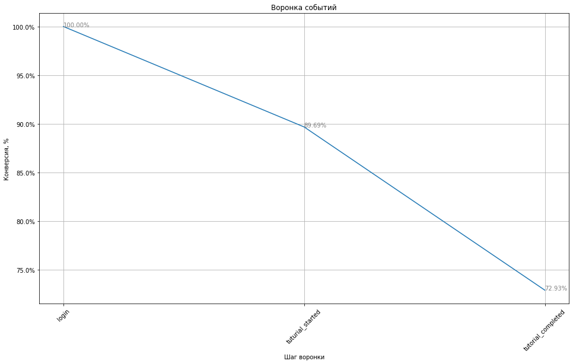

```python
import pandas as pd
from matplotlib import pyplot as plt
import matplotlib.ticker as mtick
import plotly
from plotly import graph_objects as go
plotly.offline.init_notebook_mode(connected=True)
import seaborn as sns
from statsmodels.stats.proportion import proportions_ztest
import scipy.stats as stats
import math
from datetime import datetime, timedelta
import numpy as np
```


<script type="text/javascript">
window.PlotlyConfig = {MathJaxConfig: 'local'};
if (window.MathJax) {MathJax.Hub.Config({SVG: {font: "STIX-Web"}});}
if (typeof require !== 'undefined') {
require.undef("plotly");
requirejs.config({
    paths: {
        'plotly': ['https://cdn.plot.ly/plotly-2.9.0.min']
    }
});
require(['plotly'], function(Plotly) {
    window._Plotly = Plotly;
});
}
</script>


# Задание 1. Расчет длительности A/B-теста

В этом задании нашей целью является определение параметров А/В-теста и проверка его результатов. Коллеги из отдела управления продуктом подготовили улучшенную версию учебного уровня (tutorial) и предлагают провести A/В тест, который сравнит старую и новую версии. Тест будет называться new_tutorial_test и распространяться на всех новых пользователей. В тесте будут две группы: А - контрольная (старый вариант учебной игры), В - тестовая (улучшенный вариант учебной игры).

Загрузим историю привлечения новых пользователей за май 2020 года.


```python
new_users = pd.read_csv('hw_lesson06_new_users_history.csv')
new_users.info()
new_users
```

    <class 'pandas.core.frame.DataFrame'>
    RangeIndex: 30560 entries, 0 to 30559
    Data columns (total 5 columns):
     #   Column       Non-Null Count  Dtype 
    ---  ------       --------------  ----- 
     0   user_id      30560 non-null  object
     1   dt           30560 non-null  object
     2   region       30560 non-null  object
     3   device       30560 non-null  object
     4   acq_channel  30560 non-null  object
    dtypes: object(5)
    memory usage: 1.2+ MB
    


<div>
<style scoped>
    .dataframe tbody tr th:only-of-type {
        vertical-align: middle;
    }

    .dataframe tbody tr th {
        vertical-align: top;
    }

    .dataframe thead th {
        text-align: right;
    }
</style>
<table border="1" class="dataframe">
  <thead>
    <tr style="text-align: right;">
      <th></th>
      <th>user_id</th>
      <th>dt</th>
      <th>region</th>
      <th>device</th>
      <th>acq_channel</th>
    </tr>
  </thead>
  <tbody>
    <tr>
      <th>0</th>
      <td>-152afc2b288</td>
      <td>2020-05-01</td>
      <td>North America</td>
      <td>iPhone</td>
      <td>GameAds</td>
    </tr>
    <tr>
      <th>1</th>
      <td>f89bf8_-b02a</td>
      <td>2020-05-01</td>
      <td>Europe</td>
      <td>iPhone</td>
      <td>GameAds</td>
    </tr>
    <tr>
      <th>2</th>
      <td>949cd6682_a8</td>
      <td>2020-05-01</td>
      <td>Africa</td>
      <td>iPhone</td>
      <td>SenseAds</td>
    </tr>
    <tr>
      <th>3</th>
      <td>358ba3d0f-a2</td>
      <td>2020-05-01</td>
      <td>CN</td>
      <td>iPhone</td>
      <td>GameAds</td>
    </tr>
    <tr>
      <th>4</th>
      <td>f996bf887511</td>
      <td>2020-05-01</td>
      <td>CIS</td>
      <td>iPhone</td>
      <td>GameAds</td>
    </tr>
    <tr>
      <th>...</th>
      <td>...</td>
      <td>...</td>
      <td>...</td>
      <td>...</td>
      <td>...</td>
    </tr>
    <tr>
      <th>30555</th>
      <td>62-853fd0c57</td>
      <td>2020-05-31</td>
      <td>SEA</td>
      <td>Andoroid</td>
      <td>JetAds</td>
    </tr>
    <tr>
      <th>30556</th>
      <td>-ff61-a-4397</td>
      <td>2020-05-31</td>
      <td>Europe</td>
      <td>Andoroid</td>
      <td>BrainPlus</td>
    </tr>
    <tr>
      <th>30557</th>
      <td>77_4b09f6b01</td>
      <td>2020-05-31</td>
      <td>Europe</td>
      <td>Andoroid</td>
      <td>JetAds</td>
    </tr>
    <tr>
      <th>30558</th>
      <td>bcf5_1c32-90</td>
      <td>2020-05-31</td>
      <td>CN</td>
      <td>Andoroid</td>
      <td>BrainPlus</td>
    </tr>
    <tr>
      <th>30559</th>
      <td>8932bd5bd4dc</td>
      <td>2020-05-31</td>
      <td>Europe</td>
      <td>Andoroid</td>
      <td>BrainPlus</td>
    </tr>
  </tbody>
</table>
<p>30560 rows × 5 columns</p>
</div>


```python
new_users['dt'] = pd.to_datetime(new_users['dt']).dt.date 
new_users
```


<div>
<style scoped>
    .dataframe tbody tr th:only-of-type {
        vertical-align: middle;
    }

    .dataframe tbody tr th {
        vertical-align: top;
    }

    .dataframe thead th {
        text-align: right;
    }
</style>
<table border="1" class="dataframe">
  <thead>
    <tr style="text-align: right;">
      <th></th>
      <th>user_id</th>
      <th>dt</th>
      <th>region</th>
      <th>device</th>
      <th>acq_channel</th>
    </tr>
  </thead>
  <tbody>
    <tr>
      <th>0</th>
      <td>-152afc2b288</td>
      <td>2020-05-01</td>
      <td>North America</td>
      <td>iPhone</td>
      <td>GameAds</td>
    </tr>
    <tr>
      <th>1</th>
      <td>f89bf8_-b02a</td>
      <td>2020-05-01</td>
      <td>Europe</td>
      <td>iPhone</td>
      <td>GameAds</td>
    </tr>
    <tr>
      <th>2</th>
      <td>949cd6682_a8</td>
      <td>2020-05-01</td>
      <td>Africa</td>
      <td>iPhone</td>
      <td>SenseAds</td>
    </tr>
    <tr>
      <th>3</th>
      <td>358ba3d0f-a2</td>
      <td>2020-05-01</td>
      <td>CN</td>
      <td>iPhone</td>
      <td>GameAds</td>
    </tr>
    <tr>
      <th>4</th>
      <td>f996bf887511</td>
      <td>2020-05-01</td>
      <td>CIS</td>
      <td>iPhone</td>
      <td>GameAds</td>
    </tr>
    <tr>
      <th>...</th>
      <td>...</td>
      <td>...</td>
      <td>...</td>
      <td>...</td>
      <td>...</td>
    </tr>
    <tr>
      <th>30555</th>
      <td>62-853fd0c57</td>
      <td>2020-05-31</td>
      <td>SEA</td>
      <td>Andoroid</td>
      <td>JetAds</td>
    </tr>
    <tr>
      <th>30556</th>
      <td>-ff61-a-4397</td>
      <td>2020-05-31</td>
      <td>Europe</td>
      <td>Andoroid</td>
      <td>BrainPlus</td>
    </tr>
    <tr>
      <th>30557</th>
      <td>77_4b09f6b01</td>
      <td>2020-05-31</td>
      <td>Europe</td>
      <td>Andoroid</td>
      <td>JetAds</td>
    </tr>
    <tr>
      <th>30558</th>
      <td>bcf5_1c32-90</td>
      <td>2020-05-31</td>
      <td>CN</td>
      <td>Andoroid</td>
      <td>BrainPlus</td>
    </tr>
    <tr>
      <th>30559</th>
      <td>8932bd5bd4dc</td>
      <td>2020-05-31</td>
      <td>Europe</td>
      <td>Andoroid</td>
      <td>BrainPlus</td>
    </tr>
  </tbody>
</table>
<p>30560 rows × 5 columns</p>
</div>


И данные о внутриигровых событиях, совершенных этими новыми пользователями.


```python
funnel_history = pd.read_csv('hw_lesson06_funnel_history.csv')
funnel_history.info()
funnel_history
```

    <class 'pandas.core.frame.DataFrame'>
    RangeIndex: 80254 entries, 0 to 80253
    Data columns (total 5 columns):
     #   Column      Non-Null Count  Dtype 
    ---  ------      --------------  ----- 
     0   user_id     80254 non-null  object
     1   event_name  80254 non-null  object
     2   event_dt    80254 non-null  object
     3   dt          80254 non-null  object
     4   region      80254 non-null  object
    dtypes: object(5)
    memory usage: 3.1+ MB
    


<div>
<style scoped>
    .dataframe tbody tr th:only-of-type {
        vertical-align: middle;
    }

    .dataframe tbody tr th {
        vertical-align: top;
    }

    .dataframe thead th {
        text-align: right;
    }
</style>
<table border="1" class="dataframe">
  <thead>
    <tr style="text-align: right;">
      <th></th>
      <th>user_id</th>
      <th>event_name</th>
      <th>event_dt</th>
      <th>dt</th>
      <th>region</th>
    </tr>
  </thead>
  <tbody>
    <tr>
      <th>0</th>
      <td>--014ca35_b7</td>
      <td>login</td>
      <td>2020-05-09 04:20:12</td>
      <td>2020-05-09</td>
      <td>North America</td>
    </tr>
    <tr>
      <th>1</th>
      <td>--014ca35_b7</td>
      <td>tutorial_completed</td>
      <td>2020-05-09 04:20:13</td>
      <td>2020-05-09</td>
      <td>North America</td>
    </tr>
    <tr>
      <th>2</th>
      <td>--014ca35_b7</td>
      <td>tuturial_started</td>
      <td>2020-05-09 04:20:11</td>
      <td>2020-05-09</td>
      <td>North America</td>
    </tr>
    <tr>
      <th>3</th>
      <td>--0424774bcb</td>
      <td>login</td>
      <td>2020-05-30 07:23:03</td>
      <td>2020-05-30</td>
      <td>CIS</td>
    </tr>
    <tr>
      <th>4</th>
      <td>--0424774bcb</td>
      <td>tutorial_completed</td>
      <td>2020-05-30 07:23:05</td>
      <td>2020-05-30</td>
      <td>CIS</td>
    </tr>
    <tr>
      <th>...</th>
      <td>...</td>
      <td>...</td>
      <td>...</td>
      <td>...</td>
      <td>...</td>
    </tr>
    <tr>
      <th>80249</th>
      <td>fff7d81ca3_5</td>
      <td>tutorial_completed</td>
      <td>2020-05-31 18:55:50</td>
      <td>2020-05-31</td>
      <td>Africa</td>
    </tr>
    <tr>
      <th>80250</th>
      <td>fff7d81ca3_5</td>
      <td>tuturial_started</td>
      <td>2020-05-31 18:55:47</td>
      <td>2020-05-31</td>
      <td>Africa</td>
    </tr>
    <tr>
      <th>80251</th>
      <td>fff88bbb3_c8</td>
      <td>login</td>
      <td>2020-05-28 13:14:36</td>
      <td>2020-05-28</td>
      <td>SEA</td>
    </tr>
    <tr>
      <th>80252</th>
      <td>fff88bbb3_c8</td>
      <td>tutorial_completed</td>
      <td>2020-05-28 13:14:38</td>
      <td>2020-05-28</td>
      <td>SEA</td>
    </tr>
    <tr>
      <th>80253</th>
      <td>fff88bbb3_c8</td>
      <td>tuturial_started</td>
      <td>2020-05-28 13:14:33</td>
      <td>2020-05-28</td>
      <td>SEA</td>
    </tr>
  </tbody>
</table>
<p>80254 rows × 5 columns</p>
</div>


```python
funnel_history['event_dt'] = pd.to_datetime(funnel_history['event_dt']).dt.date 
```


```python
funnel_history['user_id'].nunique()
```


    30560


Построим воронку событий, совершенных пользователями.


```python
report = funnel_history.groupby('event_name').agg({'user_id': ['count', 'nunique']})
report.columns = ['События', 'Уникальные пользователи']
report = report.sort_values(by ='Уникальные пользователи', ascending = False)
report['%'] = report['Уникальные пользователи'] / report['Уникальные пользователи'].values[0]
report.style.format({'%': '{:.2%}'})
```


<style type="text/css">
</style>
<table id="T_d46c2">
  <thead>
    <tr>
      <th class="blank level0" >&nbsp;</th>
      <th id="T_d46c2_level0_col0" class="col_heading level0 col0" >События</th>
      <th id="T_d46c2_level0_col1" class="col_heading level0 col1" >Уникальные пользователи</th>
      <th id="T_d46c2_level0_col2" class="col_heading level0 col2" >%</th>
    </tr>
    <tr>
      <th class="index_name level0" >event_name</th>
      <th class="blank col0" >&nbsp;</th>
      <th class="blank col1" >&nbsp;</th>
      <th class="blank col2" >&nbsp;</th>
    </tr>
  </thead>
  <tbody>
    <tr>
      <th id="T_d46c2_level0_row0" class="row_heading level0 row0" >login</th>
      <td id="T_d46c2_row0_col0" class="data row0 col0" >30560</td>
      <td id="T_d46c2_row0_col1" class="data row0 col1" >30560</td>
      <td id="T_d46c2_row0_col2" class="data row0 col2" >100.00%</td>
    </tr>
    <tr>
      <th id="T_d46c2_level0_row1" class="row_heading level0 row1" >tuturial_started</th>
      <td id="T_d46c2_row1_col0" class="data row1 col0" >27408</td>
      <td id="T_d46c2_row1_col1" class="data row1 col1" >27408</td>
      <td id="T_d46c2_row1_col2" class="data row1 col2" >89.69%</td>
    </tr>
    <tr>
      <th id="T_d46c2_level0_row2" class="row_heading level0 row2" >tutorial_completed</th>
      <td id="T_d46c2_row2_col0" class="data row2 col0" >22286</td>
      <td id="T_d46c2_row2_col1" class="data row2 col1" >22286</td>
      <td id="T_d46c2_row2_col2" class="data row2 col2" >72.93%</td>
    </tr>
  </tbody>
</table>


```python
ax = report['%'].plot(figsize = (16, 9), grid =True)
ax.yaxis.set_major_formatter(mtick.PercentFormatter(1))
plt.xticks(range(len(report)), report.index.values, rotation =45)
for x, y in zip(range(len(report)), report['%']):
    ax.annotate('{:.2%}'.format(y), xy = (x, y), color ='grey')
    
plt.xlabel('Шаг воронки'), plt.ylabel('Конверсия, %'), plt.title('Воронка событий');
```


    

    


Вероятность того, что пользователь успешно завершит обучение 0.73


```python
p = 0.7293
```

Рассчитайте необходимую длительность A/B-теста. Учтем, что коллеги ожидают, что новый туториал повысит вероятность прохождения обучения на 3.8%.


```python
def get_sample_size(mean, # среднее метрики
                    std, # среднеквадратическое отклонение (СКО) метрики
                    relative_practical_significance, # минимальный эффект - процент изменений среднего метрики, который мы хотим обнаружить
                    alpha, # уровень значимости (вероятность обнаружить эффект случайно)
                    power # мощность (вероятность НЕ отбросить случайно реально существующий эффект)
                   ):
    z = stats.norm.ppf( 1- alpha / 2) + abs(stats.norm.ppf(1 - power))
    d = mean * relative_practical_significance
    return math.ceil(2 * ((std * z / d) ** 2))
```


```python
relative_practical_significance = 0.038
alpha = 0.05
power = 0.8

sample_size = get_sample_size(p, np.sqrt(p*(1-p)), relative_practical_significance, alpha, power)
sample_size
```


    4036


Учтем, что лучше длительность теста будет кратна 7 дням(неделе).


```python
test_days_num = 7 * math.ceil(2 * sample_size / new_users.groupby('dt').agg({'user_id':'nunique'})['user_id'].mean() / 7)

print('На проведение теста потребуется: {:.0f} дней'.format(test_days_num))
```

    На проведение теста потребуется: 14 дней
    

# Задание 2. Оценка корректности проведения теста

Мы успешно рассчитали длительность теста. Тест решено было запустить 14.06.2020. Сегодня 19.06.2020, тест идет уже 5 дней. Оценим корректность проведения теста. С помощью статистического теста проверим, попадают ли пользователи с равной вероятностью в обе тестовые группы.

Дата-инженеры выгрузили для нас файл hw_lesson06_participants_run.csv, в котором содержатся данные о всех участниках теста, присоединившихся к тесту в период с 14.06.2020 по 19.06.2020.


```python
participants = pd.read_csv('hw_lesson06_participants_run.csv')
participants
```


<div>
<style scoped>
    .dataframe tbody tr th:only-of-type {
        vertical-align: middle;
    }

    .dataframe tbody tr th {
        vertical-align: top;
    }

    .dataframe thead th {
        text-align: right;
    }
</style>
<table border="1" class="dataframe">
  <thead>
    <tr style="text-align: right;">
      <th></th>
      <th>user_id</th>
      <th>test_name</th>
      <th>test_group</th>
    </tr>
  </thead>
  <tbody>
    <tr>
      <th>0</th>
      <td>-5dabb4f564d</td>
      <td>new_tutorial_test</td>
      <td>A</td>
    </tr>
    <tr>
      <th>1</th>
      <td>9d335_2101b0</td>
      <td>new_tutorial_test</td>
      <td>A</td>
    </tr>
    <tr>
      <th>2</th>
      <td>29_1_-d06009</td>
      <td>new_tutorial_test</td>
      <td>A</td>
    </tr>
    <tr>
      <th>3</th>
      <td>4-11cdb_323_</td>
      <td>new_tutorial_test</td>
      <td>A</td>
    </tr>
    <tr>
      <th>4</th>
      <td>09a-1df--3-8</td>
      <td>new_tutorial_test</td>
      <td>A</td>
    </tr>
    <tr>
      <th>...</th>
      <td>...</td>
      <td>...</td>
      <td>...</td>
    </tr>
    <tr>
      <th>2830</th>
      <td>da548a441d78</td>
      <td>new_tutorial_test</td>
      <td>B</td>
    </tr>
    <tr>
      <th>2831</th>
      <td>4df97d74a826</td>
      <td>new_tutorial_test</td>
      <td>B</td>
    </tr>
    <tr>
      <th>2832</th>
      <td>49-8-d102058</td>
      <td>new_tutorial_test</td>
      <td>B</td>
    </tr>
    <tr>
      <th>2833</th>
      <td>8-512dcc03-6</td>
      <td>new_tutorial_test</td>
      <td>B</td>
    </tr>
    <tr>
      <th>2834</th>
      <td>a8d991_77f68</td>
      <td>new_tutorial_test</td>
      <td>B</td>
    </tr>
  </tbody>
</table>
<p>2835 rows × 3 columns</p>
</div>


Найдем доли пользователей из обеих групп.


```python
report1 = participants.groupby('test_group').agg({'user_id':'nunique'})
report1['%'] = report1['user_id'] / report1['user_id'].sum()
report1
```


<div>
<style scoped>
    .dataframe tbody tr th:only-of-type {
        vertical-align: middle;
    }

    .dataframe tbody tr th {
        vertical-align: top;
    }

    .dataframe thead th {
        text-align: right;
    }
</style>
<table border="1" class="dataframe">
  <thead>
    <tr style="text-align: right;">
      <th></th>
      <th>user_id</th>
      <th>%</th>
    </tr>
    <tr>
      <th>test_group</th>
      <th></th>
      <th></th>
    </tr>
  </thead>
  <tbody>
    <tr>
      <th>A</th>
      <td>1368</td>
      <td>0.48254</td>
    </tr>
    <tr>
      <th>B</th>
      <td>1467</td>
      <td>0.51746</td>
    </tr>
  </tbody>
</table>
</div>


С помощью одновыборочного z-теста сравним долю пользователей из группы A c 0.5.


```python
value = 0.5
alpha = 0.05

p_value = proportions_ztest(report1.loc['A', 'user_id'], report1['user_id'].sum() , value = value)[1]
print('p-value: {:.5f}'.format(p_value))

if p_value < alpha:
    print('Отвергаем нулевую гипотезу: доля целевых наблюдений не равна заданному порогу.')
else:
    print('Не отвергаем нулевую гипотезу: доля целевых наблюдений равна заданному порогу.')
```

    p-value: 0.06282
    Не отвергаем нулевую гипотезу: доля целевых наблюдений равна заданному порогу.
    

Удостоверимся, что нет пользователей, которые попали в обе группы.


```python
participants.groupby('user_id').agg({'test_group':'nunique'}).query('test_group > 1')
```


<div>
<style scoped>
    .dataframe tbody tr th:only-of-type {
        vertical-align: middle;
    }

    .dataframe tbody tr th {
        vertical-align: top;
    }

    .dataframe thead th {
        text-align: right;
    }
</style>
<table border="1" class="dataframe">
  <thead>
    <tr style="text-align: right;">
      <th></th>
      <th>test_group</th>
    </tr>
    <tr>
      <th>user_id</th>
      <th></th>
    </tr>
  </thead>
  <tbody>
  </tbody>
</table>
</div>


# Задание 3. Анализ результатов теста

Тест завершен, оценим полученные результаты. Дата-инженеры выгрузили для вас три файла:

hw_lesson06_new_users_test.csv содержит историю привлечения новых пользователей за весь период теста;

hw_lesson06_funnel_test.csv содержит данные о внутриигровых событиях, совершенных этими новыми пользователями;

hw_lesson06_participants_test.csv содержит данные о всех участниках теста.


```python
participants_test = pd.read_csv('hw_lesson06_funnel_test.csv')
participants_test
```


<div>
<style scoped>
    .dataframe tbody tr th:only-of-type {
        vertical-align: middle;
    }

    .dataframe tbody tr th {
        vertical-align: top;
    }

    .dataframe thead th {
        text-align: right;
    }
</style>
<table border="1" class="dataframe">
  <thead>
    <tr style="text-align: right;">
      <th></th>
      <th>user_id</th>
      <th>event_name</th>
      <th>event_dt</th>
      <th>test_group</th>
    </tr>
  </thead>
  <tbody>
    <tr>
      <th>0</th>
      <td>--0879c8c638</td>
      <td>login</td>
      <td>2020-06-22 07:53:05</td>
      <td>A</td>
    </tr>
    <tr>
      <th>1</th>
      <td>--0879c8c638</td>
      <td>tutorial_completed</td>
      <td>2020-06-22 07:53:02</td>
      <td>A</td>
    </tr>
    <tr>
      <th>2</th>
      <td>--0879c8c638</td>
      <td>tuturial_started</td>
      <td>2020-06-22 07:53:12</td>
      <td>A</td>
    </tr>
    <tr>
      <th>3</th>
      <td>--10-567_cd0</td>
      <td>login</td>
      <td>2020-06-26 13:14:00</td>
      <td>A</td>
    </tr>
    <tr>
      <th>4</th>
      <td>--10-567_cd0</td>
      <td>tuturial_started</td>
      <td>2020-06-26 13:14:02</td>
      <td>A</td>
    </tr>
    <tr>
      <th>...</th>
      <td>...</td>
      <td>...</td>
      <td>...</td>
      <td>...</td>
    </tr>
    <tr>
      <th>22440</th>
      <td>fff34d_b25d7</td>
      <td>login</td>
      <td>2020-06-14 01:16:34</td>
      <td>B</td>
    </tr>
    <tr>
      <th>22441</th>
      <td>fff34d_b25d7</td>
      <td>tutorial_completed</td>
      <td>2020-06-14 01:16:38</td>
      <td>B</td>
    </tr>
    <tr>
      <th>22442</th>
      <td>fff34d_b25d7</td>
      <td>tuturial_started</td>
      <td>2020-06-14 01:16:37</td>
      <td>B</td>
    </tr>
    <tr>
      <th>22443</th>
      <td>fffa52af06d-</td>
      <td>login</td>
      <td>2020-06-19 10:48:31</td>
      <td>B</td>
    </tr>
    <tr>
      <th>22444</th>
      <td>fffa52af06d-</td>
      <td>tuturial_started</td>
      <td>2020-06-19 10:48:31</td>
      <td>B</td>
    </tr>
  </tbody>
</table>
<p>22445 rows × 4 columns</p>
</div>


```python
report2 = participants_test.groupby('test_group').agg({'user_id':'nunique'})
report2['%'] = report2['user_id'] / report2['user_id'].sum()
report2
```


<div>
<style scoped>
    .dataframe tbody tr th:only-of-type {
        vertical-align: middle;
    }

    .dataframe tbody tr th {
        vertical-align: top;
    }

    .dataframe thead th {
        text-align: right;
    }
</style>
<table border="1" class="dataframe">
  <thead>
    <tr style="text-align: right;">
      <th></th>
      <th>user_id</th>
      <th>%</th>
    </tr>
    <tr>
      <th>test_group</th>
      <th></th>
      <th></th>
    </tr>
  </thead>
  <tbody>
    <tr>
      <th>A</th>
      <td>4226</td>
      <td>0.494211</td>
    </tr>
    <tr>
      <th>B</th>
      <td>4325</td>
      <td>0.505789</td>
    </tr>
  </tbody>
</table>
</div>


```python
report3 = participants_test.pivot_table(index = 'event_name', columns = 'test_group', values ='user_id', aggfunc ='nunique').fillna(0).sort_values(by = 'A', ascending = False)
report3
```


<div>
<style scoped>
    .dataframe tbody tr th:only-of-type {
        vertical-align: middle;
    }

    .dataframe tbody tr th {
        vertical-align: top;
    }

    .dataframe thead th {
        text-align: right;
    }
</style>
<table border="1" class="dataframe">
  <thead>
    <tr style="text-align: right;">
      <th>test_group</th>
      <th>A</th>
      <th>B</th>
    </tr>
    <tr>
      <th>event_name</th>
      <th></th>
      <th></th>
    </tr>
  </thead>
  <tbody>
    <tr>
      <th>login</th>
      <td>4226</td>
      <td>4325</td>
    </tr>
    <tr>
      <th>tuturial_started</th>
      <td>3980</td>
      <td>3731</td>
    </tr>
    <tr>
      <th>tutorial_completed</th>
      <td>3302</td>
      <td>2881</td>
    </tr>
  </tbody>
</table>
</div>


Сравним воронки обучения в группах А и В.


```python
report4 = report3.copy()
for s in report4:
    report4[s] = report4[s] / report4.loc['login', s]
report4.style.format('{:.2%}')
```


<style type="text/css">
</style>
<table id="T_d664c">
  <thead>
    <tr>
      <th class="index_name level0" >test_group</th>
      <th id="T_d664c_level0_col0" class="col_heading level0 col0" >A</th>
      <th id="T_d664c_level0_col1" class="col_heading level0 col1" >B</th>
    </tr>
    <tr>
      <th class="index_name level0" >event_name</th>
      <th class="blank col0" >&nbsp;</th>
      <th class="blank col1" >&nbsp;</th>
    </tr>
  </thead>
  <tbody>
    <tr>
      <th id="T_d664c_level0_row0" class="row_heading level0 row0" >login</th>
      <td id="T_d664c_row0_col0" class="data row0 col0" >100.00%</td>
      <td id="T_d664c_row0_col1" class="data row0 col1" >100.00%</td>
    </tr>
    <tr>
      <th id="T_d664c_level0_row1" class="row_heading level0 row1" >tuturial_started</th>
      <td id="T_d664c_row1_col0" class="data row1 col0" >94.18%</td>
      <td id="T_d664c_row1_col1" class="data row1 col1" >86.27%</td>
    </tr>
    <tr>
      <th id="T_d664c_level0_row2" class="row_heading level0 row2" >tutorial_completed</th>
      <td id="T_d664c_row2_col0" class="data row2 col0" >78.14%</td>
      <td id="T_d664c_row2_col1" class="data row2 col1" >66.61%</td>
    </tr>
  </tbody>
</table>


С помощью двухвыборочного z-теста для пропорций проверим, являются ли различия между группами статистически значимыми.


```python
alpha = 0.05

p_value = proportions_ztest([report3.loc['tutorial_completed', 'A'], report3.loc['tutorial_completed', 'B']],[report3.loc['login', 'A'], report3.loc['login', 'B']])[1]
print('p-value: {:.5f}'.format(p_value))

if p_value < alpha:
    print('Отвергаем нулевую гипотезу: доли целевых наблюдений в двух группах отличаются.')
else: 
    print('Не отвергаем нулевую гипотезу: доли целевых наблюдений в обеих группах одинаковые.')
```

    p-value: 0.00000
    Отвергаем нулевую гипотезу: доли целевых наблюдений в двух группах отличаются.
    

Делаем вывод, что с помощью новой версии не пучилось улучшить вероятность прохождения туториала.

# Задание 4.Поиск причин различий между группами

Попробуем понять, мог ли этот эффект быть вызван различиями между группами.


```python
new_users2 = pd.read_excel('lesson06_new_users_test.xlsx')
participants_test2 = pd.read_excel('lesson06_participants_test.xlsx')
```


```python
report5 = participants_test2.merge(new_users2, on = 'user_id')
report5
```


<div>
<style scoped>
    .dataframe tbody tr th:only-of-type {
        vertical-align: middle;
    }

    .dataframe tbody tr th {
        vertical-align: top;
    }

    .dataframe thead th {
        text-align: right;
    }
</style>
<table border="1" class="dataframe">
  <thead>
    <tr style="text-align: right;">
      <th></th>
      <th>user_id</th>
      <th>group</th>
      <th>ab_test</th>
      <th>first_date</th>
      <th>region</th>
      <th>device</th>
    </tr>
  </thead>
  <tbody>
    <tr>
      <th>0</th>
      <td>aa8a165353cbc7b9</td>
      <td>B</td>
      <td>new_desing_test</td>
      <td>2021-09-06</td>
      <td>United States</td>
      <td>iPhone</td>
    </tr>
    <tr>
      <th>1</th>
      <td>af94b6f391fd60d3</td>
      <td>A</td>
      <td>new_desing_test</td>
      <td>2021-09-06</td>
      <td>United States</td>
      <td>iPhone</td>
    </tr>
    <tr>
      <th>2</th>
      <td>53cb4dca018b4c6f</td>
      <td>A</td>
      <td>new_desing_test</td>
      <td>2021-09-06</td>
      <td>Brasil</td>
      <td>iPhone</td>
    </tr>
    <tr>
      <th>3</th>
      <td>3a2f68acfcf9c893</td>
      <td>B</td>
      <td>new_desing_test</td>
      <td>2021-09-06</td>
      <td>United States</td>
      <td>iPhone</td>
    </tr>
    <tr>
      <th>4</th>
      <td>28b4b9932996f6d1</td>
      <td>B</td>
      <td>new_desing_test</td>
      <td>2021-09-06</td>
      <td>France</td>
      <td>iPhone</td>
    </tr>
    <tr>
      <th>...</th>
      <td>...</td>
      <td>...</td>
      <td>...</td>
      <td>...</td>
      <td>...</td>
      <td>...</td>
    </tr>
    <tr>
      <th>6247</th>
      <td>34fb211643145112</td>
      <td>A</td>
      <td>new_desing_test</td>
      <td>2021-09-04</td>
      <td>Russian Federation</td>
      <td>Mac</td>
    </tr>
    <tr>
      <th>6248</th>
      <td>6f981c87df2d101d</td>
      <td>A</td>
      <td>new_desing_test</td>
      <td>2021-09-03</td>
      <td>United States</td>
      <td>Mac</td>
    </tr>
    <tr>
      <th>6249</th>
      <td>3d3f21b4179a3815</td>
      <td>A</td>
      <td>new_desing_test</td>
      <td>2021-09-02</td>
      <td>Russian Federation</td>
      <td>Android</td>
    </tr>
    <tr>
      <th>6250</th>
      <td>4226df51d85768f0</td>
      <td>A</td>
      <td>new_desing_test</td>
      <td>2021-09-03</td>
      <td>United States</td>
      <td>PC</td>
    </tr>
    <tr>
      <th>6251</th>
      <td>c78b591d91993751</td>
      <td>A</td>
      <td>new_desing_test</td>
      <td>2021-09-01</td>
      <td>Germany</td>
      <td>PC</td>
    </tr>
  </tbody>
</table>
<p>6252 rows × 6 columns</p>
</div>


```python
report6 = report5.pivot_table(index = 'region', columns = 'group', values = 'user_id', aggfunc = 'nunique')
report6
```


<div>
<style scoped>
    .dataframe tbody tr th:only-of-type {
        vertical-align: middle;
    }

    .dataframe tbody tr th {
        vertical-align: top;
    }

    .dataframe thead th {
        text-align: right;
    }
</style>
<table border="1" class="dataframe">
  <thead>
    <tr style="text-align: right;">
      <th>group</th>
      <th>A</th>
      <th>B</th>
    </tr>
    <tr>
      <th>region</th>
      <th></th>
      <th></th>
    </tr>
  </thead>
  <tbody>
    <tr>
      <th>Brasil</th>
      <td>81</td>
      <td>85</td>
    </tr>
    <tr>
      <th>France</th>
      <td>441</td>
      <td>510</td>
    </tr>
    <tr>
      <th>Germany</th>
      <td>760</td>
      <td>786</td>
    </tr>
    <tr>
      <th>India</th>
      <td>250</td>
      <td>261</td>
    </tr>
    <tr>
      <th>Russian Federation</th>
      <td>458</td>
      <td>480</td>
    </tr>
    <tr>
      <th>South Africa</th>
      <td>31</td>
      <td>34</td>
    </tr>
    <tr>
      <th>United States</th>
      <td>995</td>
      <td>1080</td>
    </tr>
  </tbody>
</table>
</div>


```python
report7 = report5.pivot_table(index = 'device', columns = 'group', values = 'user_id', aggfunc = 'nunique')
report7
```


<div>
<style scoped>
    .dataframe tbody tr th:only-of-type {
        vertical-align: middle;
    }

    .dataframe tbody tr th {
        vertical-align: top;
    }

    .dataframe thead th {
        text-align: right;
    }
</style>
<table border="1" class="dataframe">
  <thead>
    <tr style="text-align: right;">
      <th>group</th>
      <th>A</th>
      <th>B</th>
    </tr>
    <tr>
      <th>device</th>
      <th></th>
      <th></th>
    </tr>
  </thead>
  <tbody>
    <tr>
      <th>Android</th>
      <td>20</td>
      <td>25</td>
    </tr>
    <tr>
      <th>Mac</th>
      <td>45</td>
      <td>35</td>
    </tr>
    <tr>
      <th>PC</th>
      <td>15</td>
      <td>16</td>
    </tr>
    <tr>
      <th>iPhone</th>
      <td>2936</td>
      <td>3160</td>
    </tr>
  </tbody>
</table>
</div>


Существенных различий между группами A и B не обнаружено.
