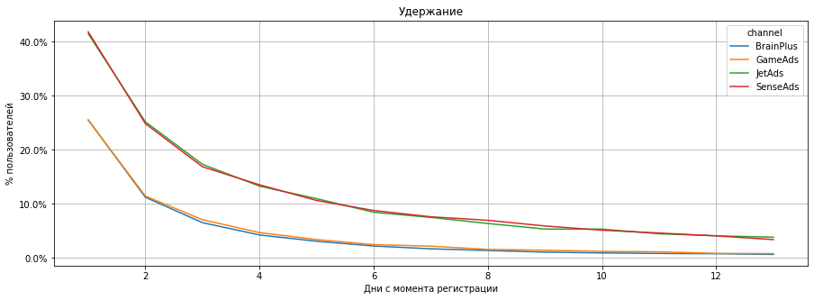
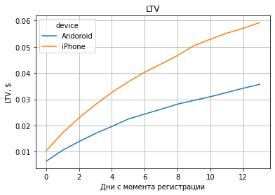
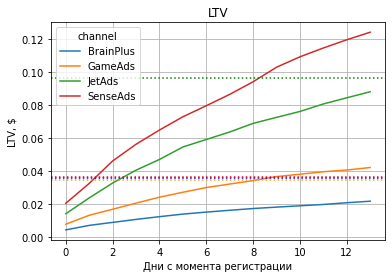
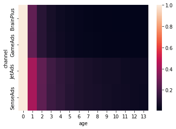
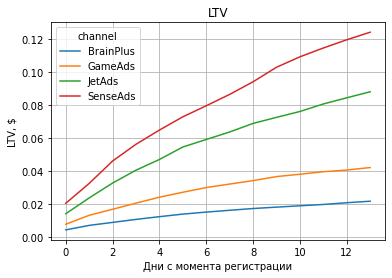
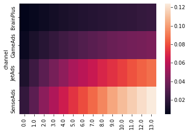

```python
import pandas as pd
from matplotlib import pyplot as plt
import matplotlib.ticker as mtick
import plotly
from plotly import graph_objects as go
plotly.offline.init_notebook_mode(connected = True)
import seaborn as sns
from statsmodels.stats.proportion import proportions_ztest
import scipy.stats as stats
import math
from datetime import datetime, timedelta
import numpy as np
```


<script type="text/javascript">
window.PlotlyConfig = {MathJaxConfig: 'local'};
if (window.MathJax) {MathJax.Hub.Config({SVG: {font: "STIX-Web"}});}
if (typeof require !== 'undefined') {
require.undef("plotly");
requirejs.config({
    paths: {
        'plotly': ['https://cdn.plot.ly/plotly-2.9.0.min']
    }
});
require(['plotly'], function(Plotly) {
    window._Plotly = Plotly;
});
}
</script>


# Задание 1. Загрузка данных и построение профилей пользователей

В этом задании вашей целью будет оценить эффективность маркетинговых усилий с помощью когортного анализа и построить рекомендации для отдела маркетинга о том, в какие каналы привлечения пользователей имеет смысл вкладываться в дальнейшем.

Дата-инженеры выгрузили для нас три файла:

hw_lesson07_sessions.xlsx - журнал посещений;

hw_lesson07_purchases.csv - журнал покупок;

hw_lesson07_costs.csv - данные о ежедневных рекламных затратах.

Загрузим данные, исследуем их состав и приведем столбцы к нужному формату (например, трансформируем даты в datetime).


```python
sessions = pd.read_excel('hw_lesson07_sessions.xlsx')
sessions
```


<div>
<style scoped>
    .dataframe tbody tr th:only-of-type {
        vertical-align: middle;
    }

    .dataframe tbody tr th {
        vertical-align: top;
    }

    .dataframe thead th {
        text-align: right;
    }
</style>
<table border="1" class="dataframe">
  <thead>
    <tr style="text-align: right;">
      <th></th>
      <th>user_id</th>
      <th>region</th>
      <th>device</th>
      <th>channel</th>
      <th>session_duration</th>
      <th>session_start</th>
    </tr>
  </thead>
  <tbody>
    <tr>
      <th>0</th>
      <td>d35ad20dd45d</td>
      <td>SEA</td>
      <td>iPhone</td>
      <td>GameAds</td>
      <td>2589.186227</td>
      <td>2020-04-01 17:51:25</td>
    </tr>
    <tr>
      <th>1</th>
      <td>ac4a113c52c_</td>
      <td>CIS</td>
      <td>iPhone</td>
      <td>GameAds</td>
      <td>1467.539334</td>
      <td>2020-04-01 09:39:33</td>
    </tr>
    <tr>
      <th>2</th>
      <td>d0337d117cc8</td>
      <td>CIS</td>
      <td>iPhone</td>
      <td>GameAds</td>
      <td>3777.737508</td>
      <td>2020-04-01 01:19:56</td>
    </tr>
    <tr>
      <th>3</th>
      <td>2f8c_262-_85</td>
      <td>North America</td>
      <td>iPhone</td>
      <td>GameAds</td>
      <td>3755.966201</td>
      <td>2020-04-01 11:21:54</td>
    </tr>
    <tr>
      <th>4</th>
      <td>4b1-114-4692</td>
      <td>Europe</td>
      <td>iPhone</td>
      <td>GameAds</td>
      <td>2898.802314</td>
      <td>2020-04-01 18:29:57</td>
    </tr>
    <tr>
      <th>...</th>
      <td>...</td>
      <td>...</td>
      <td>...</td>
      <td>...</td>
      <td>...</td>
      <td>...</td>
    </tr>
    <tr>
      <th>167885</th>
      <td>f4436b_52dc_</td>
      <td>CIS</td>
      <td>Andoroid</td>
      <td>BrainPlus</td>
      <td>2775.695988</td>
      <td>2020-06-30 15:14:56</td>
    </tr>
    <tr>
      <th>167886</th>
      <td>ad3-bc75a9fc</td>
      <td>Europe</td>
      <td>Andoroid</td>
      <td>JetAds</td>
      <td>1885.137209</td>
      <td>2020-06-30 14:56:09</td>
    </tr>
    <tr>
      <th>167887</th>
      <td>a08d5af97-3d</td>
      <td>Europe</td>
      <td>Andoroid</td>
      <td>BrainPlus</td>
      <td>157.472441</td>
      <td>2020-06-30 05:22:07</td>
    </tr>
    <tr>
      <th>167888</th>
      <td>-9_13acb52-7</td>
      <td>Africa</td>
      <td>Andoroid</td>
      <td>BrainPlus</td>
      <td>151.266928</td>
      <td>2020-06-30 17:43:42</td>
    </tr>
    <tr>
      <th>167889</th>
      <td>-175c05_40d3</td>
      <td>North America</td>
      <td>Andoroid</td>
      <td>BrainPlus</td>
      <td>5052.781567</td>
      <td>2020-06-30 11:38:15</td>
    </tr>
  </tbody>
</table>
<p>167890 rows × 6 columns</p>
</div>


```python
purchases = pd.read_excel('hw_lesson07_purchases.xlsx')
purchases
```


<div>
<style scoped>
    .dataframe tbody tr th:only-of-type {
        vertical-align: middle;
    }

    .dataframe tbody tr th {
        vertical-align: top;
    }

    .dataframe thead th {
        text-align: right;
    }
</style>
<table border="1" class="dataframe">
  <thead>
    <tr style="text-align: right;">
      <th></th>
      <th>user_id</th>
      <th>event_dt</th>
      <th>revenue</th>
      <th>item</th>
    </tr>
  </thead>
  <tbody>
    <tr>
      <th>0</th>
      <td>df0f3327-381</td>
      <td>2020-04-01 05:16:29</td>
      <td>1.0</td>
      <td>10 золотых монет</td>
    </tr>
    <tr>
      <th>1</th>
      <td>df0f3327-381</td>
      <td>2020-04-02 18:32:34</td>
      <td>1.0</td>
      <td>10 золотых монет</td>
    </tr>
    <tr>
      <th>2</th>
      <td>241cb8694b53</td>
      <td>2020-04-02 01:04:57</td>
      <td>1.0</td>
      <td>10 золотых монет</td>
    </tr>
    <tr>
      <th>3</th>
      <td>0c9453440c85</td>
      <td>2020-04-02 11:36:41</td>
      <td>1.0</td>
      <td>10 золотых монет</td>
    </tr>
    <tr>
      <th>4</th>
      <td>96-4377d99ca</td>
      <td>2020-04-02 23:28:18</td>
      <td>1.0</td>
      <td>10 золотых монет</td>
    </tr>
    <tr>
      <th>...</th>
      <td>...</td>
      <td>...</td>
      <td>...</td>
      <td>...</td>
    </tr>
    <tr>
      <th>6884</th>
      <td>9cd8aa06b00b</td>
      <td>2020-06-30 04:10:13</td>
      <td>1.0</td>
      <td>10 золотых монет</td>
    </tr>
    <tr>
      <th>6885</th>
      <td>-f-dbaa-52f0</td>
      <td>2020-06-30 13:12:34</td>
      <td>1.0</td>
      <td>10 золотых монет</td>
    </tr>
    <tr>
      <th>6886</th>
      <td>50d0c5-63801</td>
      <td>2020-06-30 13:43:59</td>
      <td>1.0</td>
      <td>10 золотых монет</td>
    </tr>
    <tr>
      <th>6887</th>
      <td>109af6_d505-</td>
      <td>2020-06-30 08:45:05</td>
      <td>1.0</td>
      <td>10 золотых монет</td>
    </tr>
    <tr>
      <th>6888</th>
      <td>b243584_22c_</td>
      <td>2020-06-30 16:17:04</td>
      <td>1.0</td>
      <td>10 золотых монет</td>
    </tr>
  </tbody>
</table>
<p>6889 rows × 4 columns</p>
</div>


```python
purchases.info()
```

    <class 'pandas.core.frame.DataFrame'>
    RangeIndex: 6889 entries, 0 to 6888
    Data columns (total 4 columns):
     #   Column    Non-Null Count  Dtype         
    ---  ------    --------------  -----         
     0   user_id   6889 non-null   object        
     1   event_dt  6889 non-null   datetime64[ns]
     2   revenue   6889 non-null   object        
     3   item      6889 non-null   object        
    dtypes: datetime64[ns](1), object(3)
    memory usage: 215.4+ KB
    


```python
costs = pd.read_excel('hw_lesson07_costs.xlsx')
costs
```


<div>
<style scoped>
    .dataframe tbody tr th:only-of-type {
        vertical-align: middle;
    }

    .dataframe tbody tr th {
        vertical-align: top;
    }

    .dataframe thead th {
        text-align: right;
    }
</style>
<table border="1" class="dataframe">
  <thead>
    <tr style="text-align: right;">
      <th></th>
      <th>dt</th>
      <th>channel</th>
      <th>costs</th>
    </tr>
  </thead>
  <tbody>
    <tr>
      <th>0</th>
      <td>2020-04-01</td>
      <td>GameAds</td>
      <td>10.325000000000001</td>
    </tr>
    <tr>
      <th>1</th>
      <td>2020-04-02</td>
      <td>GameAds</td>
      <td>9.030000000000001</td>
    </tr>
    <tr>
      <th>2</th>
      <td>2020-04-03</td>
      <td>GameAds</td>
      <td>11.690000000000001</td>
    </tr>
    <tr>
      <th>3</th>
      <td>2020-04-04</td>
      <td>GameAds</td>
      <td>12.040000000000001</td>
    </tr>
    <tr>
      <th>4</th>
      <td>2020-04-05</td>
      <td>GameAds</td>
      <td>10.465000000000002</td>
    </tr>
    <tr>
      <th>...</th>
      <td>...</td>
      <td>...</td>
      <td>...</td>
    </tr>
    <tr>
      <th>359</th>
      <td>2020-06-26</td>
      <td>JetAds</td>
      <td>21.75</td>
    </tr>
    <tr>
      <th>360</th>
      <td>2020-06-27</td>
      <td>JetAds</td>
      <td>24.75</td>
    </tr>
    <tr>
      <th>361</th>
      <td>2020-06-28</td>
      <td>JetAds</td>
      <td>24.599999999999998</td>
    </tr>
    <tr>
      <th>362</th>
      <td>2020-06-29</td>
      <td>JetAds</td>
      <td>25.65</td>
    </tr>
    <tr>
      <th>363</th>
      <td>2020-06-30</td>
      <td>JetAds</td>
      <td>18.75</td>
    </tr>
  </tbody>
</table>
<p>364 rows × 3 columns</p>
</div>


```python
sessions['session_start'] = pd.to_datetime(sessions['session_start']).dt.date
purchases['event_dt'] = pd.to_datetime(purchases['event_dt']).dt.date
costs['dt'] = pd.to_datetime(costs['dt']).dt.date
purchases['revenue'] = pd.to_numeric(purchases['revenue'], errors = 'coerce').fillna(0)
costs['costs'] = pd.to_numeric(costs['costs'], errors = 'coerce').fillna(0)
```


```python
sessions.info()
purchases.info()
costs.info()
```

    <class 'pandas.core.frame.DataFrame'>
    RangeIndex: 167890 entries, 0 to 167889
    Data columns (total 6 columns):
     #   Column            Non-Null Count   Dtype  
    ---  ------            --------------   -----  
     0   user_id           167890 non-null  object 
     1   region            167890 non-null  object 
     2   device            167890 non-null  object 
     3   channel           167890 non-null  object 
     4   session_duration  167890 non-null  float64
     5   session_start     167890 non-null  object 
    dtypes: float64(1), object(5)
    memory usage: 7.7+ MB
    <class 'pandas.core.frame.DataFrame'>
    RangeIndex: 6889 entries, 0 to 6888
    Data columns (total 4 columns):
     #   Column    Non-Null Count  Dtype  
    ---  ------    --------------  -----  
     0   user_id   6889 non-null   object 
     1   event_dt  6889 non-null   object 
     2   revenue   6889 non-null   float64
     3   item      6889 non-null   object 
    dtypes: float64(1), object(3)
    memory usage: 215.4+ KB
    <class 'pandas.core.frame.DataFrame'>
    RangeIndex: 364 entries, 0 to 363
    Data columns (total 3 columns):
     #   Column   Non-Null Count  Dtype  
    ---  ------   --------------  -----  
     0   dt       364 non-null    object 
     1   channel  364 non-null    object 
     2   costs    364 non-null    float64
    dtypes: float64(1), object(2)
    memory usage: 8.7+ KB
    

Построим профили пользователей.


```python
profiles = sessions.sort_values(by = ['user_id', 'session_start']).groupby('user_id').agg({'region': 'first', 'device': 'first', 'channel': 'first', 'session_start': 'first'}).reset_index()
profiles
```


<div>
<style scoped>
    .dataframe tbody tr th:only-of-type {
        vertical-align: middle;
    }

    .dataframe tbody tr th {
        vertical-align: top;
    }

    .dataframe thead th {
        text-align: right;
    }
</style>
<table border="1" class="dataframe">
  <thead>
    <tr style="text-align: right;">
      <th></th>
      <th>user_id</th>
      <th>region</th>
      <th>device</th>
      <th>channel</th>
      <th>session_start</th>
    </tr>
  </thead>
  <tbody>
    <tr>
      <th>0</th>
      <td>----a1283_6_</td>
      <td>South America</td>
      <td>Andoroid</td>
      <td>JetAds</td>
      <td>2020-06-23</td>
    </tr>
    <tr>
      <th>1</th>
      <td>---0f3689-06</td>
      <td>Africa</td>
      <td>Andoroid</td>
      <td>BrainPlus</td>
      <td>2020-04-14</td>
    </tr>
    <tr>
      <th>2</th>
      <td>---23ca-3f53</td>
      <td>SEA</td>
      <td>Andoroid</td>
      <td>BrainPlus</td>
      <td>2020-05-18</td>
    </tr>
    <tr>
      <th>3</th>
      <td>---23f6c-3b2</td>
      <td>CN</td>
      <td>Andoroid</td>
      <td>BrainPlus</td>
      <td>2020-05-11</td>
    </tr>
    <tr>
      <th>4</th>
      <td>---2ab5c35c6</td>
      <td>SEA</td>
      <td>Andoroid</td>
      <td>BrainPlus</td>
      <td>2020-06-21</td>
    </tr>
    <tr>
      <th>...</th>
      <td>...</td>
      <td>...</td>
      <td>...</td>
      <td>...</td>
      <td>...</td>
    </tr>
    <tr>
      <th>83180</th>
      <td>fff9b9683358</td>
      <td>Europe</td>
      <td>iPhone</td>
      <td>GameAds</td>
      <td>2020-05-20</td>
    </tr>
    <tr>
      <th>83181</th>
      <td>fffa52af06d-</td>
      <td>Europe</td>
      <td>Andoroid</td>
      <td>BrainPlus</td>
      <td>2020-06-19</td>
    </tr>
    <tr>
      <th>83182</th>
      <td>fffa9419ccf6</td>
      <td>South America</td>
      <td>Andoroid</td>
      <td>BrainPlus</td>
      <td>2020-06-06</td>
    </tr>
    <tr>
      <th>83183</th>
      <td>fffbf373cc64</td>
      <td>North America</td>
      <td>iPhone</td>
      <td>GameAds</td>
      <td>2020-04-20</td>
    </tr>
    <tr>
      <th>83184</th>
      <td>fffcc8249f_4</td>
      <td>SEA</td>
      <td>iPhone</td>
      <td>GameAds</td>
      <td>2020-04-09</td>
    </tr>
  </tbody>
</table>
<p>83185 rows × 5 columns</p>
</div>


```python
purchases['user_id'].nunique()
```


    1385


```python
profiles['payer'] = profiles['user_id'].isin(purchases['user_id'].unique())
profiles
```


<div>
<style scoped>
    .dataframe tbody tr th:only-of-type {
        vertical-align: middle;
    }

    .dataframe tbody tr th {
        vertical-align: top;
    }

    .dataframe thead th {
        text-align: right;
    }
</style>
<table border="1" class="dataframe">
  <thead>
    <tr style="text-align: right;">
      <th></th>
      <th>user_id</th>
      <th>region</th>
      <th>device</th>
      <th>channel</th>
      <th>session_start</th>
      <th>payer</th>
    </tr>
  </thead>
  <tbody>
    <tr>
      <th>0</th>
      <td>----a1283_6_</td>
      <td>South America</td>
      <td>Andoroid</td>
      <td>JetAds</td>
      <td>2020-06-23</td>
      <td>False</td>
    </tr>
    <tr>
      <th>1</th>
      <td>---0f3689-06</td>
      <td>Africa</td>
      <td>Andoroid</td>
      <td>BrainPlus</td>
      <td>2020-04-14</td>
      <td>False</td>
    </tr>
    <tr>
      <th>2</th>
      <td>---23ca-3f53</td>
      <td>SEA</td>
      <td>Andoroid</td>
      <td>BrainPlus</td>
      <td>2020-05-18</td>
      <td>False</td>
    </tr>
    <tr>
      <th>3</th>
      <td>---23f6c-3b2</td>
      <td>CN</td>
      <td>Andoroid</td>
      <td>BrainPlus</td>
      <td>2020-05-11</td>
      <td>False</td>
    </tr>
    <tr>
      <th>4</th>
      <td>---2ab5c35c6</td>
      <td>SEA</td>
      <td>Andoroid</td>
      <td>BrainPlus</td>
      <td>2020-06-21</td>
      <td>False</td>
    </tr>
    <tr>
      <th>...</th>
      <td>...</td>
      <td>...</td>
      <td>...</td>
      <td>...</td>
      <td>...</td>
      <td>...</td>
    </tr>
    <tr>
      <th>83180</th>
      <td>fff9b9683358</td>
      <td>Europe</td>
      <td>iPhone</td>
      <td>GameAds</td>
      <td>2020-05-20</td>
      <td>False</td>
    </tr>
    <tr>
      <th>83181</th>
      <td>fffa52af06d-</td>
      <td>Europe</td>
      <td>Andoroid</td>
      <td>BrainPlus</td>
      <td>2020-06-19</td>
      <td>False</td>
    </tr>
    <tr>
      <th>83182</th>
      <td>fffa9419ccf6</td>
      <td>South America</td>
      <td>Andoroid</td>
      <td>BrainPlus</td>
      <td>2020-06-06</td>
      <td>False</td>
    </tr>
    <tr>
      <th>83183</th>
      <td>fffbf373cc64</td>
      <td>North America</td>
      <td>iPhone</td>
      <td>GameAds</td>
      <td>2020-04-20</td>
      <td>False</td>
    </tr>
    <tr>
      <th>83184</th>
      <td>fffcc8249f_4</td>
      <td>SEA</td>
      <td>iPhone</td>
      <td>GameAds</td>
      <td>2020-04-09</td>
      <td>False</td>
    </tr>
  </tbody>
</table>
<p>83185 rows × 6 columns</p>
</div>


Изучим как пользователи распределены по странам, устройствам и каналам привлечения.


```python
region = profiles.groupby('region').agg({'user_id': 'nunique'})
region['user_id'] = region['user_id'] / region['user_id'].sum()
region.style.format({'user_id': '{:.2%}' })
```


<style type="text/css">
</style>
<table id="T_b6672">
  <thead>
    <tr>
      <th class="blank level0" >&nbsp;</th>
      <th id="T_b6672_level0_col0" class="col_heading level0 col0" >user_id</th>
    </tr>
    <tr>
      <th class="index_name level0" >region</th>
      <th class="blank col0" >&nbsp;</th>
    </tr>
  </thead>
  <tbody>
    <tr>
      <th id="T_b6672_level0_row0" class="row_heading level0 row0" >Africa</th>
      <td id="T_b6672_row0_col0" class="data row0 col0" >9.00%</td>
    </tr>
    <tr>
      <th id="T_b6672_level0_row1" class="row_heading level0 row1" >Australia</th>
      <td id="T_b6672_row1_col0" class="data row1 col0" >5.64%</td>
    </tr>
    <tr>
      <th id="T_b6672_level0_row2" class="row_heading level0 row2" >CIS</th>
      <td id="T_b6672_row2_col0" class="data row2 col0" >15.56%</td>
    </tr>
    <tr>
      <th id="T_b6672_level0_row3" class="row_heading level0 row3" >CN</th>
      <td id="T_b6672_row3_col0" class="data row3 col0" >19.61%</td>
    </tr>
    <tr>
      <th id="T_b6672_level0_row4" class="row_heading level0 row4" >Europe</th>
      <td id="T_b6672_row4_col0" class="data row4 col0" >13.90%</td>
    </tr>
    <tr>
      <th id="T_b6672_level0_row5" class="row_heading level0 row5" >North America</th>
      <td id="T_b6672_row5_col0" class="data row5 col0" >16.98%</td>
    </tr>
    <tr>
      <th id="T_b6672_level0_row6" class="row_heading level0 row6" >SEA</th>
      <td id="T_b6672_row6_col0" class="data row6 col0" >7.48%</td>
    </tr>
    <tr>
      <th id="T_b6672_level0_row7" class="row_heading level0 row7" >South America</th>
      <td id="T_b6672_row7_col0" class="data row7 col0" >11.82%</td>
    </tr>
  </tbody>
</table>


```python
device = profiles.groupby('device').agg({'user_id': 'nunique'})
device['user_id'] = device['user_id'] / device['user_id'].sum()
device.style.format({'user_id': '{:.2%}' })
```


<style type="text/css">
</style>
<table id="T_1b6e9">
  <thead>
    <tr>
      <th class="blank level0" >&nbsp;</th>
      <th id="T_1b6e9_level0_col0" class="col_heading level0 col0" >user_id</th>
    </tr>
    <tr>
      <th class="index_name level0" >device</th>
      <th class="blank col0" >&nbsp;</th>
    </tr>
  </thead>
  <tbody>
    <tr>
      <th id="T_1b6e9_level0_row0" class="row_heading level0 row0" >Andoroid</th>
      <td id="T_1b6e9_row0_col0" class="data row0 col0" >69.98%</td>
    </tr>
    <tr>
      <th id="T_1b6e9_level0_row1" class="row_heading level0 row1" >iPhone</th>
      <td id="T_1b6e9_row1_col0" class="data row1 col0" >30.02%</td>
    </tr>
  </tbody>
</table>


```python
channel = profiles.groupby('channel').agg({'user_id': 'nunique'})
channel['user_id'] = channel['user_id'] / channel['user_id'].sum()
channel.style.format({'user_id': '{:.2%}' })
```


<style type="text/css">
</style>
<table id="T_37dd4">
  <thead>
    <tr>
      <th class="blank level0" >&nbsp;</th>
      <th id="T_37dd4_level0_col0" class="col_heading level0 col0" >user_id</th>
    </tr>
    <tr>
      <th class="index_name level0" >channel</th>
      <th class="blank col0" >&nbsp;</th>
    </tr>
  </thead>
  <tbody>
    <tr>
      <th id="T_37dd4_level0_row0" class="row_heading level0 row0" >BrainPlus</th>
      <td id="T_37dd4_row0_col0" class="data row0 col0" >55.16%</td>
    </tr>
    <tr>
      <th id="T_37dd4_level0_row1" class="row_heading level0 row1" >GameAds</th>
      <td id="T_37dd4_row1_col0" class="data row1 col0" >23.72%</td>
    </tr>
    <tr>
      <th id="T_37dd4_level0_row2" class="row_heading level0 row2" >JetAds</th>
      <td id="T_37dd4_row2_col0" class="data row2 col0" >14.82%</td>
    </tr>
    <tr>
      <th id="T_37dd4_level0_row3" class="row_heading level0 row3" >SenseAds</th>
      <td id="T_37dd4_row3_col0" class="data row3 col0" >6.29%</td>
    </tr>
  </tbody>
</table>


Исследуем долю (%) платящих пользователей.


```python
payer = profiles.groupby('payer').agg({'user_id': 'nunique'})
payer['user_id'] = payer['user_id'] / payer['user_id'].sum()
payer.style.format({'user_id': '{:.2%}' })
```


<style type="text/css">
</style>
<table id="T_7f68c">
  <thead>
    <tr>
      <th class="blank level0" >&nbsp;</th>
      <th id="T_7f68c_level0_col0" class="col_heading level0 col0" >user_id</th>
    </tr>
    <tr>
      <th class="index_name level0" >payer</th>
      <th class="blank col0" >&nbsp;</th>
    </tr>
  </thead>
  <tbody>
    <tr>
      <th id="T_7f68c_level0_row0" class="row_heading level0 row0" >False</th>
      <td id="T_7f68c_row0_col0" class="data row0 col0" >98.34%</td>
    </tr>
    <tr>
      <th id="T_7f68c_level0_row1" class="row_heading level0 row1" >True</th>
      <td id="T_7f68c_row1_col0" class="data row1 col0" >1.66%</td>
    </tr>
  </tbody>
</table>


# Задание 2. Рассчитайте удержание

Рассчитаем  удержание 14-го дня с разбивкой на платящих и неплатящих пользователей,  по рекламным каналам, странам и устройствам.


```python
profiles = profiles.rename(columns = {'session_start': 'first_dt'})
profiles
```


<div>
<style scoped>
    .dataframe tbody tr th:only-of-type {
        vertical-align: middle;
    }

    .dataframe tbody tr th {
        vertical-align: top;
    }

    .dataframe thead th {
        text-align: right;
    }
</style>
<table border="1" class="dataframe">
  <thead>
    <tr style="text-align: right;">
      <th></th>
      <th>user_id</th>
      <th>region</th>
      <th>device</th>
      <th>channel</th>
      <th>first_dt</th>
      <th>payer</th>
    </tr>
  </thead>
  <tbody>
    <tr>
      <th>0</th>
      <td>----a1283_6_</td>
      <td>South America</td>
      <td>Andoroid</td>
      <td>JetAds</td>
      <td>2020-06-23</td>
      <td>False</td>
    </tr>
    <tr>
      <th>1</th>
      <td>---0f3689-06</td>
      <td>Africa</td>
      <td>Andoroid</td>
      <td>BrainPlus</td>
      <td>2020-04-14</td>
      <td>False</td>
    </tr>
    <tr>
      <th>2</th>
      <td>---23ca-3f53</td>
      <td>SEA</td>
      <td>Andoroid</td>
      <td>BrainPlus</td>
      <td>2020-05-18</td>
      <td>False</td>
    </tr>
    <tr>
      <th>3</th>
      <td>---23f6c-3b2</td>
      <td>CN</td>
      <td>Andoroid</td>
      <td>BrainPlus</td>
      <td>2020-05-11</td>
      <td>False</td>
    </tr>
    <tr>
      <th>4</th>
      <td>---2ab5c35c6</td>
      <td>SEA</td>
      <td>Andoroid</td>
      <td>BrainPlus</td>
      <td>2020-06-21</td>
      <td>False</td>
    </tr>
    <tr>
      <th>...</th>
      <td>...</td>
      <td>...</td>
      <td>...</td>
      <td>...</td>
      <td>...</td>
      <td>...</td>
    </tr>
    <tr>
      <th>83180</th>
      <td>fff9b9683358</td>
      <td>Europe</td>
      <td>iPhone</td>
      <td>GameAds</td>
      <td>2020-05-20</td>
      <td>False</td>
    </tr>
    <tr>
      <th>83181</th>
      <td>fffa52af06d-</td>
      <td>Europe</td>
      <td>Andoroid</td>
      <td>BrainPlus</td>
      <td>2020-06-19</td>
      <td>False</td>
    </tr>
    <tr>
      <th>83182</th>
      <td>fffa9419ccf6</td>
      <td>South America</td>
      <td>Andoroid</td>
      <td>BrainPlus</td>
      <td>2020-06-06</td>
      <td>False</td>
    </tr>
    <tr>
      <th>83183</th>
      <td>fffbf373cc64</td>
      <td>North America</td>
      <td>iPhone</td>
      <td>GameAds</td>
      <td>2020-04-20</td>
      <td>False</td>
    </tr>
    <tr>
      <th>83184</th>
      <td>fffcc8249f_4</td>
      <td>SEA</td>
      <td>iPhone</td>
      <td>GameAds</td>
      <td>2020-04-09</td>
      <td>False</td>
    </tr>
  </tbody>
</table>
<p>83185 rows × 6 columns</p>
</div>


```python
retention_raw = profiles.merge(sessions[['user_id','session_start']], on = 'user_id', how='left')
retention_raw['age'] = (retention_raw['session_start'] - retention_raw['first_dt']).dt.days
retention_raw
```


<div>
<style scoped>
    .dataframe tbody tr th:only-of-type {
        vertical-align: middle;
    }

    .dataframe tbody tr th {
        vertical-align: top;
    }

    .dataframe thead th {
        text-align: right;
    }
</style>
<table border="1" class="dataframe">
  <thead>
    <tr style="text-align: right;">
      <th></th>
      <th>user_id</th>
      <th>region</th>
      <th>device</th>
      <th>channel</th>
      <th>first_dt</th>
      <th>payer</th>
      <th>session_start</th>
      <th>age</th>
    </tr>
  </thead>
  <tbody>
    <tr>
      <th>0</th>
      <td>----a1283_6_</td>
      <td>South America</td>
      <td>Andoroid</td>
      <td>JetAds</td>
      <td>2020-06-23</td>
      <td>False</td>
      <td>2020-06-23</td>
      <td>0</td>
    </tr>
    <tr>
      <th>1</th>
      <td>---0f3689-06</td>
      <td>Africa</td>
      <td>Andoroid</td>
      <td>BrainPlus</td>
      <td>2020-04-14</td>
      <td>False</td>
      <td>2020-04-14</td>
      <td>0</td>
    </tr>
    <tr>
      <th>2</th>
      <td>---0f3689-06</td>
      <td>Africa</td>
      <td>Andoroid</td>
      <td>BrainPlus</td>
      <td>2020-04-14</td>
      <td>False</td>
      <td>2020-04-15</td>
      <td>1</td>
    </tr>
    <tr>
      <th>3</th>
      <td>---0f3689-06</td>
      <td>Africa</td>
      <td>Andoroid</td>
      <td>BrainPlus</td>
      <td>2020-04-14</td>
      <td>False</td>
      <td>2020-04-17</td>
      <td>3</td>
    </tr>
    <tr>
      <th>4</th>
      <td>---0f3689-06</td>
      <td>Africa</td>
      <td>Andoroid</td>
      <td>BrainPlus</td>
      <td>2020-04-14</td>
      <td>False</td>
      <td>2020-04-19</td>
      <td>5</td>
    </tr>
    <tr>
      <th>...</th>
      <td>...</td>
      <td>...</td>
      <td>...</td>
      <td>...</td>
      <td>...</td>
      <td>...</td>
      <td>...</td>
      <td>...</td>
    </tr>
    <tr>
      <th>167885</th>
      <td>fffa52af06d-</td>
      <td>Europe</td>
      <td>Andoroid</td>
      <td>BrainPlus</td>
      <td>2020-06-19</td>
      <td>False</td>
      <td>2020-06-19</td>
      <td>0</td>
    </tr>
    <tr>
      <th>167886</th>
      <td>fffa9419ccf6</td>
      <td>South America</td>
      <td>Andoroid</td>
      <td>BrainPlus</td>
      <td>2020-06-06</td>
      <td>False</td>
      <td>2020-06-06</td>
      <td>0</td>
    </tr>
    <tr>
      <th>167887</th>
      <td>fffbf373cc64</td>
      <td>North America</td>
      <td>iPhone</td>
      <td>GameAds</td>
      <td>2020-04-20</td>
      <td>False</td>
      <td>2020-04-20</td>
      <td>0</td>
    </tr>
    <tr>
      <th>167888</th>
      <td>fffcc8249f_4</td>
      <td>SEA</td>
      <td>iPhone</td>
      <td>GameAds</td>
      <td>2020-04-09</td>
      <td>False</td>
      <td>2020-04-09</td>
      <td>0</td>
    </tr>
    <tr>
      <th>167889</th>
      <td>fffcc8249f_4</td>
      <td>SEA</td>
      <td>iPhone</td>
      <td>GameAds</td>
      <td>2020-04-09</td>
      <td>False</td>
      <td>2020-04-11</td>
      <td>2</td>
    </tr>
  </tbody>
</table>
<p>167890 rows × 8 columns</p>
</div>


```python
retention_payer = retention_raw.query('age <= 13').pivot_table(index = 'payer', columns = 'age', values = 'user_id', aggfunc = 'nunique').fillna(0)
retention_payer = retention_payer.div(retention_payer[0], axis = 0)
retention_payer.style.format('{:.2%}')
```


<style type="text/css">
</style>
<table id="T_493b2">
  <thead>
    <tr>
      <th class="index_name level0" >age</th>
      <th id="T_493b2_level0_col0" class="col_heading level0 col0" >0</th>
      <th id="T_493b2_level0_col1" class="col_heading level0 col1" >1</th>
      <th id="T_493b2_level0_col2" class="col_heading level0 col2" >2</th>
      <th id="T_493b2_level0_col3" class="col_heading level0 col3" >3</th>
      <th id="T_493b2_level0_col4" class="col_heading level0 col4" >4</th>
      <th id="T_493b2_level0_col5" class="col_heading level0 col5" >5</th>
      <th id="T_493b2_level0_col6" class="col_heading level0 col6" >6</th>
      <th id="T_493b2_level0_col7" class="col_heading level0 col7" >7</th>
      <th id="T_493b2_level0_col8" class="col_heading level0 col8" >8</th>
      <th id="T_493b2_level0_col9" class="col_heading level0 col9" >9</th>
      <th id="T_493b2_level0_col10" class="col_heading level0 col10" >10</th>
      <th id="T_493b2_level0_col11" class="col_heading level0 col11" >11</th>
      <th id="T_493b2_level0_col12" class="col_heading level0 col12" >12</th>
      <th id="T_493b2_level0_col13" class="col_heading level0 col13" >13</th>
    </tr>
    <tr>
      <th class="index_name level0" >payer</th>
      <th class="blank col0" >&nbsp;</th>
      <th class="blank col1" >&nbsp;</th>
      <th class="blank col2" >&nbsp;</th>
      <th class="blank col3" >&nbsp;</th>
      <th class="blank col4" >&nbsp;</th>
      <th class="blank col5" >&nbsp;</th>
      <th class="blank col6" >&nbsp;</th>
      <th class="blank col7" >&nbsp;</th>
      <th class="blank col8" >&nbsp;</th>
      <th class="blank col9" >&nbsp;</th>
      <th class="blank col10" >&nbsp;</th>
      <th class="blank col11" >&nbsp;</th>
      <th class="blank col12" >&nbsp;</th>
      <th class="blank col13" >&nbsp;</th>
    </tr>
  </thead>
  <tbody>
    <tr>
      <th id="T_493b2_level0_row0" class="row_heading level0 row0" >False</th>
      <td id="T_493b2_row0_col0" class="data row0 col0" >100.00%</td>
      <td id="T_493b2_row0_col1" class="data row0 col1" >28.25%</td>
      <td id="T_493b2_row0_col2" class="data row0 col2" >13.52%</td>
      <td id="T_493b2_row0_col3" class="data row0 col3" >8.27%</td>
      <td id="T_493b2_row0_col4" class="data row0 col4" >5.67%</td>
      <td id="T_493b2_row0_col5" class="data row0 col5" >4.25%</td>
      <td id="T_493b2_row0_col6" class="data row0 col6" >3.15%</td>
      <td id="T_493b2_row0_col7" class="data row0 col7" >2.55%</td>
      <td id="T_493b2_row0_col8" class="data row0 col8" >2.08%</td>
      <td id="T_493b2_row0_col9" class="data row0 col9" >1.70%</td>
      <td id="T_493b2_row0_col10" class="data row0 col10" >1.54%</td>
      <td id="T_493b2_row0_col11" class="data row0 col11" >1.29%</td>
      <td id="T_493b2_row0_col12" class="data row0 col12" >1.14%</td>
      <td id="T_493b2_row0_col13" class="data row0 col13" >0.96%</td>
    </tr>
    <tr>
      <th id="T_493b2_level0_row1" class="row_heading level0 row1" >True</th>
      <td id="T_493b2_row1_col0" class="data row1 col0" >100.00%</td>
      <td id="T_493b2_row1_col1" class="data row1 col1" >68.30%</td>
      <td id="T_493b2_row1_col2" class="data row1 col2" >55.67%</td>
      <td id="T_493b2_row1_col3" class="data row1 col3" >46.93%</td>
      <td id="T_493b2_row1_col4" class="data row1 col4" >42.74%</td>
      <td id="T_493b2_row1_col5" class="data row1 col5" >37.91%</td>
      <td id="T_493b2_row1_col6" class="data row1 col6" >31.12%</td>
      <td id="T_493b2_row1_col7" class="data row1 col7" >32.35%</td>
      <td id="T_493b2_row1_col8" class="data row1 col8" >28.95%</td>
      <td id="T_493b2_row1_col9" class="data row1 col9" >25.70%</td>
      <td id="T_493b2_row1_col10" class="data row1 col10" >24.55%</td>
      <td id="T_493b2_row1_col11" class="data row1 col11" >25.42%</td>
      <td id="T_493b2_row1_col12" class="data row1 col12" >22.60%</td>
      <td id="T_493b2_row1_col13" class="data row1 col13" >23.75%</td>
    </tr>
  </tbody>
</table>


```python
retention_region = retention_raw.query('age <= 13').pivot_table(index = 'region', columns = 'age', values = 'user_id', aggfunc = 'nunique').fillna(0)
retention_region = retention_region.div(retention_region[0], axis = 0)
retention_region.style.format('{:.2%}')
```


<style type="text/css">
</style>
<table id="T_827c1">
  <thead>
    <tr>
      <th class="index_name level0" >age</th>
      <th id="T_827c1_level0_col0" class="col_heading level0 col0" >0</th>
      <th id="T_827c1_level0_col1" class="col_heading level0 col1" >1</th>
      <th id="T_827c1_level0_col2" class="col_heading level0 col2" >2</th>
      <th id="T_827c1_level0_col3" class="col_heading level0 col3" >3</th>
      <th id="T_827c1_level0_col4" class="col_heading level0 col4" >4</th>
      <th id="T_827c1_level0_col5" class="col_heading level0 col5" >5</th>
      <th id="T_827c1_level0_col6" class="col_heading level0 col6" >6</th>
      <th id="T_827c1_level0_col7" class="col_heading level0 col7" >7</th>
      <th id="T_827c1_level0_col8" class="col_heading level0 col8" >8</th>
      <th id="T_827c1_level0_col9" class="col_heading level0 col9" >9</th>
      <th id="T_827c1_level0_col10" class="col_heading level0 col10" >10</th>
      <th id="T_827c1_level0_col11" class="col_heading level0 col11" >11</th>
      <th id="T_827c1_level0_col12" class="col_heading level0 col12" >12</th>
      <th id="T_827c1_level0_col13" class="col_heading level0 col13" >13</th>
    </tr>
    <tr>
      <th class="index_name level0" >region</th>
      <th class="blank col0" >&nbsp;</th>
      <th class="blank col1" >&nbsp;</th>
      <th class="blank col2" >&nbsp;</th>
      <th class="blank col3" >&nbsp;</th>
      <th class="blank col4" >&nbsp;</th>
      <th class="blank col5" >&nbsp;</th>
      <th class="blank col6" >&nbsp;</th>
      <th class="blank col7" >&nbsp;</th>
      <th class="blank col8" >&nbsp;</th>
      <th class="blank col9" >&nbsp;</th>
      <th class="blank col10" >&nbsp;</th>
      <th class="blank col11" >&nbsp;</th>
      <th class="blank col12" >&nbsp;</th>
      <th class="blank col13" >&nbsp;</th>
    </tr>
  </thead>
  <tbody>
    <tr>
      <th id="T_827c1_level0_row0" class="row_heading level0 row0" >Africa</th>
      <td id="T_827c1_row0_col0" class="data row0 col0" >100.00%</td>
      <td id="T_827c1_row0_col1" class="data row0 col1" >28.48%</td>
      <td id="T_827c1_row0_col2" class="data row0 col2" >14.21%</td>
      <td id="T_827c1_row0_col3" class="data row0 col3" >9.39%</td>
      <td id="T_827c1_row0_col4" class="data row0 col4" >6.40%</td>
      <td id="T_827c1_row0_col5" class="data row0 col5" >4.82%</td>
      <td id="T_827c1_row0_col6" class="data row0 col6" >3.38%</td>
      <td id="T_827c1_row0_col7" class="data row0 col7" >3.12%</td>
      <td id="T_827c1_row0_col8" class="data row0 col8" >2.42%</td>
      <td id="T_827c1_row0_col9" class="data row0 col9" >2.27%</td>
      <td id="T_827c1_row0_col10" class="data row0 col10" >1.90%</td>
      <td id="T_827c1_row0_col11" class="data row0 col11" >1.82%</td>
      <td id="T_827c1_row0_col12" class="data row0 col12" >1.64%</td>
      <td id="T_827c1_row0_col13" class="data row0 col13" >1.20%</td>
    </tr>
    <tr>
      <th id="T_827c1_level0_row1" class="row_heading level0 row1" >Australia</th>
      <td id="T_827c1_row1_col0" class="data row1 col0" >100.00%</td>
      <td id="T_827c1_row1_col1" class="data row1 col1" >29.55%</td>
      <td id="T_827c1_row1_col2" class="data row1 col2" >13.88%</td>
      <td id="T_827c1_row1_col3" class="data row1 col3" >9.17%</td>
      <td id="T_827c1_row1_col4" class="data row1 col4" >6.59%</td>
      <td id="T_827c1_row1_col5" class="data row1 col5" >5.10%</td>
      <td id="T_827c1_row1_col6" class="data row1 col6" >3.58%</td>
      <td id="T_827c1_row1_col7" class="data row1 col7" >3.18%</td>
      <td id="T_827c1_row1_col8" class="data row1 col8" >2.32%</td>
      <td id="T_827c1_row1_col9" class="data row1 col9" >2.15%</td>
      <td id="T_827c1_row1_col10" class="data row1 col10" >1.88%</td>
      <td id="T_827c1_row1_col11" class="data row1 col11" >1.36%</td>
      <td id="T_827c1_row1_col12" class="data row1 col12" >1.43%</td>
      <td id="T_827c1_row1_col13" class="data row1 col13" >1.36%</td>
    </tr>
    <tr>
      <th id="T_827c1_level0_row2" class="row_heading level0 row2" >CIS</th>
      <td id="T_827c1_row2_col0" class="data row2 col0" >100.00%</td>
      <td id="T_827c1_row2_col1" class="data row2 col1" >29.21%</td>
      <td id="T_827c1_row2_col2" class="data row2 col2" >13.94%</td>
      <td id="T_827c1_row2_col3" class="data row2 col3" >9.34%</td>
      <td id="T_827c1_row2_col4" class="data row2 col4" >6.68%</td>
      <td id="T_827c1_row2_col5" class="data row2 col5" >4.75%</td>
      <td id="T_827c1_row2_col6" class="data row2 col6" >3.63%</td>
      <td id="T_827c1_row2_col7" class="data row2 col7" >2.93%</td>
      <td id="T_827c1_row2_col8" class="data row2 col8" >2.57%</td>
      <td id="T_827c1_row2_col9" class="data row2 col9" >2.10%</td>
      <td id="T_827c1_row2_col10" class="data row2 col10" >1.87%</td>
      <td id="T_827c1_row2_col11" class="data row2 col11" >1.78%</td>
      <td id="T_827c1_row2_col12" class="data row2 col12" >1.48%</td>
      <td id="T_827c1_row2_col13" class="data row2 col13" >1.41%</td>
    </tr>
    <tr>
      <th id="T_827c1_level0_row3" class="row_heading level0 row3" >CN</th>
      <td id="T_827c1_row3_col0" class="data row3 col0" >100.00%</td>
      <td id="T_827c1_row3_col1" class="data row3 col1" >28.89%</td>
      <td id="T_827c1_row3_col2" class="data row3 col2" >14.78%</td>
      <td id="T_827c1_row3_col3" class="data row3 col3" >8.92%</td>
      <td id="T_827c1_row3_col4" class="data row3 col4" >6.44%</td>
      <td id="T_827c1_row3_col5" class="data row3 col5" >5.06%</td>
      <td id="T_827c1_row3_col6" class="data row3 col6" >3.63%</td>
      <td id="T_827c1_row3_col7" class="data row3 col7" >3.03%</td>
      <td id="T_827c1_row3_col8" class="data row3 col8" >2.57%</td>
      <td id="T_827c1_row3_col9" class="data row3 col9" >2.15%</td>
      <td id="T_827c1_row3_col10" class="data row3 col10" >2.06%</td>
      <td id="T_827c1_row3_col11" class="data row3 col11" >1.63%</td>
      <td id="T_827c1_row3_col12" class="data row3 col12" >1.59%</td>
      <td id="T_827c1_row3_col13" class="data row3 col13" >1.32%</td>
    </tr>
    <tr>
      <th id="T_827c1_level0_row4" class="row_heading level0 row4" >Europe</th>
      <td id="T_827c1_row4_col0" class="data row4 col0" >100.00%</td>
      <td id="T_827c1_row4_col1" class="data row4 col1" >28.76%</td>
      <td id="T_827c1_row4_col2" class="data row4 col2" >13.92%</td>
      <td id="T_827c1_row4_col3" class="data row4 col3" >8.70%</td>
      <td id="T_827c1_row4_col4" class="data row4 col4" >6.21%</td>
      <td id="T_827c1_row4_col5" class="data row4 col5" >4.75%</td>
      <td id="T_827c1_row4_col6" class="data row4 col6" >3.66%</td>
      <td id="T_827c1_row4_col7" class="data row4 col7" >3.32%</td>
      <td id="T_827c1_row4_col8" class="data row4 col8" >2.79%</td>
      <td id="T_827c1_row4_col9" class="data row4 col9" >2.08%</td>
      <td id="T_827c1_row4_col10" class="data row4 col10" >1.97%</td>
      <td id="T_827c1_row4_col11" class="data row4 col11" >1.60%</td>
      <td id="T_827c1_row4_col12" class="data row4 col12" >1.53%</td>
      <td id="T_827c1_row4_col13" class="data row4 col13" >1.51%</td>
    </tr>
    <tr>
      <th id="T_827c1_level0_row5" class="row_heading level0 row5" >North America</th>
      <td id="T_827c1_row5_col0" class="data row5 col0" >100.00%</td>
      <td id="T_827c1_row5_col1" class="data row5 col1" >28.77%</td>
      <td id="T_827c1_row5_col2" class="data row5 col2" >13.74%</td>
      <td id="T_827c1_row5_col3" class="data row5 col3" >8.51%</td>
      <td id="T_827c1_row5_col4" class="data row5 col4" >6.15%</td>
      <td id="T_827c1_row5_col5" class="data row5 col5" >4.69%</td>
      <td id="T_827c1_row5_col6" class="data row5 col6" >3.47%</td>
      <td id="T_827c1_row5_col7" class="data row5 col7" >3.06%</td>
      <td id="T_827c1_row5_col8" class="data row5 col8" >2.42%</td>
      <td id="T_827c1_row5_col9" class="data row5 col9" >2.09%</td>
      <td id="T_827c1_row5_col10" class="data row5 col10" >1.80%</td>
      <td id="T_827c1_row5_col11" class="data row5 col11" >1.76%</td>
      <td id="T_827c1_row5_col12" class="data row5 col12" >1.42%</td>
      <td id="T_827c1_row5_col13" class="data row5 col13" >1.25%</td>
    </tr>
    <tr>
      <th id="T_827c1_level0_row6" class="row_heading level0 row6" >SEA</th>
      <td id="T_827c1_row6_col0" class="data row6 col0" >100.00%</td>
      <td id="T_827c1_row6_col1" class="data row6 col1" >28.54%</td>
      <td id="T_827c1_row6_col2" class="data row6 col2" >14.43%</td>
      <td id="T_827c1_row6_col3" class="data row6 col3" >8.66%</td>
      <td id="T_827c1_row6_col4" class="data row6 col4" >5.75%</td>
      <td id="T_827c1_row6_col5" class="data row6 col5" >4.98%</td>
      <td id="T_827c1_row6_col6" class="data row6 col6" >3.60%</td>
      <td id="T_827c1_row6_col7" class="data row6 col7" >2.35%</td>
      <td id="T_827c1_row6_col8" class="data row6 col8" >2.67%</td>
      <td id="T_827c1_row6_col9" class="data row6 col9" >1.98%</td>
      <td id="T_827c1_row6_col10" class="data row6 col10" >1.77%</td>
      <td id="T_827c1_row6_col11" class="data row6 col11" >1.66%</td>
      <td id="T_827c1_row6_col12" class="data row6 col12" >1.35%</td>
      <td id="T_827c1_row6_col13" class="data row6 col13" >1.33%</td>
    </tr>
    <tr>
      <th id="T_827c1_level0_row7" class="row_heading level0 row7" >South America</th>
      <td id="T_827c1_row7_col0" class="data row7 col0" >100.00%</td>
      <td id="T_827c1_row7_col1" class="data row7 col1" >29.27%</td>
      <td id="T_827c1_row7_col2" class="data row7 col2" >14.76%</td>
      <td id="T_827c1_row7_col3" class="data row7 col3" >8.87%</td>
      <td id="T_827c1_row7_col4" class="data row7 col4" >5.92%</td>
      <td id="T_827c1_row7_col5" class="data row7 col5" >4.46%</td>
      <td id="T_827c1_row7_col6" class="data row7 col6" >3.93%</td>
      <td id="T_827c1_row7_col7" class="data row7 col7" >3.22%</td>
      <td id="T_827c1_row7_col8" class="data row7 col8" >2.33%</td>
      <td id="T_827c1_row7_col9" class="data row7 col9" >2.00%</td>
      <td id="T_827c1_row7_col10" class="data row7 col10" >2.00%</td>
      <td id="T_827c1_row7_col11" class="data row7 col11" >1.73%</td>
      <td id="T_827c1_row7_col12" class="data row7 col12" >1.48%</td>
      <td id="T_827c1_row7_col13" class="data row7 col13" >1.30%</td>
    </tr>
  </tbody>
</table>


```python
retention_device = retention_raw.query('age <= 13').pivot_table(index = 'device', columns = 'age', values = 'user_id', aggfunc = 'nunique').fillna(0)
retention_device = retention_device.div(retention_device[0], axis = 0)
retention_device.style.format('{:.2%}')
```


<style type="text/css">
</style>
<table id="T_ce723">
  <thead>
    <tr>
      <th class="index_name level0" >age</th>
      <th id="T_ce723_level0_col0" class="col_heading level0 col0" >0</th>
      <th id="T_ce723_level0_col1" class="col_heading level0 col1" >1</th>
      <th id="T_ce723_level0_col2" class="col_heading level0 col2" >2</th>
      <th id="T_ce723_level0_col3" class="col_heading level0 col3" >3</th>
      <th id="T_ce723_level0_col4" class="col_heading level0 col4" >4</th>
      <th id="T_ce723_level0_col5" class="col_heading level0 col5" >5</th>
      <th id="T_ce723_level0_col6" class="col_heading level0 col6" >6</th>
      <th id="T_ce723_level0_col7" class="col_heading level0 col7" >7</th>
      <th id="T_ce723_level0_col8" class="col_heading level0 col8" >8</th>
      <th id="T_ce723_level0_col9" class="col_heading level0 col9" >9</th>
      <th id="T_ce723_level0_col10" class="col_heading level0 col10" >10</th>
      <th id="T_ce723_level0_col11" class="col_heading level0 col11" >11</th>
      <th id="T_ce723_level0_col12" class="col_heading level0 col12" >12</th>
      <th id="T_ce723_level0_col13" class="col_heading level0 col13" >13</th>
    </tr>
    <tr>
      <th class="index_name level0" >device</th>
      <th class="blank col0" >&nbsp;</th>
      <th class="blank col1" >&nbsp;</th>
      <th class="blank col2" >&nbsp;</th>
      <th class="blank col3" >&nbsp;</th>
      <th class="blank col4" >&nbsp;</th>
      <th class="blank col5" >&nbsp;</th>
      <th class="blank col6" >&nbsp;</th>
      <th class="blank col7" >&nbsp;</th>
      <th class="blank col8" >&nbsp;</th>
      <th class="blank col9" >&nbsp;</th>
      <th class="blank col10" >&nbsp;</th>
      <th class="blank col11" >&nbsp;</th>
      <th class="blank col12" >&nbsp;</th>
      <th class="blank col13" >&nbsp;</th>
    </tr>
  </thead>
  <tbody>
    <tr>
      <th id="T_ce723_level0_row0" class="row_heading level0 row0" >Andoroid</th>
      <td id="T_ce723_row0_col0" class="data row0 col0" >100.00%</td>
      <td id="T_ce723_row0_col1" class="data row0 col1" >28.92%</td>
      <td id="T_ce723_row0_col2" class="data row0 col2" >14.20%</td>
      <td id="T_ce723_row0_col3" class="data row0 col3" >8.82%</td>
      <td id="T_ce723_row0_col4" class="data row0 col4" >6.17%</td>
      <td id="T_ce723_row0_col5" class="data row0 col5" >4.76%</td>
      <td id="T_ce723_row0_col6" class="data row0 col6" >3.54%</td>
      <td id="T_ce723_row0_col7" class="data row0 col7" >2.93%</td>
      <td id="T_ce723_row0_col8" class="data row0 col8" >2.45%</td>
      <td id="T_ce723_row0_col9" class="data row0 col9" >1.99%</td>
      <td id="T_ce723_row0_col10" class="data row0 col10" >1.87%</td>
      <td id="T_ce723_row0_col11" class="data row0 col11" >1.61%</td>
      <td id="T_ce723_row0_col12" class="data row0 col12" >1.49%</td>
      <td id="T_ce723_row0_col13" class="data row0 col13" >1.33%</td>
    </tr>
    <tr>
      <th id="T_ce723_level0_row1" class="row_heading level0 row1" >iPhone</th>
      <td id="T_ce723_row1_col0" class="data row1 col0" >100.00%</td>
      <td id="T_ce723_row1_col1" class="data row1 col1" >28.92%</td>
      <td id="T_ce723_row1_col2" class="data row1 col2" >14.28%</td>
      <td id="T_ce723_row1_col3" class="data row1 col3" >9.13%</td>
      <td id="T_ce723_row1_col4" class="data row1 col4" >6.56%</td>
      <td id="T_ce723_row1_col5" class="data row1 col5" >4.92%</td>
      <td id="T_ce723_row1_col6" class="data row1 col6" >3.80%</td>
      <td id="T_ce723_row1_col7" class="data row1 col7" >3.33%</td>
      <td id="T_ce723_row1_col8" class="data row1 col8" >2.72%</td>
      <td id="T_ce723_row1_col9" class="data row1 col9" >2.37%</td>
      <td id="T_ce723_row1_col10" class="data row1 col10" >2.05%</td>
      <td id="T_ce723_row1_col11" class="data row1 col11" >1.87%</td>
      <td id="T_ce723_row1_col12" class="data row1 col12" >1.53%</td>
      <td id="T_ce723_row1_col13" class="data row1 col13" >1.36%</td>
    </tr>
  </tbody>
</table>


```python
retention_channel = retention_raw.query('age <= 13').pivot_table(index = 'channel', columns = 'age', values = 'user_id', aggfunc = 'nunique').fillna(0)
retention_channel = retention_channel.div(retention_channel[0], axis = 0)
retention_channel.style.format('{:.2%}')
```


<style type="text/css">
</style>
<table id="T_f2b37">
  <thead>
    <tr>
      <th class="index_name level0" >age</th>
      <th id="T_f2b37_level0_col0" class="col_heading level0 col0" >0</th>
      <th id="T_f2b37_level0_col1" class="col_heading level0 col1" >1</th>
      <th id="T_f2b37_level0_col2" class="col_heading level0 col2" >2</th>
      <th id="T_f2b37_level0_col3" class="col_heading level0 col3" >3</th>
      <th id="T_f2b37_level0_col4" class="col_heading level0 col4" >4</th>
      <th id="T_f2b37_level0_col5" class="col_heading level0 col5" >5</th>
      <th id="T_f2b37_level0_col6" class="col_heading level0 col6" >6</th>
      <th id="T_f2b37_level0_col7" class="col_heading level0 col7" >7</th>
      <th id="T_f2b37_level0_col8" class="col_heading level0 col8" >8</th>
      <th id="T_f2b37_level0_col9" class="col_heading level0 col9" >9</th>
      <th id="T_f2b37_level0_col10" class="col_heading level0 col10" >10</th>
      <th id="T_f2b37_level0_col11" class="col_heading level0 col11" >11</th>
      <th id="T_f2b37_level0_col12" class="col_heading level0 col12" >12</th>
      <th id="T_f2b37_level0_col13" class="col_heading level0 col13" >13</th>
    </tr>
    <tr>
      <th class="index_name level0" >channel</th>
      <th class="blank col0" >&nbsp;</th>
      <th class="blank col1" >&nbsp;</th>
      <th class="blank col2" >&nbsp;</th>
      <th class="blank col3" >&nbsp;</th>
      <th class="blank col4" >&nbsp;</th>
      <th class="blank col5" >&nbsp;</th>
      <th class="blank col6" >&nbsp;</th>
      <th class="blank col7" >&nbsp;</th>
      <th class="blank col8" >&nbsp;</th>
      <th class="blank col9" >&nbsp;</th>
      <th class="blank col10" >&nbsp;</th>
      <th class="blank col11" >&nbsp;</th>
      <th class="blank col12" >&nbsp;</th>
      <th class="blank col13" >&nbsp;</th>
    </tr>
  </thead>
  <tbody>
    <tr>
      <th id="T_f2b37_level0_row0" class="row_heading level0 row0" >BrainPlus</th>
      <td id="T_f2b37_row0_col0" class="data row0 col0" >100.00%</td>
      <td id="T_f2b37_row0_col1" class="data row0 col1" >25.54%</td>
      <td id="T_f2b37_row0_col2" class="data row0 col2" >11.24%</td>
      <td id="T_f2b37_row0_col3" class="data row0 col3" >6.54%</td>
      <td id="T_f2b37_row0_col4" class="data row0 col4" >4.26%</td>
      <td id="T_f2b37_row0_col5" class="data row0 col5" >3.09%</td>
      <td id="T_f2b37_row0_col6" class="data row0 col6" >2.21%</td>
      <td id="T_f2b37_row0_col7" class="data row0 col7" >1.70%</td>
      <td id="T_f2b37_row0_col8" class="data row0 col8" >1.39%</td>
      <td id="T_f2b37_row0_col9" class="data row0 col9" >1.08%</td>
      <td id="T_f2b37_row0_col10" class="data row0 col10" >0.93%</td>
      <td id="T_f2b37_row0_col11" class="data row0 col11" >0.84%</td>
      <td id="T_f2b37_row0_col12" class="data row0 col12" >0.78%</td>
      <td id="T_f2b37_row0_col13" class="data row0 col13" >0.66%</td>
    </tr>
    <tr>
      <th id="T_f2b37_level0_row1" class="row_heading level0 row1" >GameAds</th>
      <td id="T_f2b37_row1_col0" class="data row1 col0" >100.00%</td>
      <td id="T_f2b37_row1_col1" class="data row1 col1" >25.49%</td>
      <td id="T_f2b37_row1_col2" class="data row1 col2" >11.47%</td>
      <td id="T_f2b37_row1_col3" class="data row1 col3" >7.07%</td>
      <td id="T_f2b37_row1_col4" class="data row1 col4" >4.70%</td>
      <td id="T_f2b37_row1_col5" class="data row1 col5" >3.41%</td>
      <td id="T_f2b37_row1_col6" class="data row1 col6" >2.48%</td>
      <td id="T_f2b37_row1_col7" class="data row1 col7" >2.19%</td>
      <td id="T_f2b37_row1_col8" class="data row1 col8" >1.59%</td>
      <td id="T_f2b37_row1_col9" class="data row1 col9" >1.43%</td>
      <td id="T_f2b37_row1_col10" class="data row1 col10" >1.23%</td>
      <td id="T_f2b37_row1_col11" class="data row1 col11" >1.14%</td>
      <td id="T_f2b37_row1_col12" class="data row1 col12" >0.85%</td>
      <td id="T_f2b37_row1_col13" class="data row1 col13" >0.82%</td>
    </tr>
    <tr>
      <th id="T_f2b37_level0_row2" class="row_heading level0 row2" >JetAds</th>
      <td id="T_f2b37_row2_col0" class="data row2 col0" >100.00%</td>
      <td id="T_f2b37_row2_col1" class="data row2 col1" >41.49%</td>
      <td id="T_f2b37_row2_col2" class="data row2 col2" >25.20%</td>
      <td id="T_f2b37_row2_col3" class="data row2 col3" >17.33%</td>
      <td id="T_f2b37_row2_col4" class="data row2 col4" >13.29%</td>
      <td id="T_f2b37_row2_col5" class="data row2 col5" >10.97%</td>
      <td id="T_f2b37_row2_col6" class="data row2 col6" >8.46%</td>
      <td id="T_f2b37_row2_col7" class="data row2 col7" >7.51%</td>
      <td id="T_f2b37_row2_col8" class="data row2 col8" >6.38%</td>
      <td id="T_f2b37_row2_col9" class="data row2 col9" >5.35%</td>
      <td id="T_f2b37_row2_col10" class="data row2 col10" >5.34%</td>
      <td id="T_f2b37_row2_col11" class="data row2 col11" >4.48%</td>
      <td id="T_f2b37_row2_col12" class="data row2 col12" >4.10%</td>
      <td id="T_f2b37_row2_col13" class="data row2 col13" >3.84%</td>
    </tr>
    <tr>
      <th id="T_f2b37_level0_row3" class="row_heading level0 row3" >SenseAds</th>
      <td id="T_f2b37_row3_col0" class="data row3 col0" >100.00%</td>
      <td id="T_f2b37_row3_col1" class="data row3 col1" >41.84%</td>
      <td id="T_f2b37_row3_col2" class="data row3 col2" >24.87%</td>
      <td id="T_f2b37_row3_col3" class="data row3 col3" >16.88%</td>
      <td id="T_f2b37_row3_col4" class="data row3 col4" >13.54%</td>
      <td id="T_f2b37_row3_col5" class="data row3 col5" >10.64%</td>
      <td id="T_f2b37_row3_col6" class="data row3 col6" >8.79%</td>
      <td id="T_f2b37_row3_col7" class="data row3 col7" >7.62%</td>
      <td id="T_f2b37_row3_col8" class="data row3 col8" >6.97%</td>
      <td id="T_f2b37_row3_col9" class="data row3 col9" >5.92%</td>
      <td id="T_f2b37_row3_col10" class="data row3 col10" >5.14%</td>
      <td id="T_f2b37_row3_col11" class="data row3 col11" >4.62%</td>
      <td id="T_f2b37_row3_col12" class="data row3 col12" >4.09%</td>
      <td id="T_f2b37_row3_col13" class="data row3 col13" >3.40%</td>
    </tr>
  </tbody>
</table>


Построим график удержания для рекламных каналов.


```python
ax = retention_channel.drop(columns = [0]).T.plot(figsize = (15,5), grid = True)
ax.yaxis.set_major_formatter(mtick.PercentFormatter(1))
plt.title('Удержание'), plt.xlabel('Дни с момента регистрации'), plt.ylabel('% пользователей');
```


    

    


Мы видим, что платящие пользователи значительно лучше удерживаются в игре. Явных различий в зависимости от утройства или страны не наблюдается. Удержание пользоватей из рекламных каналов JetAds и SenseAds значительно выше, чем из BrainPlus и GameAds. 

# Задание 3. Рассчитайте LTV и оцените окупаемость

Рассчитаем LTV (lifetime value, средняя выручка с пользователя за "время жизни") 14-го дня с разбивкой по устройствам и  рекламным каналам.


```python
ltv_raw = profiles.merge(purchases[['user_id', 'event_dt', 'revenue']], on = 'user_id', how = 'left')
ltv_raw['age'] = (ltv_raw['event_dt'] - ltv_raw['first_dt']).dt.days
ltv_raw.query('payer == True')
```


<div>
<style scoped>
    .dataframe tbody tr th:only-of-type {
        vertical-align: middle;
    }

    .dataframe tbody tr th {
        vertical-align: top;
    }

    .dataframe thead th {
        text-align: right;
    }
</style>
<table border="1" class="dataframe">
  <thead>
    <tr style="text-align: right;">
      <th></th>
      <th>user_id</th>
      <th>region</th>
      <th>device</th>
      <th>channel</th>
      <th>first_dt</th>
      <th>payer</th>
      <th>event_dt</th>
      <th>revenue</th>
      <th>age</th>
    </tr>
  </thead>
  <tbody>
    <tr>
      <th>58</th>
      <td>--266505a_8d</td>
      <td>Africa</td>
      <td>Andoroid</td>
      <td>BrainPlus</td>
      <td>2020-05-30</td>
      <td>True</td>
      <td>2020-05-31</td>
      <td>1.0</td>
      <td>1.0</td>
    </tr>
    <tr>
      <th>59</th>
      <td>--266505a_8d</td>
      <td>Africa</td>
      <td>Andoroid</td>
      <td>BrainPlus</td>
      <td>2020-05-30</td>
      <td>True</td>
      <td>2020-06-04</td>
      <td>1.0</td>
      <td>5.0</td>
    </tr>
    <tr>
      <th>60</th>
      <td>--266505a_8d</td>
      <td>Africa</td>
      <td>Andoroid</td>
      <td>BrainPlus</td>
      <td>2020-05-30</td>
      <td>True</td>
      <td>2020-06-06</td>
      <td>1.0</td>
      <td>7.0</td>
    </tr>
    <tr>
      <th>61</th>
      <td>--266505a_8d</td>
      <td>Africa</td>
      <td>Andoroid</td>
      <td>BrainPlus</td>
      <td>2020-05-30</td>
      <td>True</td>
      <td>2020-06-14</td>
      <td>1.0</td>
      <td>15.0</td>
    </tr>
    <tr>
      <th>62</th>
      <td>--266505a_8d</td>
      <td>Africa</td>
      <td>Andoroid</td>
      <td>BrainPlus</td>
      <td>2020-05-30</td>
      <td>True</td>
      <td>2020-06-16</td>
      <td>1.0</td>
      <td>17.0</td>
    </tr>
    <tr>
      <th>...</th>
      <td>...</td>
      <td>...</td>
      <td>...</td>
      <td>...</td>
      <td>...</td>
      <td>...</td>
      <td>...</td>
      <td>...</td>
      <td>...</td>
    </tr>
    <tr>
      <th>88673</th>
      <td>fff60-20ddb0</td>
      <td>CIS</td>
      <td>Andoroid</td>
      <td>JetAds</td>
      <td>2020-05-02</td>
      <td>True</td>
      <td>2020-05-02</td>
      <td>1.0</td>
      <td>0.0</td>
    </tr>
    <tr>
      <th>88674</th>
      <td>fff60-20ddb0</td>
      <td>CIS</td>
      <td>Andoroid</td>
      <td>JetAds</td>
      <td>2020-05-02</td>
      <td>True</td>
      <td>2020-05-20</td>
      <td>0.0</td>
      <td>18.0</td>
    </tr>
    <tr>
      <th>88675</th>
      <td>fff60-20ddb0</td>
      <td>CIS</td>
      <td>Andoroid</td>
      <td>JetAds</td>
      <td>2020-05-02</td>
      <td>True</td>
      <td>2020-05-21</td>
      <td>1.0</td>
      <td>19.0</td>
    </tr>
    <tr>
      <th>88676</th>
      <td>fff60-20ddb0</td>
      <td>CIS</td>
      <td>Andoroid</td>
      <td>JetAds</td>
      <td>2020-05-02</td>
      <td>True</td>
      <td>2020-05-22</td>
      <td>1.0</td>
      <td>20.0</td>
    </tr>
    <tr>
      <th>88677</th>
      <td>fff60-20ddb0</td>
      <td>CIS</td>
      <td>Andoroid</td>
      <td>JetAds</td>
      <td>2020-05-02</td>
      <td>True</td>
      <td>2020-05-30</td>
      <td>1.0</td>
      <td>28.0</td>
    </tr>
  </tbody>
</table>
<p>6889 rows × 9 columns</p>
</div>


```python
ltv_raw = ltv_raw.drop(index = [88674])
ltv_raw
```


<div>
<style scoped>
    .dataframe tbody tr th:only-of-type {
        vertical-align: middle;
    }

    .dataframe tbody tr th {
        vertical-align: top;
    }

    .dataframe thead th {
        text-align: right;
    }
</style>
<table border="1" class="dataframe">
  <thead>
    <tr style="text-align: right;">
      <th></th>
      <th>user_id</th>
      <th>region</th>
      <th>device</th>
      <th>channel</th>
      <th>first_dt</th>
      <th>payer</th>
      <th>event_dt</th>
      <th>revenue</th>
      <th>age</th>
    </tr>
  </thead>
  <tbody>
    <tr>
      <th>0</th>
      <td>----a1283_6_</td>
      <td>South America</td>
      <td>Andoroid</td>
      <td>JetAds</td>
      <td>2020-06-23</td>
      <td>False</td>
      <td>NaN</td>
      <td>NaN</td>
      <td>NaN</td>
    </tr>
    <tr>
      <th>1</th>
      <td>---0f3689-06</td>
      <td>Africa</td>
      <td>Andoroid</td>
      <td>BrainPlus</td>
      <td>2020-04-14</td>
      <td>False</td>
      <td>NaN</td>
      <td>NaN</td>
      <td>NaN</td>
    </tr>
    <tr>
      <th>2</th>
      <td>---23ca-3f53</td>
      <td>SEA</td>
      <td>Andoroid</td>
      <td>BrainPlus</td>
      <td>2020-05-18</td>
      <td>False</td>
      <td>NaN</td>
      <td>NaN</td>
      <td>NaN</td>
    </tr>
    <tr>
      <th>3</th>
      <td>---23f6c-3b2</td>
      <td>CN</td>
      <td>Andoroid</td>
      <td>BrainPlus</td>
      <td>2020-05-11</td>
      <td>False</td>
      <td>NaN</td>
      <td>NaN</td>
      <td>NaN</td>
    </tr>
    <tr>
      <th>4</th>
      <td>---2ab5c35c6</td>
      <td>SEA</td>
      <td>Andoroid</td>
      <td>BrainPlus</td>
      <td>2020-06-21</td>
      <td>False</td>
      <td>NaN</td>
      <td>NaN</td>
      <td>NaN</td>
    </tr>
    <tr>
      <th>...</th>
      <td>...</td>
      <td>...</td>
      <td>...</td>
      <td>...</td>
      <td>...</td>
      <td>...</td>
      <td>...</td>
      <td>...</td>
      <td>...</td>
    </tr>
    <tr>
      <th>88684</th>
      <td>fff9b9683358</td>
      <td>Europe</td>
      <td>iPhone</td>
      <td>GameAds</td>
      <td>2020-05-20</td>
      <td>False</td>
      <td>NaN</td>
      <td>NaN</td>
      <td>NaN</td>
    </tr>
    <tr>
      <th>88685</th>
      <td>fffa52af06d-</td>
      <td>Europe</td>
      <td>Andoroid</td>
      <td>BrainPlus</td>
      <td>2020-06-19</td>
      <td>False</td>
      <td>NaN</td>
      <td>NaN</td>
      <td>NaN</td>
    </tr>
    <tr>
      <th>88686</th>
      <td>fffa9419ccf6</td>
      <td>South America</td>
      <td>Andoroid</td>
      <td>BrainPlus</td>
      <td>2020-06-06</td>
      <td>False</td>
      <td>NaN</td>
      <td>NaN</td>
      <td>NaN</td>
    </tr>
    <tr>
      <th>88687</th>
      <td>fffbf373cc64</td>
      <td>North America</td>
      <td>iPhone</td>
      <td>GameAds</td>
      <td>2020-04-20</td>
      <td>False</td>
      <td>NaN</td>
      <td>NaN</td>
      <td>NaN</td>
    </tr>
    <tr>
      <th>88688</th>
      <td>fffcc8249f_4</td>
      <td>SEA</td>
      <td>iPhone</td>
      <td>GameAds</td>
      <td>2020-04-09</td>
      <td>False</td>
      <td>NaN</td>
      <td>NaN</td>
      <td>NaN</td>
    </tr>
  </tbody>
</table>
<p>88688 rows × 9 columns</p>
</div>


Посчитаем, какую прибыль принесли пользователи различных устройств за 14 дней.


```python
ltv = ltv_raw.query('age <= 13').pivot_table(index = 'device', columns = 'age', values = 'revenue', aggfunc = 'sum').fillna(0)
ltv = ltv.cumsum(axis = 1)
ltv
```


<div>
<style scoped>
    .dataframe tbody tr th:only-of-type {
        vertical-align: middle;
    }

    .dataframe tbody tr th {
        vertical-align: top;
    }

    .dataframe thead th {
        text-align: right;
    }
</style>
<table border="1" class="dataframe">
  <thead>
    <tr style="text-align: right;">
      <th>age</th>
      <th>0.0</th>
      <th>1.0</th>
      <th>2.0</th>
      <th>3.0</th>
      <th>4.0</th>
      <th>5.0</th>
      <th>6.0</th>
      <th>7.0</th>
      <th>8.0</th>
      <th>9.0</th>
      <th>10.0</th>
      <th>11.0</th>
      <th>12.0</th>
      <th>13.0</th>
    </tr>
    <tr>
      <th>device</th>
      <th></th>
      <th></th>
      <th></th>
      <th></th>
      <th></th>
      <th></th>
      <th></th>
      <th></th>
      <th></th>
      <th></th>
      <th></th>
      <th></th>
      <th></th>
      <th></th>
    </tr>
  </thead>
  <tbody>
    <tr>
      <th>Andoroid</th>
      <td>373.0</td>
      <td>616.0</td>
      <td>810.0</td>
      <td>989.0</td>
      <td>1145.0</td>
      <td>1309.0</td>
      <td>1421.0</td>
      <td>1527.0</td>
      <td>1640.0</td>
      <td>1724.0</td>
      <td>1805.0</td>
      <td>1898.0</td>
      <td>1992.0</td>
      <td>2079.0</td>
    </tr>
    <tr>
      <th>iPhone</th>
      <td>260.0</td>
      <td>430.0</td>
      <td>573.0</td>
      <td>699.0</td>
      <td>815.0</td>
      <td>916.0</td>
      <td>1007.0</td>
      <td>1085.0</td>
      <td>1166.0</td>
      <td>1260.0</td>
      <td>1321.0</td>
      <td>1379.0</td>
      <td>1425.0</td>
      <td>1479.0</td>
    </tr>
  </tbody>
</table>
</div>


Посчитаем количество пользователей в зависимости от устройсва.


```python
cohort_sizes = profiles.groupby('device').agg({'user_id':'nunique'})
cohort_sizes.columns=['cohort_size']
cohort_sizes
```


<div>
<style scoped>
    .dataframe tbody tr th:only-of-type {
        vertical-align: middle;
    }

    .dataframe tbody tr th {
        vertical-align: top;
    }

    .dataframe thead th {
        text-align: right;
    }
</style>
<table border="1" class="dataframe">
  <thead>
    <tr style="text-align: right;">
      <th></th>
      <th>cohort_size</th>
    </tr>
    <tr>
      <th>device</th>
      <th></th>
    </tr>
  </thead>
  <tbody>
    <tr>
      <th>Andoroid</th>
      <td>58216</td>
    </tr>
    <tr>
      <th>iPhone</th>
      <td>24969</td>
    </tr>
  </tbody>
</table>
</div>


Постичаем среднюю выручку с пользователя за "время жизни".


```python
report = cohort_sizes.merge(ltv, on = 'device')
report
```


<div>
<style scoped>
    .dataframe tbody tr th:only-of-type {
        vertical-align: middle;
    }

    .dataframe tbody tr th {
        vertical-align: top;
    }

    .dataframe thead th {
        text-align: right;
    }
</style>
<table border="1" class="dataframe">
  <thead>
    <tr style="text-align: right;">
      <th></th>
      <th>cohort_size</th>
      <th>0.0</th>
      <th>1.0</th>
      <th>2.0</th>
      <th>3.0</th>
      <th>4.0</th>
      <th>5.0</th>
      <th>6.0</th>
      <th>7.0</th>
      <th>8.0</th>
      <th>9.0</th>
      <th>10.0</th>
      <th>11.0</th>
      <th>12.0</th>
      <th>13.0</th>
    </tr>
    <tr>
      <th>device</th>
      <th></th>
      <th></th>
      <th></th>
      <th></th>
      <th></th>
      <th></th>
      <th></th>
      <th></th>
      <th></th>
      <th></th>
      <th></th>
      <th></th>
      <th></th>
      <th></th>
      <th></th>
    </tr>
  </thead>
  <tbody>
    <tr>
      <th>Andoroid</th>
      <td>58216</td>
      <td>373.0</td>
      <td>616.0</td>
      <td>810.0</td>
      <td>989.0</td>
      <td>1145.0</td>
      <td>1309.0</td>
      <td>1421.0</td>
      <td>1527.0</td>
      <td>1640.0</td>
      <td>1724.0</td>
      <td>1805.0</td>
      <td>1898.0</td>
      <td>1992.0</td>
      <td>2079.0</td>
    </tr>
    <tr>
      <th>iPhone</th>
      <td>24969</td>
      <td>260.0</td>
      <td>430.0</td>
      <td>573.0</td>
      <td>699.0</td>
      <td>815.0</td>
      <td>916.0</td>
      <td>1007.0</td>
      <td>1085.0</td>
      <td>1166.0</td>
      <td>1260.0</td>
      <td>1321.0</td>
      <td>1379.0</td>
      <td>1425.0</td>
      <td>1479.0</td>
    </tr>
  </tbody>
</table>
</div>


```python
report = report.div(report['cohort_size'],axis = 0)
report
```


<div>
<style scoped>
    .dataframe tbody tr th:only-of-type {
        vertical-align: middle;
    }

    .dataframe tbody tr th {
        vertical-align: top;
    }

    .dataframe thead th {
        text-align: right;
    }
</style>
<table border="1" class="dataframe">
  <thead>
    <tr style="text-align: right;">
      <th></th>
      <th>cohort_size</th>
      <th>0.0</th>
      <th>1.0</th>
      <th>2.0</th>
      <th>3.0</th>
      <th>4.0</th>
      <th>5.0</th>
      <th>6.0</th>
      <th>7.0</th>
      <th>8.0</th>
      <th>9.0</th>
      <th>10.0</th>
      <th>11.0</th>
      <th>12.0</th>
      <th>13.0</th>
    </tr>
    <tr>
      <th>device</th>
      <th></th>
      <th></th>
      <th></th>
      <th></th>
      <th></th>
      <th></th>
      <th></th>
      <th></th>
      <th></th>
      <th></th>
      <th></th>
      <th></th>
      <th></th>
      <th></th>
      <th></th>
    </tr>
  </thead>
  <tbody>
    <tr>
      <th>Andoroid</th>
      <td>1.0</td>
      <td>0.006407</td>
      <td>0.010581</td>
      <td>0.013914</td>
      <td>0.016988</td>
      <td>0.019668</td>
      <td>0.022485</td>
      <td>0.024409</td>
      <td>0.026230</td>
      <td>0.028171</td>
      <td>0.029614</td>
      <td>0.031005</td>
      <td>0.032603</td>
      <td>0.034217</td>
      <td>0.035712</td>
    </tr>
    <tr>
      <th>iPhone</th>
      <td>1.0</td>
      <td>0.010413</td>
      <td>0.017221</td>
      <td>0.022948</td>
      <td>0.027995</td>
      <td>0.032640</td>
      <td>0.036685</td>
      <td>0.040330</td>
      <td>0.043454</td>
      <td>0.046698</td>
      <td>0.050463</td>
      <td>0.052906</td>
      <td>0.055228</td>
      <td>0.057071</td>
      <td>0.059233</td>
    </tr>
  </tbody>
</table>
</div>


Построим график LTV.


```python
report.drop(columns = 'cohort_size').T.plot(grid = True)
plt.title('LTV'), plt.xlabel('Дни с момента регистрации'), plt.ylabel('LTV, $');
```


    

    


Сделаем тоже самое с разбивкой по рекрамным каналам. Учтем  рекламные затраты на привлечение новых пользователей из данных каналов, будем испльзовать обобщенную метрику - ROI (return on investment, окупаемость инвестиций).


```python
ltv1 = ltv_raw.query('age <= 13').pivot_table(index = 'channel', columns = 'age', values = 'revenue', aggfunc = 'sum').fillna(0).cumsum(axis = 1)
cohort_sizes1 = profiles.groupby('channel').agg({'user_id':'nunique'})
cohort_sizes1.columns = ['cohort_size']
cac = costs.groupby('channel').agg({'costs':'sum'})
cac.columns = ['ad_costs']
report1 = ltv1.merge(cac, on = 'channel').merge(cohort_sizes1, on = 'channel')
report1 = report1.div(report1['cohort_size'], axis = 0)
report1
```


<div>
<style scoped>
    .dataframe tbody tr th:only-of-type {
        vertical-align: middle;
    }

    .dataframe tbody tr th {
        vertical-align: top;
    }

    .dataframe thead th {
        text-align: right;
    }
</style>
<table border="1" class="dataframe">
  <thead>
    <tr style="text-align: right;">
      <th></th>
      <th>0.0</th>
      <th>1.0</th>
      <th>2.0</th>
      <th>3.0</th>
      <th>4.0</th>
      <th>5.0</th>
      <th>6.0</th>
      <th>7.0</th>
      <th>8.0</th>
      <th>9.0</th>
      <th>10.0</th>
      <th>11.0</th>
      <th>12.0</th>
      <th>13.0</th>
      <th>ad_costs</th>
      <th>cohort_size</th>
    </tr>
    <tr>
      <th>channel</th>
      <th></th>
      <th></th>
      <th></th>
      <th></th>
      <th></th>
      <th></th>
      <th></th>
      <th></th>
      <th></th>
      <th></th>
      <th></th>
      <th></th>
      <th></th>
      <th></th>
      <th></th>
      <th></th>
    </tr>
  </thead>
  <tbody>
    <tr>
      <th>BrainPlus</th>
      <td>0.004337</td>
      <td>0.007061</td>
      <td>0.008870</td>
      <td>0.010679</td>
      <td>0.012335</td>
      <td>0.013883</td>
      <td>0.015103</td>
      <td>0.016193</td>
      <td>0.017261</td>
      <td>0.018110</td>
      <td>0.018917</td>
      <td>0.019723</td>
      <td>0.020769</td>
      <td>0.021685</td>
      <td>0.035449</td>
      <td>1.0</td>
    </tr>
    <tr>
      <th>GameAds</th>
      <td>0.007754</td>
      <td>0.013176</td>
      <td>0.016825</td>
      <td>0.020524</td>
      <td>0.024122</td>
      <td>0.027112</td>
      <td>0.029950</td>
      <td>0.032078</td>
      <td>0.034156</td>
      <td>0.036588</td>
      <td>0.038007</td>
      <td>0.039528</td>
      <td>0.040541</td>
      <td>0.042062</td>
      <td>0.034745</td>
      <td>1.0</td>
    </tr>
    <tr>
      <th>JetAds</th>
      <td>0.014111</td>
      <td>0.023680</td>
      <td>0.032682</td>
      <td>0.040467</td>
      <td>0.046955</td>
      <td>0.054497</td>
      <td>0.059038</td>
      <td>0.063580</td>
      <td>0.068770</td>
      <td>0.072419</td>
      <td>0.075987</td>
      <td>0.080529</td>
      <td>0.084259</td>
      <td>0.087909</td>
      <td>0.096197</td>
      <td>1.0</td>
    </tr>
    <tr>
      <th>SenseAds</th>
      <td>0.020435</td>
      <td>0.032468</td>
      <td>0.046028</td>
      <td>0.056150</td>
      <td>0.064744</td>
      <td>0.072765</td>
      <td>0.079450</td>
      <td>0.086325</td>
      <td>0.093965</td>
      <td>0.102750</td>
      <td>0.109053</td>
      <td>0.114400</td>
      <td>0.119366</td>
      <td>0.123950</td>
      <td>0.036325</td>
      <td>1.0</td>
    </tr>
  </tbody>
</table>
</div>


Построим график LTV для разбивкипо рекламным каналам. На этом же графике укажем  линии для рекламных затрат для каждой когорты.


```python
report1.drop(columns = ['cohort_size','ad_costs']).T.plot(grid = True)
plt.title('LTV'), plt.xlabel('Дни с момента регистрации'), plt.ylabel('LTV, $');

palette = {'BrainPlus': 'blue','GameAds': 'orange', 'JetAds': 'green', 'SenseAds': 'red'}
for channel, ad_costs_value in report1[['ad_costs']].iterrows():
    plt.axhline(ad_costs_value['ad_costs'], linestyle = ':', color = palette[channel])

```


    

    


Мы наблюдаем, что пользователи iPhone монетизируются лучше. Также из графика выше, видим что быстрее всего монетизируются пользователи из рекламного канала SenseAds. При этом ест вероятность, что пользователи из екламного канала BrainPlus не окупятся вовсе.

# Задание 4. Автоматизация расчетов

Напишем функции для автоматизации расчета удержания и LTV. Функции получают на вход профили пользователей, данные о визитах (или покупках) и измерение, по которому группируются данные (например, device). Функция выводит на экран таблицу удержания/LTV, линейные графики удержания/LTV и тепловую карту (heatmap).


```python
def retention(profiles, visits, dimension):
    
    retention_raw = profiles.merge(visits[['user_id','session_start']], on = 'user_id', how = 'left')
    retention_raw['age'] = (retention_raw['session_start'] - retention_raw['first_dt']).dt.days
    
    retention_dimension = retention_raw.query('age <= 13').pivot_table(index = dimension, columns = 'age', values = 'user_id', aggfunc = 'nunique').fillna(0)
    retention_dimension = retention_dimension.div(retention_dimension[0], axis = 0)
    display(retention_dimension.style.format('{:.2%}'))
    
    ax = retention_dimension.drop(columns = [0]).T.plot(figsize = (15,5), grid = True)
    ax.yaxis.set_major_formatter(mtick.PercentFormatter(1))
    plt.title('Удержание'), plt.xlabel('Дни с момента регистрации'), plt.ylabel('% пользователей')
    plt.show()
    
    sns.heatmap(retention_dimension)
    plt.show()
    
retention(profiles, sessions, 'channel') 
```


<style type="text/css">
</style>
<table id="T_88faa">
  <thead>
    <tr>
      <th class="index_name level0" >age</th>
      <th id="T_88faa_level0_col0" class="col_heading level0 col0" >0</th>
      <th id="T_88faa_level0_col1" class="col_heading level0 col1" >1</th>
      <th id="T_88faa_level0_col2" class="col_heading level0 col2" >2</th>
      <th id="T_88faa_level0_col3" class="col_heading level0 col3" >3</th>
      <th id="T_88faa_level0_col4" class="col_heading level0 col4" >4</th>
      <th id="T_88faa_level0_col5" class="col_heading level0 col5" >5</th>
      <th id="T_88faa_level0_col6" class="col_heading level0 col6" >6</th>
      <th id="T_88faa_level0_col7" class="col_heading level0 col7" >7</th>
      <th id="T_88faa_level0_col8" class="col_heading level0 col8" >8</th>
      <th id="T_88faa_level0_col9" class="col_heading level0 col9" >9</th>
      <th id="T_88faa_level0_col10" class="col_heading level0 col10" >10</th>
      <th id="T_88faa_level0_col11" class="col_heading level0 col11" >11</th>
      <th id="T_88faa_level0_col12" class="col_heading level0 col12" >12</th>
      <th id="T_88faa_level0_col13" class="col_heading level0 col13" >13</th>
    </tr>
    <tr>
      <th class="index_name level0" >channel</th>
      <th class="blank col0" >&nbsp;</th>
      <th class="blank col1" >&nbsp;</th>
      <th class="blank col2" >&nbsp;</th>
      <th class="blank col3" >&nbsp;</th>
      <th class="blank col4" >&nbsp;</th>
      <th class="blank col5" >&nbsp;</th>
      <th class="blank col6" >&nbsp;</th>
      <th class="blank col7" >&nbsp;</th>
      <th class="blank col8" >&nbsp;</th>
      <th class="blank col9" >&nbsp;</th>
      <th class="blank col10" >&nbsp;</th>
      <th class="blank col11" >&nbsp;</th>
      <th class="blank col12" >&nbsp;</th>
      <th class="blank col13" >&nbsp;</th>
    </tr>
  </thead>
  <tbody>
    <tr>
      <th id="T_88faa_level0_row0" class="row_heading level0 row0" >BrainPlus</th>
      <td id="T_88faa_row0_col0" class="data row0 col0" >100.00%</td>
      <td id="T_88faa_row0_col1" class="data row0 col1" >25.54%</td>
      <td id="T_88faa_row0_col2" class="data row0 col2" >11.24%</td>
      <td id="T_88faa_row0_col3" class="data row0 col3" >6.54%</td>
      <td id="T_88faa_row0_col4" class="data row0 col4" >4.26%</td>
      <td id="T_88faa_row0_col5" class="data row0 col5" >3.09%</td>
      <td id="T_88faa_row0_col6" class="data row0 col6" >2.21%</td>
      <td id="T_88faa_row0_col7" class="data row0 col7" >1.70%</td>
      <td id="T_88faa_row0_col8" class="data row0 col8" >1.39%</td>
      <td id="T_88faa_row0_col9" class="data row0 col9" >1.08%</td>
      <td id="T_88faa_row0_col10" class="data row0 col10" >0.93%</td>
      <td id="T_88faa_row0_col11" class="data row0 col11" >0.84%</td>
      <td id="T_88faa_row0_col12" class="data row0 col12" >0.78%</td>
      <td id="T_88faa_row0_col13" class="data row0 col13" >0.66%</td>
    </tr>
    <tr>
      <th id="T_88faa_level0_row1" class="row_heading level0 row1" >GameAds</th>
      <td id="T_88faa_row1_col0" class="data row1 col0" >100.00%</td>
      <td id="T_88faa_row1_col1" class="data row1 col1" >25.49%</td>
      <td id="T_88faa_row1_col2" class="data row1 col2" >11.47%</td>
      <td id="T_88faa_row1_col3" class="data row1 col3" >7.07%</td>
      <td id="T_88faa_row1_col4" class="data row1 col4" >4.70%</td>
      <td id="T_88faa_row1_col5" class="data row1 col5" >3.41%</td>
      <td id="T_88faa_row1_col6" class="data row1 col6" >2.48%</td>
      <td id="T_88faa_row1_col7" class="data row1 col7" >2.19%</td>
      <td id="T_88faa_row1_col8" class="data row1 col8" >1.59%</td>
      <td id="T_88faa_row1_col9" class="data row1 col9" >1.43%</td>
      <td id="T_88faa_row1_col10" class="data row1 col10" >1.23%</td>
      <td id="T_88faa_row1_col11" class="data row1 col11" >1.14%</td>
      <td id="T_88faa_row1_col12" class="data row1 col12" >0.85%</td>
      <td id="T_88faa_row1_col13" class="data row1 col13" >0.82%</td>
    </tr>
    <tr>
      <th id="T_88faa_level0_row2" class="row_heading level0 row2" >JetAds</th>
      <td id="T_88faa_row2_col0" class="data row2 col0" >100.00%</td>
      <td id="T_88faa_row2_col1" class="data row2 col1" >41.49%</td>
      <td id="T_88faa_row2_col2" class="data row2 col2" >25.20%</td>
      <td id="T_88faa_row2_col3" class="data row2 col3" >17.33%</td>
      <td id="T_88faa_row2_col4" class="data row2 col4" >13.29%</td>
      <td id="T_88faa_row2_col5" class="data row2 col5" >10.97%</td>
      <td id="T_88faa_row2_col6" class="data row2 col6" >8.46%</td>
      <td id="T_88faa_row2_col7" class="data row2 col7" >7.51%</td>
      <td id="T_88faa_row2_col8" class="data row2 col8" >6.38%</td>
      <td id="T_88faa_row2_col9" class="data row2 col9" >5.35%</td>
      <td id="T_88faa_row2_col10" class="data row2 col10" >5.34%</td>
      <td id="T_88faa_row2_col11" class="data row2 col11" >4.48%</td>
      <td id="T_88faa_row2_col12" class="data row2 col12" >4.10%</td>
      <td id="T_88faa_row2_col13" class="data row2 col13" >3.84%</td>
    </tr>
    <tr>
      <th id="T_88faa_level0_row3" class="row_heading level0 row3" >SenseAds</th>
      <td id="T_88faa_row3_col0" class="data row3 col0" >100.00%</td>
      <td id="T_88faa_row3_col1" class="data row3 col1" >41.84%</td>
      <td id="T_88faa_row3_col2" class="data row3 col2" >24.87%</td>
      <td id="T_88faa_row3_col3" class="data row3 col3" >16.88%</td>
      <td id="T_88faa_row3_col4" class="data row3 col4" >13.54%</td>
      <td id="T_88faa_row3_col5" class="data row3 col5" >10.64%</td>
      <td id="T_88faa_row3_col6" class="data row3 col6" >8.79%</td>
      <td id="T_88faa_row3_col7" class="data row3 col7" >7.62%</td>
      <td id="T_88faa_row3_col8" class="data row3 col8" >6.97%</td>
      <td id="T_88faa_row3_col9" class="data row3 col9" >5.92%</td>
      <td id="T_88faa_row3_col10" class="data row3 col10" >5.14%</td>
      <td id="T_88faa_row3_col11" class="data row3 col11" >4.62%</td>
      <td id="T_88faa_row3_col12" class="data row3 col12" >4.09%</td>
      <td id="T_88faa_row3_col13" class="data row3 col13" >3.40%</td>
    </tr>
  </tbody>
</table>


    

    


    

    


```python
def LTV(profiles, purchases, dimension):
    
    ltv_raw = profiles.merge(purchases[['user_id', 'event_dt', 'revenue']], on = 'user_id', how = 'left')
    ltv_raw['age'] = (ltv_raw['event_dt'] - ltv_raw['first_dt']).dt.days
    
    ltv1 = ltv_raw.query('age <= 13').pivot_table(index = dimension, columns = 'age', values = 'revenue', aggfunc = 'sum').fillna(0).cumsum(axis = 1)
    cohort_sizes1 = profiles.groupby(dimension).agg({'user_id':'nunique'})
    cohort_sizes1.columns = ['cohort_size']
    cac = costs.groupby(dimension).agg({'costs':'sum'})
    cac.columns = ['ad_costs']
    report1 = ltv1.merge(cac, on = dimension).merge(cohort_sizes1, on = dimension)
    report1 = report1.div(report1['cohort_size'], axis = 0)
    display(report1)
    
    report1.drop(columns = ['cohort_size','ad_costs']).T.plot(grid = True)
    plt.title('LTV'), plt.xlabel('Дни с момента регистрации'), plt.ylabel('LTV, $');
    plt.show()

    sns.heatmap(report1.drop(columns = ['cohort_size','ad_costs']))
    plt.show()
    
LTV(profiles, purchases, 'channel')
```


<div>
<style scoped>
    .dataframe tbody tr th:only-of-type {
        vertical-align: middle;
    }

    .dataframe tbody tr th {
        vertical-align: top;
    }

    .dataframe thead th {
        text-align: right;
    }
</style>
<table border="1" class="dataframe">
  <thead>
    <tr style="text-align: right;">
      <th></th>
      <th>0.0</th>
      <th>1.0</th>
      <th>2.0</th>
      <th>3.0</th>
      <th>4.0</th>
      <th>5.0</th>
      <th>6.0</th>
      <th>7.0</th>
      <th>8.0</th>
      <th>9.0</th>
      <th>10.0</th>
      <th>11.0</th>
      <th>12.0</th>
      <th>13.0</th>
      <th>ad_costs</th>
      <th>cohort_size</th>
    </tr>
    <tr>
      <th>channel</th>
      <th></th>
      <th></th>
      <th></th>
      <th></th>
      <th></th>
      <th></th>
      <th></th>
      <th></th>
      <th></th>
      <th></th>
      <th></th>
      <th></th>
      <th></th>
      <th></th>
      <th></th>
      <th></th>
    </tr>
  </thead>
  <tbody>
    <tr>
      <th>BrainPlus</th>
      <td>0.004337</td>
      <td>0.007061</td>
      <td>0.008870</td>
      <td>0.010679</td>
      <td>0.012335</td>
      <td>0.013883</td>
      <td>0.015103</td>
      <td>0.016193</td>
      <td>0.017261</td>
      <td>0.018110</td>
      <td>0.018917</td>
      <td>0.019723</td>
      <td>0.020769</td>
      <td>0.021685</td>
      <td>0.035449</td>
      <td>1.0</td>
    </tr>
    <tr>
      <th>GameAds</th>
      <td>0.007754</td>
      <td>0.013176</td>
      <td>0.016825</td>
      <td>0.020524</td>
      <td>0.024122</td>
      <td>0.027112</td>
      <td>0.029950</td>
      <td>0.032078</td>
      <td>0.034156</td>
      <td>0.036588</td>
      <td>0.038007</td>
      <td>0.039528</td>
      <td>0.040541</td>
      <td>0.042062</td>
      <td>0.034745</td>
      <td>1.0</td>
    </tr>
    <tr>
      <th>JetAds</th>
      <td>0.014111</td>
      <td>0.023680</td>
      <td>0.032682</td>
      <td>0.040467</td>
      <td>0.046955</td>
      <td>0.054497</td>
      <td>0.059038</td>
      <td>0.063580</td>
      <td>0.068770</td>
      <td>0.072419</td>
      <td>0.075987</td>
      <td>0.080529</td>
      <td>0.084259</td>
      <td>0.087909</td>
      <td>0.096197</td>
      <td>1.0</td>
    </tr>
    <tr>
      <th>SenseAds</th>
      <td>0.020435</td>
      <td>0.032468</td>
      <td>0.046028</td>
      <td>0.056150</td>
      <td>0.064744</td>
      <td>0.072765</td>
      <td>0.079450</td>
      <td>0.086325</td>
      <td>0.093965</td>
      <td>0.102750</td>
      <td>0.109053</td>
      <td>0.114400</td>
      <td>0.119366</td>
      <td>0.123950</td>
      <td>0.036325</td>
      <td>1.0</td>
    </tr>
  </tbody>
</table>
</div>


    

    


    

    

